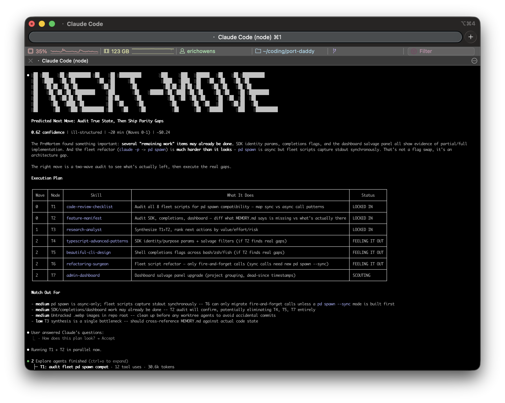
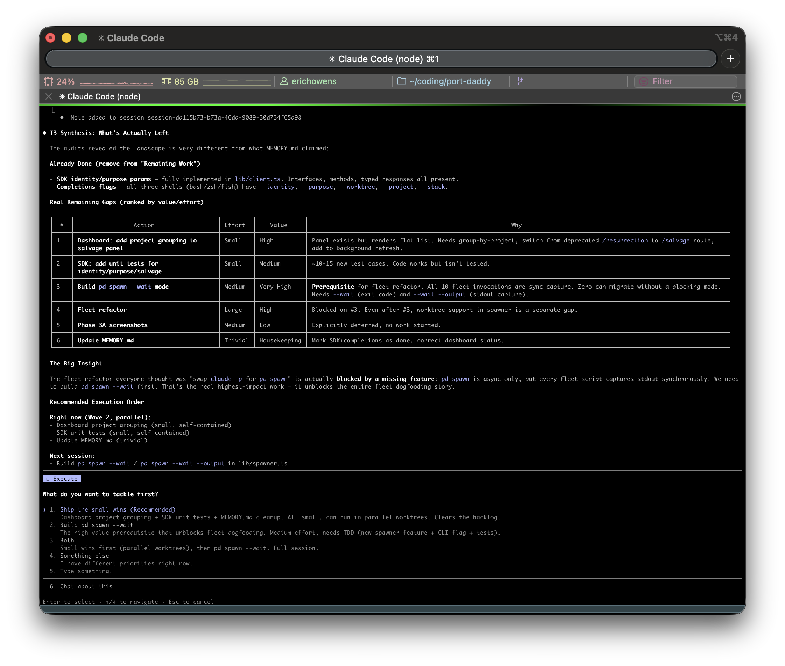
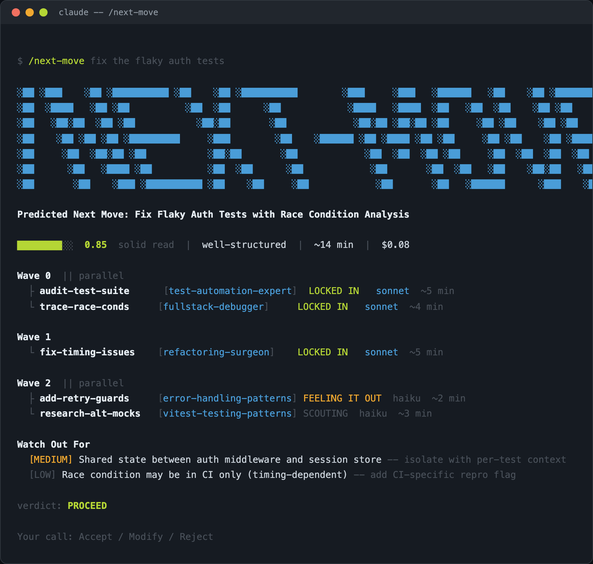
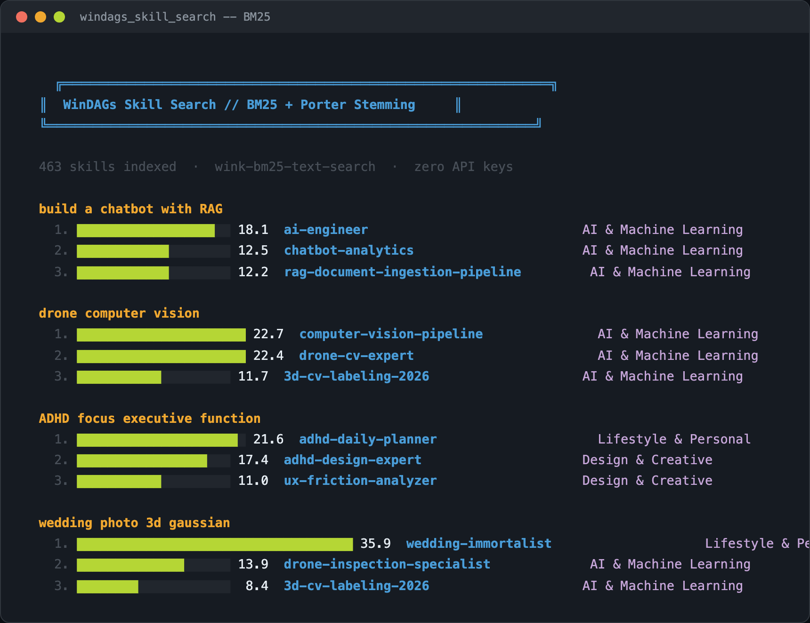
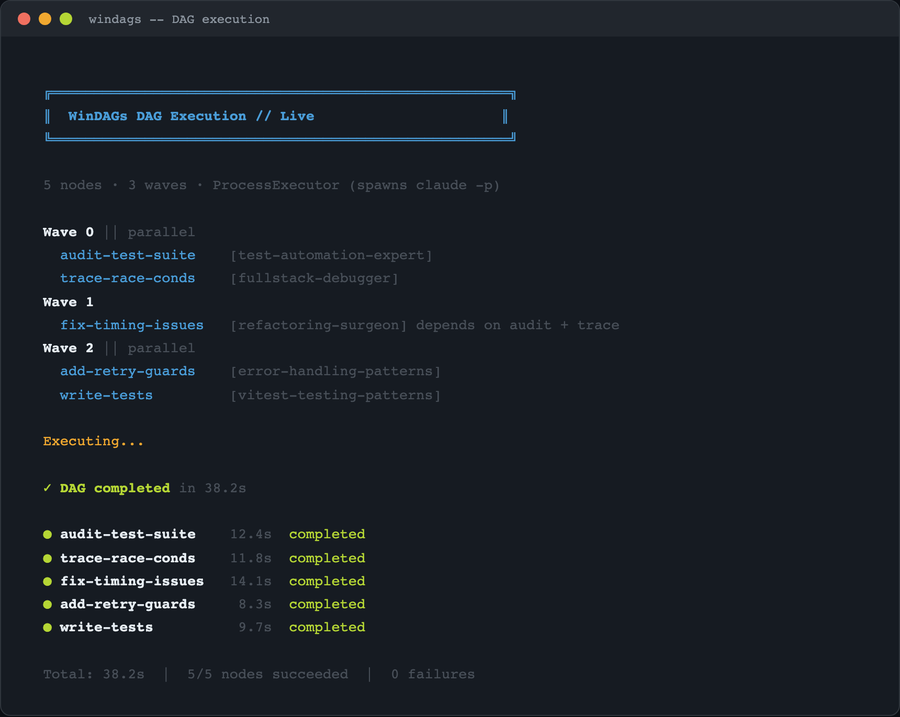

<p align="center">
  
  <br/><br/>
  
</p>

<h1 align="center">windags-skills</h1>

<p align="center">
  <strong>463+ agent skills</strong> for Claude Code, Codex, Gemini CLI, Cursor, and 40+ other coding agents.<br/>
  Built by <a href="https://windags.ai">WinDAGs</a> — DAG orchestration for multi-agent workflows.
</p>

<p align="center">
  <a href="#next-move">next-move</a> · <a href="#skill-search">skill search</a> · <a href="#all-categories">all skills</a> · <a href="#install">install</a> · <a href="https://windags.ai">windags.ai</a>
</p>

---

## /next-move

The flagship skill. Tell it what you're working on (or don't — it reads your git state), and it produces a **predicted DAG** of the highest-impact agents to run next.

```
/next-move                           # auto-detect from git + conversation
/next-move fix the flaky auth tests  # tell it what you care about
```



**What you get:**
- Problem classification — well-structured, ill-structured, or wicked
- 3-8 subtasks decomposed into parallel waves
- Each subtask matched to the best skill from 463+ via BM25 retrieval
- Risk analysis with mitigations (PreMortem agent)
- Time and cost estimates per node
- Accept / Modify / Reject feedback loop

**How it works:** A 5-agent meta-DAG runs inside your Claude Code session:

```
Wave 0: Sensemaker    — classify the problem, halt gate if uncertain
Wave 1: Decomposer    — break into subtasks with dependencies
Wave 2: Skill Selector — BM25 search → match skills to subtasks  (parallel)
Wave 2: PreMortem      — scan for failure patterns                (parallel)
Wave 3: Synthesizer    — assemble the predicted DAG + present to user
```

No extra API keys. No external services. Runs entirely in your Claude session.

---

## Skill Search

BM25 ranked retrieval across the full catalog. Porter stemming, real stopword removal, document-length normalization. Zero API keys — runs locally.



Queries like "drone computer vision" find `computer-vision-pipeline` and `drone-cv-expert`. "Wedding photo 3d gaussian" finds `wedding-immortalist` at 35.9. Stemming handles morphological variants — "deploy" matches "deployment" and "deployed".

---

## DAG Execution

Skills don't just get recommended — they get **executed** in parallel waves. The WinDAGs engine spawns real agents (`claude -p`) with skill-injected prompts, running independent nodes concurrently.



---

<h2 id="install">Install</h2>

**Claude Code** (plugin):
```bash
claude plugin add /path/to/windags-skills
```

**Manual** (any agent):
```bash
git clone https://github.com/curiositech/windags-skills.git

# Use /next-move:
cp -r windags-skills/skills/next-move ~/.claude/commands/

# Or symlink the whole catalog:
ln -s $(pwd)/windags-skills/skills ~/.claude/skills
```

**Single skill:**
```bash
cp -r windags-skills/skills/api-architect ~/.claude/commands/
```

---

<h2 id="all-categories">All Skills (463)</h2>

| Category | Count | Highlights |
|----------|------:|-----------|
| **Agent & Orchestration** | 78 | dag-orchestrator, next-move, skill-architect, task-decomposer |
| **Research & Academic** | 61 | raft-consensus, bdi-agents, chain-of-thought, tree-of-thoughts |
| **Design & Creative** | 46 | design-system-creator, pixel-art, typography, vibe-matcher |
| **Backend & Infrastructure** | 35 | api-architect, microservices, caching, websocket |
| **Cognitive Science** | 29 | naturalistic-decision-making, sensemaking, expertise-elicitation |
| **AI & Machine Learning** | 27 | ai-engineer, RAG, computer-vision, embeddings |
| **DevOps & Infrastructure** | 26 | github-actions, kubernetes, terraform, docker |
| **Frontend & UI** | 24 | nextjs, react-performance, animation, framer-motion |
| **Data & Analytics** | 17 | data-pipeline, dbt, data-viz, dimensional-modeling |
| **Mobile Development** | 17 | ios, react-native, flutter, swiftui |
| **Code Quality & Testing** | 16 | vitest, playwright, code-review, refactoring |
| **Productivity & Meta** | 16 | prompt-engineer, documentation, skill-creator |
| **Recovery & Wellness** | 16 | sobriety, crisis-intervention, speech-pathology |
| **Lifestyle & Personal** | 14 | ADHD, grief, finance, interior-design |
| **Content & Marketing** | 14 | SEO, copywriting, product-launches |
| **Career & Interview** | 9 | interview-prep, resume, hiring-manager |
| **Legal & Compliance** | 7 | expungement, HIPAA, legal-tech |
| **Video & Audio** | 6 | video-production, TTS, sound-design |
| **Security** | 5 | auth, vulnerability-scanning, zero-trust |

---

## How Skills Work

Each skill is a markdown file (`SKILL.md`) with YAML frontmatter:

```yaml
---
name: api-architect
description: "Expert API designer for REST, GraphQL, gRPC architectures"
category: Backend & Infrastructure
tags: [api, rest, graphql, grpc]
---
```

The body contains activation triggers, core capabilities, anti-patterns, and reference files. When an agent loads a skill, it gains bespoke expertise — not just instructions, but deep domain knowledge with working examples.

Skills follow the [Agent Skills](https://agentskills.io) open standard and work with Claude Code, OpenAI Codex CLI, Gemini CLI, Cursor, VS Code Copilot, and 30+ other agents.

---

## Install

### Claude Code (one command)

```bash
claude plugin marketplace add curiositech/windags-skills
claude plugin install windags-skills
```

This installs all 463+ skills + the 5 `/next-move` subagents (sensemaker, decomposer, skill-selector, premortem, synthesizer).

### Cross-tool install (Codex, Gemini CLI, Cursor, Aider, …)

Clone the plugin and run the installer. It detects which tools you have under `$HOME` and links skills + subagents into the right place. No hardcoded paths — uses `$HOME` and the plugin checkout dir.

```bash
git clone https://github.com/curiositech/windags-skills.git ~/coding/windags-skills
~/coding/windags-skills/scripts/install.sh
```

What it does (idempotent — safe to re-run after `git pull`):

| Tool | What gets installed |
|---|---|
| Claude Code | `~/.claude/skills/{next-move, windags-*}` + `~/.claude/agents/{5 subagents}.md` |
| Codex | `~/.codex/skills/{next-move, windags-*}` + `~/.codex/AGENTS.md` |
| Cursor / Cline / Aider | `~/AGENTS.md` (auto-discovered by AGENTS.md-aware tools) |
| Gemini CLI | Marked block appended to `~/.gemini/GEMINI.md` |

Override the install location with `WINDAGS_HOME=/path ./install.sh`. Preview without changes with `--dry-run`.

The MCP server lives at `<plugin>/mcp-server/index.js` — wire it into any MCP-aware client. It exposes 9 tools:

| Tool | Purpose |
|---|---|
| `windags_skill_search` | Cascade-ranked skill search (BM25 + MiniLM + RRF + cross-encoder + per-user attribution k-NN) |
| `windags_skill_graft` | Full SKILL.md bodies for top primaries + adjacencies + asset manifest |
| `windags_skill_reference` | Load one reference file from a skill's `references/` |
| `windags_history` | Recent `/next-move` predictions for a project |
| `windags_skill_search_batch` | N searches in one round-trip (capped at 20) |
| `windags_skill_graft_batch` | N grafts in one round-trip (capped at 20) |
| `windags_node_requirements` | Per-skill `allowed-tools`, `pairs-with`, suggested `model_tier`, and **provider-native** model IDs |
| `windags_validate_dag` | Schema-check a candidate DAG before saving |
| `windags_estimate_cost` | Per-node + total cost estimate during planning |

---

## License

**BUSL-1.1** (Business Source License). Free for non-commercial and personal use. Converts to Apache 2.0 on **2030-03-03**.

Commercial licensing: [licensing@curiositech.ai](mailto:licensing@curiositech.ai)

---

<p align="center">
  Built by <a href="https://curiositech.ai">Curiositech</a> · <a href="https://windags.ai">windags.ai</a>
</p>
