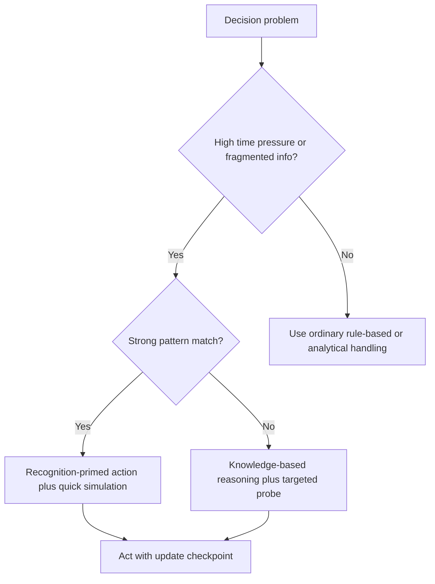

# Incident Command Decision Intelligence

Use this skill when the hard part is not generating options, but deciding how much recognition, analysis, information gathering, and coordination discipline the situation actually needs.

## When to Use

- Multi-agent or human-agent systems make worse decisions as time pressure rises.
- Handoffs, command transfers, or cross-team coordination fail even when each component looks individually competent.
- A system hesitates because information is incomplete and nobody knows what is worth learning next.
- A post-mortem or case-study-derived training set may be contaminated by retrospective rationalization.
- You need to route work by behavioral level: automatic, rule-guided, or fully analytical.

## NOT for Boundaries

This skill is not the primary lens for:
- Routine implementation work with clear requirements and no meaningful uncertainty.
- Static single-agent tasks where the environment will not change during execution.
- Problems where exhaustive optimization is cheap and there is no penalty for delay.
- Pure probability estimation tasks that do not involve expert judgment, coordination, or action under pressure.

## Core Mental Models

### Recognition Before Enumeration

Under time pressure, experts usually do not compare a ranked set of options. They recognize the situation type, surface the first workable response, mentally simulate it, and only widen the search if the simulation fails.

### Behavioral-Level Routing

Use Rasmussen's levels as a routing discipline:
- **Skill-based**: automatic or compiled responses for stable, well-rehearsed situations.
- **Rule-based**: pattern-triggered rule application with moderate adaptation.
- **Knowledge-based**: explicit reasoning for novelty, ambiguity, or high-stakes frame breaks.

The key risk is mismatch. Knowledge-based treatment of skill-level work wastes time. Skill-level automation on a knowledge-level problem is the catastrophic error.

### Epistemic Uncertainty

In crisis settings, uncertainty is often about what is not yet known, not about inherent randomness. The question becomes which missing fact would most change the action, not how to stall until certainty appears.

### Retrospective Distortion

Case studies and interviews often reconstruct what should have happened rather than what actually happened. Observational traces deserve more weight than clean after-the-fact narratives.

### Individual Excellence vs. System Reliability

Excellent local judgments do not guarantee system-level success. Boundary failures, overloaded channels, and authority mismatches can overwhelm strong individual decisions.

## Decision Points

See the compact routing view in [diagrams/01_flowchart_decision-points.md](diagrams/01_flowchart_decision-points.md).

### 1. Choose the Behavioral Register

- Use **skill-based** handling only when the situation is truly familiar, time pressure is meaningful, and automation has already been validated.
- Use **rule-based** handling when a known playbook applies but still needs situational parameterization.
- Use **knowledge-based** reasoning when the frame is contested, the situation is novel, or the stakes punish a wrong simplification.

### 2. Decide What Information to Acquire

- Identify the one missing fact most likely to change the chosen action.
- Acquire that fact before broad exploratory searching.
- If no foreseeable probe would change the action, move with the best current estimate and create an explicit update checkpoint.

### 3. Decide How to Learn From the Episode

- Prefer observational traces, timestamps, message histories, and behavior logs over polished recollections.
- Treat suspiciously clean accounts as teaching material about ideals, not as ground truth about real cognition.
- Separate action causes from system causes so a post-mortem does not collapse into blame assignment.

## Failure Modes

### 1. Analytical Paralysis

**Symptoms:** option generation expands while action quality does not improve.  
**Detection rule:** new alternatives continue to appear but none materially change the near-term decision.  
**Recovery:** switch to recognition-primed simulation of the first workable option and set a timebox for further search.

### 2. Behavioral-Level Mismatch

**Symptoms:** the system either over-reasons stable tasks or automates through novelty.  
**Detection rule:** the response style does not match the true novelty and ambiguity of the situation.  
**Recovery:** reclassify the task as SB, RB, or KB before changing tools or models.

### 3. Information Hoarding

**Symptoms:** the system keeps asking for more data without changing the action plan.  
**Detection rule:** acquired information mostly increases confidence rather than changing decisions.  
**Recovery:** rank probes by action impact and stop collecting low-leverage data.

### 4. Retrospective Overfitting

**Symptoms:** training or post-mortem conclusions become cleaner and more rational than the original event.  
**Detection rule:** explanations converge on elegant stories that are weakly supported by live traces.  
**Recovery:** downgrade self-report evidence and annotate uncertainty around reconstructed steps.

### 5. Coordination-Blind Diagnosis

**Symptoms:** every component passes local review while the full system still fails.  
**Detection rule:** explanations stay at the individual level even though failures appear at handoffs or shared channels.  
**Recovery:** audit transfer points, role boundaries, and information flows before retraining individual actors.

## Worked Examples

### Example 1: Urgent Incident Routing

An orchestration layer receives a burst of alerts during a live outage. A naive system enumerates all possible responder sequences and stalls. Using this skill, you classify the problem as RB/KB boundary work, choose the first credible containment action, simulate the next three steps, and request only the single missing signal that could reverse the containment choice.

### Example 2: Post-Mortem Training Data Triage

A polished incident review claims the commander calmly evaluated three alternatives before acting. Live chat logs show a pattern-recognition jump plus one quick viability check. The skill routes the narrative into "useful as doctrine, low weight as behavioral trace" and protects the training set from retrospective distortion.

## Quality Gates

- [ ] The task is explicitly classified as SB, RB, or KB before reasoning depth is chosen.
- [ ] Information requests are ranked by how much they could change the action.
- [ ] Post-mortems separate individual decision quality from coordination quality.
- [ ] Retrospective accounts are marked as observational, self-reported, or mixed.
- [ ] The architecture has an explicit handoff and command-transfer audit, not just component-level scoring.

## Reference Files

| File | Load when |
| --- | --- |
| `references/recognition-primed-decision-making-for-agents.md` | Designing recognition-first action selection or correcting option-enumeration bias |
| `references/three-behavior-levels-for-agent-routing.md` | Routing tasks by SB/RB/KB level or decomposing work by cognitive register |
| `references/epistemic-uncertainty-and-information-triage-in-crisis-systems.md` | Triage of missing information under time pressure |
| `references/crisis-decision-failures-taxonomy-for-agent-systems.md` | Reviewing decision pathologies and pre-mortem failure checks |
| `references/coordination-failure-modes-in-multi-agent-crisis-systems.md` | Diagnosing handoff failures and collective breakdowns |
| `references/the-retrospective-distortion-problem-for-agent-learning.md` | Weighting case-study evidence and protecting learning pipelines |
| `references/novice-to-expert-progression-in-agent-capability.md` | Deciding whether a system is expert enough for a task class |
| `references/the-theory-practice-gap-in-crisis-decision-research.md` | Assessing whether a research model fits operational reality |

## Anti-Patterns

- Treating every crisis decision as an optimization problem instead of a recognition-and-simulation problem.
- Asking for more information without first stating how that information could change the action.
- Scoring individual actors while ignoring the handoff structure that shaped the failure.
- Using after-the-fact narratives as if they were direct recordings of expert cognition.
