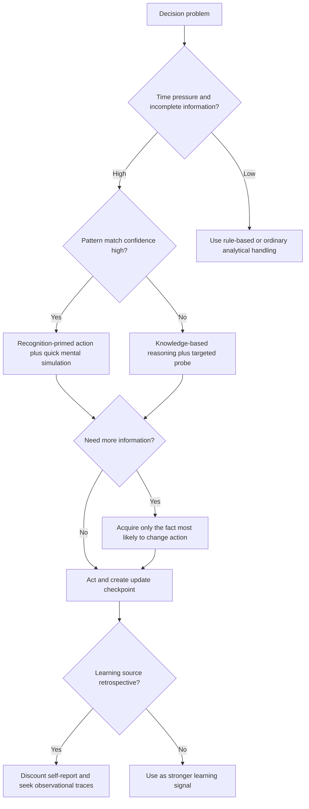

# Crisis Decision Routing

```mermaid
flowchart TD
  A[Decision problem] --> B{Time pressure and incomplete information?}
  B -->|High| C{Pattern match confidence high?}
  B -->|Low| D[Use rule-based or ordinary analytical handling]
  C -->|Yes| E[Recognition-primed action plus quick mental simulation]
  C -->|No| F[Knowledge-based reasoning plus targeted probe]
  E --> G{Need more information?}
  F --> G
  G -->|Yes| H[Acquire only the fact most likely to change action]
  G -->|No| I[Act and create update checkpoint]
  H --> I
  I --> J{Learning source retrospective?}
  J -->|Yes| K[Discount self-report and seek observational traces]
  J -->|No| L[Use as stronger learning signal]
```
