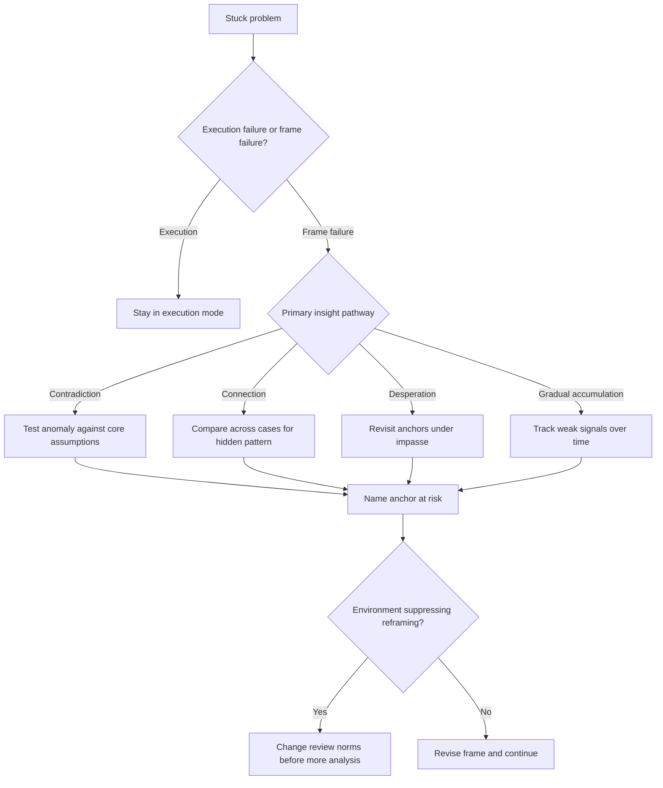

# A Naturalistic Study of Insight

Source basis: Gary Klein and Andrea Jarosz on how insight actually appears in real work, not just puzzle tasks.

## When to Use

- A user is stuck even though they already know the domain and have tried reasonable execution tactics.
- Contradictory evidence keeps recurring and the current explanation feels increasingly forced.
- You need to decide whether a problem needs decomposition or a deeper frame change.
- You are designing systems, teams, or workflows that need discovery instead of just reliable execution.
- An organization is excellent at preventing error but poor at generating new understanding.

## NOT for

- Routine optimization, incremental improvement, or straightforward debugging inside a stable frame.
- Problems with clear metrics, known solution classes, and no evidence that the framing itself is wrong.
- Generic "be more creative" coaching with no concrete contradiction, impasse, or connection signal.

## Decision Points

1. Decide whether the problem is an execution failure or a frame failure. If the current model is still sound, stay in execution mode.
2. Name the active insight pathway: contradiction, connection, desperation, or gradual accumulation.
3. Identify the anchor at risk. Ask which belief, category, or causal assumption would need to move for the anomaly to make sense.
4. Check whether the environment is suppressing insight through compliance pressure, premature documentation, or "explain it away" norms.

## Decision Flow

## Working Model

- Insight is not one mechanism. Contradiction, connection, and impasse trigger different moves and should not be treated as interchangeable.
- Contradiction work starts when you treat the anomalous datum as potentially more trustworthy than the story currently used to dismiss it.
- Real-world insight is often gradual. A slow accumulation of weak signals is still insight work if it changes the frame.
- Expertise is usually an asset because it provides the pattern library needed to notice meaningful anomalies in the first place.
- Error-prevention systems often interfere with insight because they reward stability, precision, and premature closure over exploratory reframing.

## Failure Modes

- Explaining away every anomaly as noise, measurement error, or a special case.
- Breaking an insight problem into subtasks too early, which hardens the very frame that needs revision.
- Treating expertise as contamination rather than a source of higher-quality pattern recognition.
- Waiting for a dramatic "aha" and missing the slower buildup of evidence across cases.
- Installing insight rituals in an organization without removing the control structures that punish reframing.

## Anti-Patterns and Shibboleths

- Anti-pattern: decomposing the task further when every subtask still inherits the same bad frame.
- Anti-pattern: praising "creative thinking" without naming the contradiction, anchor, or pathway that actually needs work.
- Shibboleth: if the advice never states what belief must change, it is probably motivational talk, not insight support.

## Worked Examples

- An orchestration agent keeps refining task decomposition but still misses the real bottleneck. The right move is to inspect the governing assumption about what the task actually is, not add more subtasks.
- A safety-focused team has excellent audit trails but never surfaces novel risk patterns. The right move is to protect anomaly review time and challenge the reporting frame, not just add more checklist items.

## Fork Guidance

- Stay in-process for a single stuck case where one frame is dominant and you only need to test a few anchors.
- Fork one subagent per competing frame when you need independent explanations for the same contradiction without early convergence pressure.

## Quality Gates

- The current frame is named explicitly, not implied.
- At least one anchor that might need revision is identified.
- The active pathway is diagnosed before advice is given.
- Contradictory evidence is treated as evidence, not immediately downgraded to noise.
- If the environment is organizational, the error-prevention regime is examined alongside the insight problem.

## Reference Routing

- `references/three-pathways-anchor-model.md`: load when you need a fuller pathway taxonomy and anchor logic.
- `references/contradiction-driven-insight-pathways.md`: load when anomalies keep recurring and the main challenge is breaking knowledge shields.
- `references/gradual-insight-and-pattern-accumulation.md`: load when the signal is distributed across time rather than tied to one event.
- `references/expertise-enables-insight-not-fixation.md`: load when someone assumes expertise is the reason insight is blocked.
- `references/organizational-barriers-to-insight.md`: load when process discipline or compliance culture appears to suppress discovery.
- `references/task-decomposition-for-insight-vs-execution.md`: load when you need to separate insight work from ordinary execution work.
