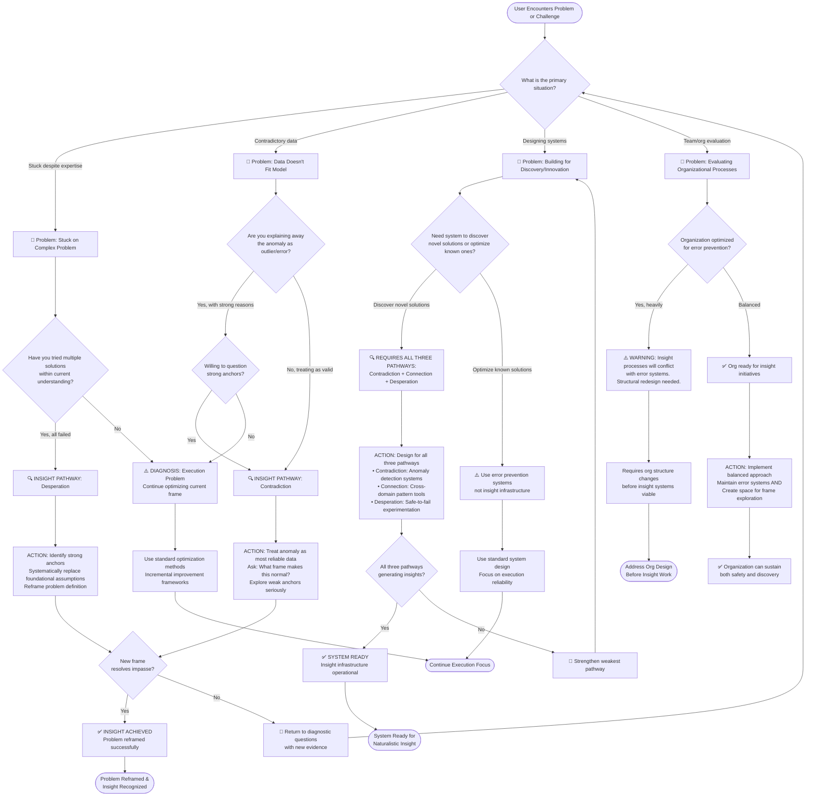

# Naturalistic Insight Decision Tree

```mermaid
flowchart TD
    Start([User Encounters Problem or Challenge]) --> Assess{What is the primary situation?}
    
    Assess -->|Stuck despite expertise| Stuck["📍 Problem: Stuck on Complex Problem"]
    Assess -->|Contradictory data| Contradiction["📍 Problem: Data Doesn't Fit Model"]
    Assess -->|Designing systems| Design["📍 Problem: Building for Discovery/Innovation"]
    Assess -->|Team/org evaluation| OrgEval["📍 Problem: Evaluating Organizational Processes"]
    
    Stuck --> StuckDiag{Have you tried multiple solutions<br/>within current understanding?}
    StuckDiag -->|Yes, all failed| Desperation["🔍 INSIGHT PATHWAY: Desperation"]
    StuckDiag -->|No| Execution["⚠️ DIAGNOSIS: Execution Problem<br/>Continue optimizing current frame"]
    
    Contradiction --> ContDiag{Are you explaining away<br/>the anomaly as outlier/error?}
    ContDiag -->|Yes, with strong reasons| TakeSeriouslyQ{Willing to question<br/>strong anchors?}
    ContDiag -->|No, treating as valid| ContradictionPath["🔍 INSIGHT PATHWAY: Contradiction"]
    
    TakeSeriouslyQ -->|Yes| ContradictionPath
    TakeSeriouslyQ -->|No| Execution
    
    Design --> DesignDiag{Need system to discover<br/>novel solutions or optimize known ones?}
    DesignDiag -->|Discover novel solutions| MultiPath["🔍 REQUIRES ALL THREE PATHWAYS:<br/>Contradiction + Connection + Desperation"]
    DesignDiag -->|Optimize known solutions| NoInsight["⚠️ Use error prevention systems<br/>not insight infrastructure"]
    
    OrgEval --> OrgDiag{Organization optimized<br/>for error prevention?}
    OrgDiag -->|Yes, heavily| OrgConflict["⚠️ WARNING: Insight processes will conflict<br/>with error systems. Structural redesign needed."]
    OrgDiag -->|Balanced| OrgReady["✅ Org ready for insight initiatives"]
    
    Desperation --> DespAction["ACTION: Identify strong anchors<br/>Systematically replace foundational assumptions<br/>Reframe problem definition"]
    
    ContradictionPath --> ContAction["ACTION: Treat anomaly as most reliable data<br/>Ask: What frame makes this normal?<br/>Explore weak anchors seriously"]
    
    MultiPath --> MultiAction["ACTION: Design for all three pathways<br/>• Contradiction: Anomaly detection systems<br/>• Connection: Cross-domain pattern tools<br/>• Desperation: Safe-to-fail experimentation"]
    
    DespAction --> Verify{New frame<br/>resolves impasse?}
    ContAction --> Verify
    MultiAction --> VerifyMulti{All three pathways<br/>generating insights?}
    
    Verify -->|Yes| Success["✅ INSIGHT ACHIEVED<br/>Problem reframed successfully"]
    Verify -->|No| Retry["🔄 Return to diagnostic questions<br/>with new evidence"]
    
    VerifyMulti -->|Yes| SystemSuccess["✅ SYSTEM READY<br/>Insight infrastructure operational"]
    VerifyMulti -->|No| SystemRetry["🔄 Strengthen weakest pathway"]
    
    OrgReady --> OrgAction["ACTION: Implement balanced approach<br/>Maintain error systems AND<br/>Create space for frame exploration"]
    OrgAction --> OrgOutcome["✅ Organization can sustain<br/>both safety and discovery"]
    
    Execution --> Optimize["Use standard optimization methods<br/>Incremental improvement frameworks"]
    NoInsight --> Standard["Use standard system design<br/>Focus on execution reliability"]
    OrgConflict --> Structural["Requires org structure changes<br/>before insight systems viable"]
    
    Retry --> Assess
    SystemRetry --> Design
    
    Success --> End([Problem Reframed &<br/>Insight Recognized])
    SystemSuccess --> EndSystem([System Ready for<br/>Naturalistic Insight])
    Optimize --> EndExecution([Continue Execution Focus])
    Standard --> EndExecution
    Structural --> EndStructural([Address Org Design<br/>Before Insight Work])
```
