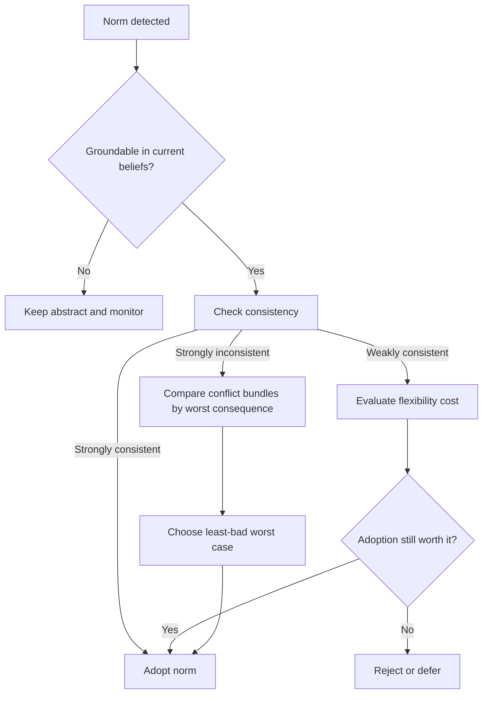

# Normative BDI Agent Architecture

Use this skill when an agent must stay aware of multiple norms, decide which ones to adopt into action, and explain why a deliberate violation was less bad than the alternatives.

## When to Use

- Multiple rules, obligations, prohibitions, or stakeholder demands cannot all be satisfied together.
- An agent must distinguish knowing that a norm exists from actually choosing to follow it.
- A system needs to justify why it violated one rule to satisfy another higher-stakes commitment.
- You need a consequence-based alternative to brittle hard-coded priority lists.
- A BDI architecture needs a principled way to integrate normative reasoning without turning norms into absolute overrides.

## NOT for Boundaries

This skill is not the primary tool for:
- Fixed priority hierarchies where the correct precedence never changes with context.
- Pure constraint satisfaction where any satisfying solution is good enough and norm violation is out of scope.
- Regulatory or ethical environments that require literal non-violation regardless of consequences.
- Toy rule engines that do not maintain beliefs, commitments, or explanations of deliberate violations.

## Core Mental Models

### Recognition Is Not Internalization

Keep the **Abstract Norm Base** separate from the **Norm Instance Base**. The agent can detect a norm without adopting it. That separation is what allows deliberate, explainable non-compliance instead of accidental ignorance.

### Three Consistency States

- **Strong inconsistency**: no plan can satisfy both commitments.
- **Weak consistency**: some plans work, but future flexibility shrinks.
- **Strong consistency**: all relevant plans remain compatible.

The weak-consistency case is where most real design judgment lives.

### Consequence Ranking

When norms conflict, compare coherent bundles of commitments by their worst downstream consequence. The point is not maximizing average goodness; it is choosing the least-bad worst case among incompatible futures.

### Norms as Hypothetical Desires

Adopted obligations and prohibitions become defeasible pressures inside the BDI machinery rather than a separate override system. That keeps normative reasoning inside the same deliberative loop as ordinary goal pursuit.

## Decision Points

See the adoption and conflict flow in [diagrams/01_flowchart_decision-points.md](diagrams/01_flowchart_decision-points.md).

### 1. Decide Whether to Adopt a Norm

- If a new norm is strongly inconsistent with current commitments, adoption requires dropping or revising something else.
- If it is weakly consistent, make the flexibility cost explicit before adopting it.
- If it is strongly consistent, adoption is low-risk and should usually be automatic.

### 2. Decide How to Resolve a Conflict

- Generate maximal non-conflicting subsets rather than comparing norms one-by-one in isolation.
- Build plans for each subset and identify the worst consequence in each future.
- Choose the subset whose worst case is least bad, then record the reason for the chosen violation.

### 3. Decide When to Instantiate an Abstract Norm

- Instantiate only when current beliefs can bind variables and satisfy activation conditions.
- Keep unresolved norms visible when knowledge is incomplete instead of pretending they do not apply.
- Re-evaluate pending abstract norms after meaningful belief updates.

## Failure Modes

### 1. Over-Adoption Deadlock

**Symptoms:** the agent keeps internalizing norms until no feasible action remains.  
**Detection rule:** the active action space shrinks faster than conflicts are resolved.  
**Recovery:** force a consistency review before any additional norm enters the Norm Instance Base.

### 2. Hidden Violation

**Symptoms:** the agent violates a norm but cannot state that it chose to do so.  
**Detection rule:** post-hoc explanations omit the rejected norm or treat the violation as if it never existed.  
**Recovery:** persist rejected-but-recognized norms and log the winning consequence comparison.

### 3. Binary Consistency Collapse

**Symptoms:** adoption logic treats every norm as either fully compatible or impossible.  
**Detection rule:** weak consistency never appears in the architecture or logs.  
**Recovery:** add an explicit weak-consistency branch and model flexibility loss directly.

### 4. Fixed-Priority Brittleness

**Symptoms:** the same global priority stack produces obviously wrong choices in edge cases.  
**Detection rule:** conflict outcomes change only when the priority table changes, never when consequences change.  
**Recovery:** move from rigid precedence to subset generation plus consequence ranking.

### 5. Norm Side-Channel Architecture

**Symptoms:** norm handling lives in a separate enforcement module that overrides BDI deliberation late in execution.  
**Detection rule:** norm logic cannot be explained using beliefs, desires, and intentions.  
**Recovery:** transform adopted norms into internal deliberative pressures and route them through the main architecture.

## Worked Examples

### Example 1: Privacy vs. Personalization

A service agent knows a norm prohibiting direct use of customer-level data and an obligation to improve the user experience. The system finds weak consistency: aggregate behavioral summaries preserve most personalization while limiting privacy harm. The skill keeps both norms visible, instantiates only the aggregate-safe obligation, and records why direct data use was rejected.

### Example 2: Robot and Baby

A caretaker robot faces an obligation to keep a baby alive and a prohibition against developing love for humans. No plan satisfies both. The skill generates two coherent subsets, compares the worst consequences, and deliberately violates the design prohibition because death is a worse outcome than the forbidden attachment. The violation is explicit and reportable.

## Quality Gates

- [ ] The architecture distinguishes detected norms from adopted norms.
- [ ] Consistency checks include strong inconsistency, weak consistency, and strong consistency.
- [ ] Conflict resolution compares coherent subsets, not isolated norms only.
- [ ] Chosen violations are logged with explicit consequence comparisons.
- [ ] Abstract norms can remain pending when belief grounding is incomplete.

## Reference Files

| File | Load when |
| --- | --- |
| `references/separation-of-norm-recognition-and-norm-internalization.md` | Designing ANB vs. NIB boundaries |
| `references/three-types-of-consistency-for-norm-adoption.md` | Implementing adoption checks and flexibility-cost logic |
| `references/normative-conflict-resolution-through-consequence-ranking.md` | Building or reviewing consequence-based conflict resolution |
| `references/norm-instantiation-through-belief-grounding.md` | Grounding abstract norms into context-specific instances |
| `references/maximal-non-conflicting-subsets-for-action-selection.md` | Computing coherent option bundles under conflict |
| `references/desire-internalization-as-norm-adoption-mechanism.md` | Integrating norms into BDI desire and intention handling |

## Anti-Patterns

- Hard-coding a single priority order and calling that "ethics."
- Auto-adopting every detected norm and discovering contradictions only at execution time.
- Treating weak consistency as if it were the same as strong consistency.
- Comparing violations by average utility while ignoring catastrophic worst cases.
