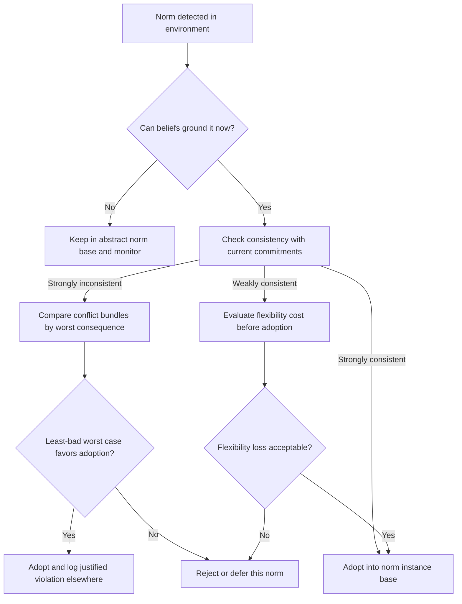

# Norm Adoption And Conflict Routing

```mermaid
flowchart TD
  A[Norm detected in environment] --> B{Can beliefs ground it now?}
  B -->|No| C[Keep in abstract norm base and monitor]
  B -->|Yes| D[Check consistency with current commitments]
  D -->|Strongly inconsistent| E[Compare conflict bundles by worst consequence]
  D -->|Weakly consistent| F[Evaluate flexibility cost before adoption]
  D -->|Strongly consistent| G[Adopt into norm instance base]
  E --> H{Least-bad worst case favors adoption?}
  H -->|Yes| I[Adopt and log justified violation elsewhere]
  H -->|No| J[Reject or defer this norm]
  F --> K{Flexibility loss acceptable?}
  K -->|Yes| G
  K -->|No| J
```
