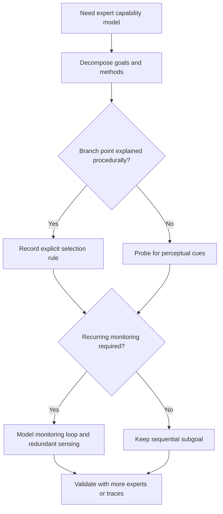

# Expert Task Analysis And Capability Design

Use this skill when a task model seems procedurally complete but still misses the perceptual triggers, monitoring loops, and tool-use habits that separate expert performance from a checklist.

## When to Use

- You need to turn expert performance into an agent architecture, simulator, or training environment.
- A written SOP explains the steps but not how experts know which branch to take.
- The system works on normal cases and fails on edge cases that hinge on situational judgment.
- You are interviewing subject-matter experts and need a method for extracting tacit knowledge rather than just narrated procedure.
- A DAG or orchestration tree needs recurring monitoring loops instead of only one-shot sequential nodes.

## NOT for Boundaries

This skill is not the right primary tool for:
- Simple, deterministic workflows where explicit procedures already capture the whole task.
- Low-stakes automation that does not depend on perceptual pattern recognition.
- Post-hoc documentation exercises that do not need validation against real expert performance.
- Simulations where visual realism matters more than cue fidelity for decision making.

## Core Mental Models

### Science Layer vs. Art Layer

Expert performance has a declarative layer that experts can usually explain and a perceptual layer that often shows up only when they are pushed on branch points. GOMS captures the former. Critical Cue Inventories and Critical Decision Method interviews are how you recover the latter.

### Cues Are Load-Bearing

Wake patterns, line tension, a sound change, or a subtle positional relationship are not decorative details. They are the actual inputs to expert choice. If the system cannot see the cues, it cannot reproduce the expert decision function.

### Hierarchy With Selection Rules

Expert work is a nested goal hierarchy with local branch conditions, not a flat list of steps. The important structure is not only what gets done, but what conditions select method A rather than method B.

### Recurring Monitoring Loops

Many expert tasks depend on continual assessment goals that run alongside sequential action. A workflow that only models one-shot nodes loses anticipation and turns expertise into reaction.

### Validation Gap

Single-expert task models are predictably incomplete because routine tools and setup behaviors vanish from conscious awareness. Validation is not an optional polish pass; it is how the missing task structure becomes visible.

## Decision Points

See the modeling flow in [diagrams/01_flowchart_decision-points.md](diagrams/01_flowchart_decision-points.md).

### 1. Decide the Right Grain of Decomposition

- Stop at the level where a meaningful method choice first appears.
- If a branch condition is still hidden, decompose deeper and probe the cue that selects the branch.
- If no branch points remain, you are now documenting execution rather than task architecture.

### 2. Decide What Knowledge-Elicitation Method to Use

- Use structured decomposition for explicit procedures and tool sequencing.
- Use Critical Decision Method probes when the expert says "I just know" or "it depends."
- Use multi-expert validation whenever the first model seems strangely clean or tool-free.

### 3. Decide What to Simulate

- Simulate cues that actually trigger branch decisions.
- Add redundant sensing where experts rely on more than one channel.
- Omit cosmetic detail that does not change cue recognition or choice quality.

## Failure Modes

### 1. Flat Checklist Capture

**Symptoms:** the task model reads smoothly but fails as soon as the environment deviates.  
**Detection rule:** branch conditions are missing or hidden inside prose instead of explicit selection rules.  
**Recovery:** convert the checklist into a goal hierarchy with cue-linked branch points.

### 2. Cue-Free Simulation

**Symptoms:** trainees or agents succeed in the simulator but fail in deployment.  
**Detection rule:** the simulation reproduces procedures but not the signals experts use to choose between them.  
**Recovery:** build a Critical Cue Inventory and redesign the environment around cue fidelity.

### 3. Single-Channel Fragility

**Symptoms:** one noisy or missing input collapses the whole decision process.  
**Detection rule:** a critical judgment depends on exactly one source.  
**Recovery:** add redundant channels and explicit cross-check behavior.

### 4. One-Expert Blind Spot

**Symptoms:** essential tools or context-setting actions never appear in the first model.  
**Detection rule:** validation experts immediately mention omitted equipment, routines, or monitoring behavior.  
**Recovery:** treat disagreement as evidence of missing structure, not as noise.

### 5. Sequential-Only Architecture

**Symptoms:** the system can react to events but cannot sustain ongoing assessment.  
**Detection rule:** all nodes are one-shot tasks and none represent recurring monitoring goals.  
**Recovery:** add explicit monitoring loops with predict-observe-compare-adjust behavior.

## Worked Examples

### Example 1: Turning Expert Judgment Into an Agent Tree

A shipping-domain expert gives a procedural narrative for docking. The first draft decomposes cleanly into steps but still fails when current, tug availability, and line behavior shift together. The skill adds selection rules at the relevant branch points, records the cue inventory that drives those choices, and introduces recurring monitoring loops instead of only sequential nodes.

### Example 2: Simulation Fidelity Triage

A training simulator renders water, vessels, and pier geometry beautifully, yet trainees still overrun the stop point. CTA reveals that experts rely on relative motion against fixed shore references and line-tension cues that the simulator never emphasizes. The skill routes design effort toward those cues instead of more visual polish.

## Quality Gates

- [ ] The task model distinguishes explicit procedure from perceptual cue knowledge.
- [ ] Branch points include the cues or conditions that select each method.
- [ ] Recurring monitoring goals are modeled separately from one-shot sequential goals.
- [ ] Critical decisions have redundant information channels where experts rely on them.
- [ ] At least one validation pass challenges the model with additional experts or traces.

## Reference Files

| File | Load when |
| --- | --- |
| `references/goms-task-decomposition-for-agent-systems.md` | Building a goal hierarchy or deciding decomposition depth |
| `references/critical-cue-inventories-for-agent-perception.md` | Recovering perceptual triggers at decision points |
| `references/knowledge-elicitation-methodology-for-agent-capability-building.md` | Running CTA or Critical Decision Method interviews |
| `references/validation-gap-what-experts-dont-know-they-know.md` | Stress-testing a first-draft task model |
| `references/redundant-sensing-in-multi-channel-environments.md` | Designing robust multi-channel perception |
| `references/the-art-science-gap-transfer-to-simulation.md` | Deciding what simulation detail materially affects skill transfer |
| `references/situation-awareness-and-the-conning-officers-mental-model.md` | Modeling monitoring loops and divergence detection |

## Anti-Patterns

- Treating "tacit knowledge" as a label that ends inquiry instead of a signal to probe harder.
- Capturing only procedures and calling the result an expert model.
- Designing simulations for realism aesthetics instead of cue fidelity.
- Assuming single-expert completeness in a domain where automaticity hides the most important structure.
