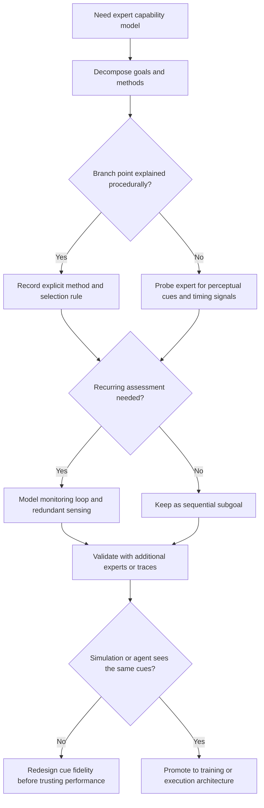

# CTA Capability Modeling Flow

```mermaid
flowchart TD
  A[Need expert capability model] --> B[Decompose goals and methods]
  B --> C{Branch point explained procedurally?}
  C -->|Yes| D[Record explicit method and selection rule]
  C -->|No| E[Probe expert for perceptual cues and timing signals]
  D --> F{Recurring assessment needed?}
  E --> F
  F -->|Yes| G[Model monitoring loop and redundant sensing]
  F -->|No| H[Keep as sequential subgoal]
  G --> I[Validate with additional experts or traces]
  H --> I
  I --> J{Simulation or agent sees the same cues?}
  J -->|No| K[Redesign cue fidelity before trusting performance]
  J -->|Yes| L[Promote to training or execution architecture]
```
