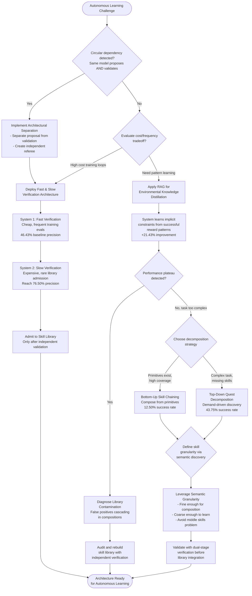

# Autonomous Learning Decision Architecture

```mermaid
flowchart TD
    Start([Autonomous Learning Challenge]) --> DetectCircular{Circular dependency detected?<br/>Same model proposes AND validates}
    
    DetectCircular -->|Yes| ArchSep["Implement Architectural Separation<br/>- Separate proposal from validation<br/>- Create independent referee"]
    DetectCircular -->|No| EvalCost{Evaluate cost/frequency<br/>tradeoff?}
    
    ArchSep --> FastSlow["Deploy Fast & Slow<br/>Verification Architecture"]
    FastSlow --> System1["System 1: Fast Verification<br/>Cheap, frequent training evals<br/>46.43% baseline precision"]
    System1 --> System2["System 2: Slow Verification<br/>Expensive, rare library admission<br/>Reach 76.50% precision"]
    System2 --> LibraryAdmit["Admit to Skill Library<br/>Only after independent validation"]
    
    EvalCost -->|High cost training loops| FastSlow
    EvalCost -->|Need pattern learning| RAG["Apply RAG for<br/>Environmental Knowledge<br/>Distillation"]
    RAG --> RAGLearn["System learns implicit<br/>constraints from successful<br/>reward patterns<br/>+21.43% improvement"]
    RAGLearn --> PerfCheck{Performance plateau<br/>detected?}
    
    PerfCheck -->|Yes| LibContam["Diagnose Library<br/>Contamination<br/>False positives cascading<br/>in compositions"]
    LibContam --> AuditLib["Audit and rebuild<br/>skill library with<br/>independent verification"]
    
    PerfCheck -->|No, task too complex| Decomp{Choose decomposition<br/>strategy}
    
    Decomp -->|Primitives exist,<br/>high coverage| BottomUp["Bottom-Up Skill Chaining<br/>Compose from primitives<br/>12.50% success rate"]
    Decomp -->|Complex task,<br/>missing skills| TopDown["Top-Down Quest<br/>Decomposition<br/>Demand-driven discovery<br/>43.75% success rate"]
    
    BottomUp --> SkillGran{Define skill<br/>granularity via<br/>semantic discovery}
    TopDown --> SkillGran
    
    SkillGran --> SemanticGran["Leverage Semantic Granularity<br/>- Fine enough for composition<br/>- Coarse enough to learn<br/>- Avoid middle skills problem"]
    
    SemanticGran --> Validate["Validate with dual-stage<br/>verification before<br/>library integration"]
    Validate --> Complete([Architecture Ready<br/>for Autonomous Learning])
    
    LibraryAdmit --> Complete
    AuditLib --> Complete
```
