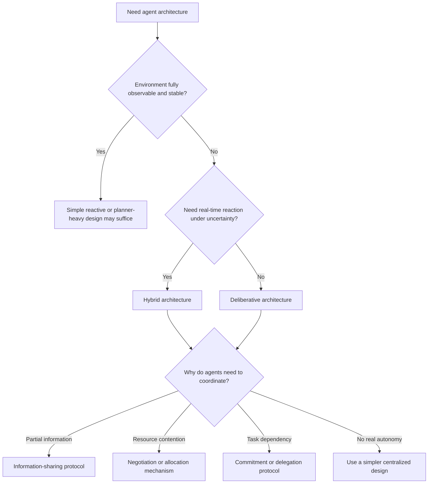

# Wooldridge Multi-Agent Systems

Use this skill when the question is not "how do I make several models talk," but "what kind of autonomous system does this environment force me to build?"

## When to Use

- You must choose between reactive, deliberative, or hybrid agent architectures.
- Coordination keeps failing because no one has complete information or uncontested control.
- Agents need negotiation, allocation, or commitment strategies under uncertainty.
- A design depends on what agents know, what everyone knows, or whether common knowledge is even achievable.
- You need to diagnose whether a "multi-agent" design is actually just asynchronous object orchestration.

## NOT for

- Single-agent planning or optimization problems with no coordination requirement.
- Centralized schedulers where one controller already owns global decision rights.
- Prompt-only roleplay swarms that do not have separate goals, beliefs, or control boundaries.
- General distributed-systems design when agent autonomy and knowledge asymmetry are irrelevant.

## Core Mental Models

### Environment Properties Drive Architecture

Start with observability, determinism, dynamics, and time pressure. Architecture choice is downstream of environment shape, not personal preference for a fashionable agent pattern.

### Autonomy Is Control Inversion

Agents are not just asynchronous objects. They decide whether and when to comply, which means requests need semantics, refusals, and coordination logic rather than implicit obedience.

### Coordination Emerges from Constraint

Partial observability, resource contention, and interdependent goals create coordination pressure. Good protocol design begins by naming that pressure instead of assuming collaboration is always desirable.

### Commitment Strategy Must Match Volatility

Bold agents overcommit in fast-changing environments; cautious agents thrash in stable ones. Reconsideration frequency is a design parameter tied to environment dynamics, not a universal best practice.

### Knowledge Levels Matter

Individual knowledge, everyone-knows, common knowledge, and distributed knowledge are not interchangeable. Asking for the wrong level can make a protocol impossible or wastefully expensive.

## Decision Points

- Characterize the environment before choosing an agent architecture.
- If agents cannot refuse, delay, or reinterpret requests, do not pretend you have agent autonomy.
- Choose knowledge requirements intentionally. Many systems need distributed knowledge, not common knowledge.
- Tune commitment boldness to the environment's change rate and the cost of reconsideration.

## Failure Modes

### Architecture-First Design

Cue: the team wants BDI, debate, or a fancy agent framework before anyone can describe the environment.

Fix: force environment characterization first.

### Anthropomorphic Autonomy

Cue: the design talks about beliefs and desires but cannot map them to local state, observations, or protocol obligations.

Fix: ground mental language in concrete computational state.

### Coordination for Its Own Sake

Cue: communication traffic rises, but no one can explain which environmental pressure requires it.

Fix: identify the actual forcing function and design the minimal protocol that addresses it.

### Hidden Central Controller

Cue: one "agent" silently makes all important choices while the others just execute.

Fix: either admit the architecture is centralized or redistribute genuine decision rights.

### Impossible Knowledge Assumptions

Cue: protocol correctness depends on every agent knowing that every other agent knows a fact, but the network is unreliable.

Fix: relax to distributed knowledge, acknowledgments, or eventual consistency as the environment allows.

## Worked Examples

### Specialist LLM Review Swarm

A coding system uses security, performance, and style agents. Security reviews depend on different evidence than style review, and no single reviewer has global visibility. Use a hybrid coordinator plus targeted information-sharing instead of assuming every reviewer should see the entire context.

### Distributed Vehicle Monitoring

Sensor agents cover overlapping but incomplete regions. Coordination is necessary because no single agent can maintain end-to-end track continuity. Design the protocol around partial observability rather than generic "collaboration."

## Quality Gates

- The environment is characterized explicitly before architecture choice.
- The design names the real source of coordination pressure.
- Knowledge requirements are stated at the right level.
- Commitment strategy is tied to volatility and reconsideration cost.
- Any claimed autonomy includes refusal, delay, or local interpretation of requests.

## Shibboleths

- If someone calls a system multi-agent but every important decision still routes through one controller, they are renaming distributed execution, not designing autonomy.
- If "common knowledge" is used casually with no communication model, the protocol is probably underspecified.
- If the team cannot say why agents must coordinate, the design probably does not need agents at all.

## Reference Routing

- `references/environment-characterization-drives-architecture.md`: load when architecture choice is the main question.
- `references/coordination-as-necessity-not-luxury.md`: load when you must justify or minimize coordination.
- `references/commitment-strategies-and-environment-dynamics.md`: load when boldness or replanning cadence is the main tuning issue.
- `references/grounded-epistemic-logic-for-distributed-agents.md`: load when knowledge claims drive safety or correctness.
- `references/negotiation-and-resource-allocation-mechanisms.md`: load when autonomy collides with scarce resources.
