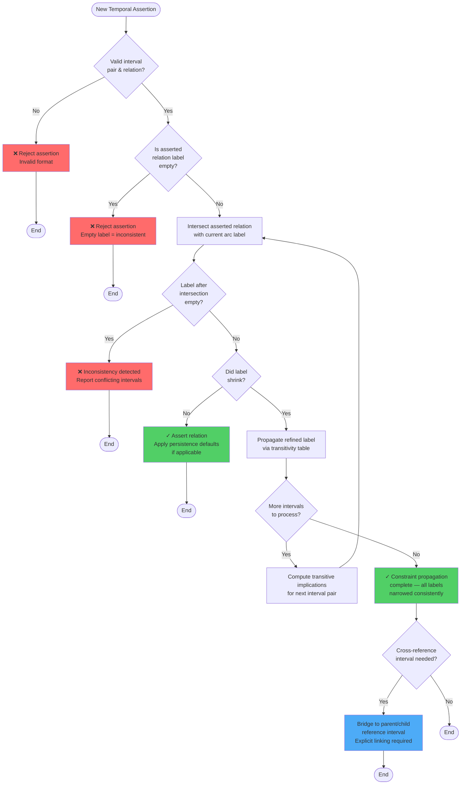

# Temporal Assertion & Constraint Propagation Protocol

```mermaid
flowchart TD
    Start([New Temporal Assertion]) --> Validate{Valid interval<br/>pair & relation?}
    
    Validate -->|No| InvalidError["❌ Reject assertion<br/>Invalid format"]
    InvalidError --> End1([End])
    
    Validate -->|Yes| CheckEmpty{Is asserted<br/>relation label<br/>empty?}
    
    CheckEmpty -->|Yes| EmptyError["❌ Reject assertion<br/>Empty label = inconsistent"]
    EmptyError --> End2([End])
    
    CheckEmpty -->|No| IntersectLabel["Intersect asserted relation<br/>with current arc label"]
    
    IntersectLabel --> LabelResult{Label after<br/>intersection<br/>empty?}
    
    LabelResult -->|Yes| Conflict["❌ Inconsistency detected<br/>Report conflicting intervals"]
    Conflict --> End3([End])
    
    LabelResult -->|No| CheckShrink{Did label<br/>shrink?}
    
    CheckShrink -->|No| Persist["✓ Assert relation<br/>Apply persistence defaults<br/>if applicable"]
    Persist --> End4([End])
    
    CheckShrink -->|Yes| Propagate["Propagate refined label<br/>via transitivity table"]
    
    Propagate --> PropagateLoop{More intervals<br/>to process?}
    
    PropagateLoop -->|Yes| ComputeTransitive["Compute transitive implications<br/>for next interval pair"]
    ComputeTransitive --> IntersectLabel
    
    PropagateLoop -->|No| NarrowComplete["✓ Constraint propagation<br/>complete — all labels<br/>narrowed consistently"]
    
    NarrowComplete --> CrossRef{Cross-reference<br/>interval needed?}
    
    CrossRef -->|Yes| BridgeLevels["Bridge to parent/child<br/>reference interval<br/>Explicit linking required"]
    BridgeLevels --> End5([End])
    
    CrossRef -->|No| End6([End])
    
    style Conflict fill:#ff6b6b
    style InvalidError fill:#ff6b6b
    style EmptyError fill:#ff6b6b
    style Persist fill:#51cf66
    style NarrowComplete fill:#51cf66
    style BridgeLevels fill:#4dabf7
```
