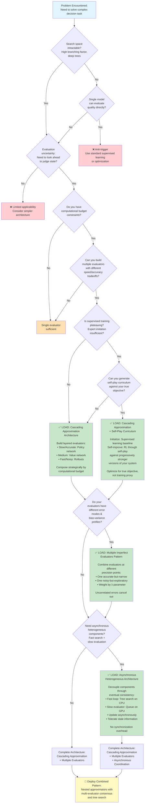

# AlphaGo Decision Framework: When to Apply Architecture Patterns

```mermaid
flowchart TD
    Start["Problem Encountered:<br/>Need to solve complex decision task"] --> Q1{Search space<br/>intractable?<br/>High branching factor,<br/>deep trees}
    
    Q1 -->|No| Q2{Single model<br/>can evaluate<br/>quality directly?}
    Q1 -->|Yes| Q3{Evaluation<br/>uncertainty:<br/>Need to look ahead<br/>to judge state?}
    
    Q2 -->|Yes| Anti["❌ Anti-trigger<br/>Use standard supervised learning<br/>or optimization"]
    Q2 -->|No| Q3
    
    Q3 -->|No| Anti2["❌ Limited applicability<br/>Consider simpler architecture"]
    Q3 -->|Yes| Q4{Do you have<br/>computational budget<br/>constraints?}
    
    Q4 -->|No| Single["Single evaluator<br/>sufficient"]
    Q4 -->|Yes| Q5{Can you build<br/>multiple evaluators<br/>with different<br/>speed/accuracy<br/>tradeoffs?}
    
    Q5 -->|No| Single
    Q5 -->|Yes| Q6{Is supervised training<br/>plateauing?<br/>Expert imitation<br/>insufficient?}
    
    Q6 -->|No| Pattern1["✅ LOAD: Cascading Approximation<br/>Architecture<br/><br/>Build layered evaluators:<br/>• Slow/Accurate: Policy network<br/>• Medium: Value network<br/>• Fast/Noisy: Rollouts<br/><br/>Compose strategically by<br/>computational budget"]
    
    Q6 -->|Yes| Q7{Can you generate<br/>self-play curriculum<br/>against your true<br/>objective?}
    
    Q7 -->|No| Pattern1
    Q7 -->|Yes| Pattern2["✅ LOAD: Cascading Approximation<br/>+ Self-Play Curriculum<br/><br/>Initialize: Supervised learning baseline<br/>Self-improve: RL through self-play<br/>against progressively stronger<br/>versions of your system<br/><br/>Optimize for true objective,<br/>not training proxy"]
    
    Pattern1 --> Q8{Do your<br/>evaluators have<br/>different error<br/>modes &<br/>bias-variance<br/>profiles?}
    
    Pattern2 --> Q8
    
    Q8 -->|No| Q9{Need asynchronous<br/>heterogeneous<br/>components?<br/>Fast search +<br/>slow evaluation}
    
    Q8 -->|Yes| Pattern3["✅ LOAD: Multiple Imperfect<br/>Evaluators Pattern<br/><br/>Combine evaluators at different<br/>precision points:<br/>• One accurate-but-narrow<br/>• One noisy-but-exploratory<br/>• Weight by λ parameter<br/><br/>Uncorrelated errors cancel out"]
    
    Q9 -->|No| Complete1["Complete Architecture:<br/>Cascading Approximation<br/>+ Multiple Evaluators"]
    Q9 -->|Yes| Pattern4["✅ LOAD: Asynchronous<br/>Heterogeneous Architecture<br/><br/>Decouple components through<br/>eventual consistency:<br/>• Fast loop: Tree search on CPU<br/>• Slow evaluator: Queue on GPU<br/>• Update asynchronously<br/>• Tolerate stale information<br/><br/>No synchronization overhead"]
    
    Pattern3 --> Q9
    Pattern4 --> Complete2["Complete Architecture:<br/>Cascading Approximation<br/>+ Multiple Evaluators<br/>+ Asynchronous Coordination"]
    
    Complete1 --> Deploy["🎯 Deploy Combined Pattern:<br/>Nested approximators with<br/>multi-evaluator consensus<br/>and tree search"]
    Complete2 --> Deploy
    
    style Start fill:#e1f5ff
    style Anti fill:#ffcdd2
    style Anti2 fill:#ffcdd2
    style Pattern1 fill:#c8e6c9
    style Pattern2 fill:#c8e6c9
    style Pattern3 fill:#c8e6c9
    style Pattern4 fill:#c8e6c9
    style Deploy fill:#fff9c4
    style Single fill:#ffe0b2
```
