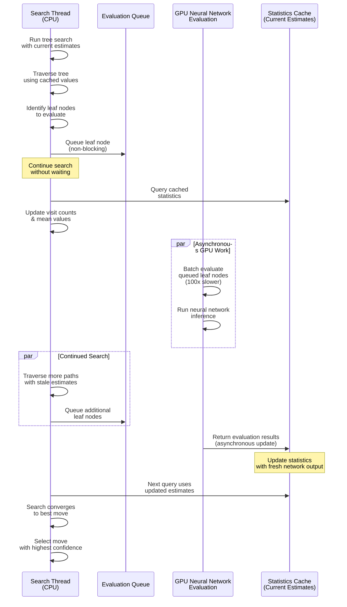

# AlphaGo Asynchronous Heterogeneous Architecture: CPU Search + GPU Evaluation

```mermaid
sequenceDiagram
    participant SearchThread as Search Thread<br/>(CPU)
    participant SearchQueue as Evaluation Queue
    participant GPUEval as GPU Neural Network<br/>Evaluation
    participant StatCache as Statistics Cache<br/>(Current Estimates)
    
    SearchThread->>SearchThread: Run tree search<br/>with current estimates
    SearchThread->>SearchThread: Traverse tree<br/>using cached values
    SearchThread->>SearchThread: Identify leaf nodes<br/>to evaluate
    
    SearchThread->>SearchQueue: Queue leaf node<br/>(non-blocking)
    Note over SearchThread: Continue search<br/>without waiting
    
    SearchThread->>StatCache: Query cached<br/>statistics
    SearchThread->>SearchThread: Update visit counts<br/>& mean values
    
    par Asynchronous GPU Work
        GPUEval->>GPUEval: Batch evaluate<br/>queued leaf nodes<br/>(100x slower)
        GPUEval->>GPUEval: Run neural network<br/>inference
    end
    
    par Continued Search
        SearchThread->>SearchThread: Traverse more paths<br/>with stale estimates
        SearchThread->>SearchQueue: Queue additional<br/>leaf nodes
    end
    
    GPUEval->>StatCache: Return evaluation results<br/>(asynchronous update)
    Note over StatCache: Update statistics<br/>with fresh network output
    
    SearchThread->>StatCache: Next query uses<br/>updated estimates
    SearchThread->>SearchThread: Search converges<br/>to best move
    
    SearchThread->>SearchThread: Select move<br/>with highest confidence
```
