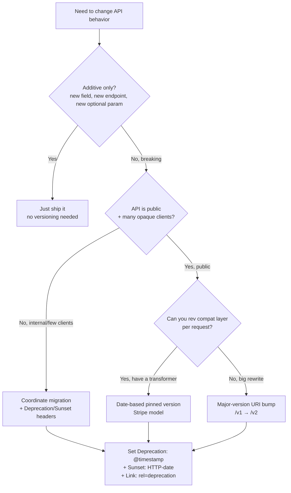

# API Versioning Strategy

> **TL;DR**: Date-based versions pinned per API key (Stripe's model) beat `/v1/`, `/v2/` for long-lived public APIs because they let you make small breaking changes without forcing clients onto a new tree. For internal APIs, additive evolution + the `Deprecation` and `Sunset` headers (RFC 9745, RFC 8594) is usually enough. Always announce, always sunset on a date, never just remove.

---

## Jump to your fire

| Symptom | Section |
|---|---|
| "Need to break a field but have 100k API keys" | [Date-pinned versions](#1-date-based-pinned-versions-stripes-model) |
| "Should I do `/v1/` vs `Accept: application/vnd.foo.v2+json`?" | [Strategy comparison](#2-versioning-strategy-comparison) |
| "How do I tell clients an endpoint is going away?" | [Deprecation + Sunset](#3-the-deprecationsunset-header-pair) |
| "Maintaining 6 versions in code is killing us" | [Version transformers](#4-the-version-transformer-pattern) |
| "Internal API — do we even need versioning?" | [Internal vs public](#5-internal-vs-public-apis) |

---

## Decision diagram



---

## 1. Date-based pinned versions (Stripe's model)

Stripe published its architecture in [API versioning at Stripe](https://stripe.com/blog/api-versioning):

> The first time a user makes an API request, their account is automatically pinned to the most recent version available, and from then on, every API call they make is assigned that version implicitly.

> [Versions are] rolling versions that are named with the date they're released (for example, `2017-05-24`).

The key properties:

| Property | Why it works |
|---|---|
| **Per-account default version** (set on first call) | New customers automatically pinned to latest; existing customers don't break when you ship a change |
| **`Stripe-Version` header overrides** the pin per-request | Allows gradual client migration: SDK can opt-in to a new version before the account does |
| **Date-based names** (`2024-04-10`) | Conveys recency; no debate about what "v3" means; allows arbitrarily many small breaks instead of saving them up for a big-bang `v3` |
| **Dashboard upgrade path** | Customer can preview the diff, then upgrade their account-default version |

This is the *only* approach that scales to truly long-lived public APIs (Stripe has versions going back a decade). It costs you internal complexity (the transformer pattern in §4) but spares your customers the perpetual `/v1/` → `/v2/` migration cycle.

---

## 2. Versioning strategy comparison

| Strategy | Where the version lives | Pro | Con | Best for |
|---|---|---|---|---|
| **URI segment** (`/v1/`, `/v2/`) | Path | Cache-friendly (different URL = different cache entry); zero client config | Can't make small breaks; forces a tree fork; URLs are no longer "stable resource identifiers" (per Fielding) | Internal APIs, public APIs that rarely break |
| **Custom header** (`Stripe-Version: 2024-04-10`) | Request header | Tons of versions cheap; per-request granularity | Can't share URLs with version baked in; harder to test in browser address bar | Public APIs at scale |
| **Accept media-type** (`Accept: application/vnd.foo.v2+json`) | Standard `Accept` header | "Spec-correct" per HTTP; reuses content negotiation machinery | Awkward to set; tooling support varies; debugging via curl is verbose | Hypermedia APIs, deeply RESTful designs |
| **Query parameter** (`?version=2`) | URL | Easy to test; visible in logs | Pollutes URL; semantically wrong (version isn't a resource property) | Rapid prototyping only |
| **No versioning, additive only** | n/a | Zero overhead; no client coordination | Can never make a breaking change without a new endpoint | Internal microservices with shared deploy |

**Pick by selecting your constraint:**
- *"We make tiny breaks frequently"* → date-based header (Stripe)
- *"We do a big rewrite every 5 years"* → URI segment (`/v1/`, `/v2/`)
- *"We never break, only add"* → no versioning + additive evolution

---

## 3. The Deprecation/Sunset header pair

Two IETF RFCs cover the lifecycle signal:

### `Sunset` header — [RFC 8594](https://datatracker.ietf.org/doc/html/rfc8594)

> The Sunset value is an HTTP-date timestamp, as defined in Section 7.1.1.1 of [RFC7231], and SHOULD be a timestamp in the future.

```http
Sunset: Sat, 31 Dec 2026 23:59:59 GMT
```

Indicates "the resource is expected to become unresponsive at a specific point in the future." Clients SHOULD treat the timestamp as a hint, not a hard contract.

### `Deprecation` header — [RFC 9745](https://datatracker.ietf.org/doc/html/rfc9745)

```http
Deprecation: @1735689599
Sunset: Sun, 31 Dec 2026 23:59:59 GMT
Link: <https://api.example.com/docs/migrate-v1-to-v2>; rel="deprecation"
```

The `Deprecation` value is a Unix timestamp (seconds, prefixed with `@` per Structured Fields). It can be in the past ("already deprecated") or future ("will be deprecated"). The MUSTs:

- **MUST use the structured-field date format** per RFC 9651
- **`Sunset` MUST NOT be earlier than `Deprecation`** — the spec is explicit; it's a temporal ordering constraint
- **SHOULD include a `Link` with `rel="deprecation"`** pointing to migration docs

The act of sending `Deprecation` does *not* change the resource's behavior — it's a signal, not a degradation. Servers SHOULD keep the resource functional through the `Sunset` date (modulo emergencies).

### Recommended timeline

```
T+0      First Deprecation: header sent in production
T+30d    Public announcement (changelog, email, docs)
T+90d    Add response logs / metrics on usage of deprecated path
T+180d   Sunset date set 90 days out
T+270d   Sunset date arrives — endpoint returns 410 Gone with migration link
```

For minor breaking changes on a major-version-pinned API: 6 months is the median. For full v1 → v2 sunsets: 12-24 months.

---

## 4. The version-transformer pattern

Stripe's internal architecture solves the "we have 50 versions in production" problem:

> [The system uses] **API resource classes** that define current API response structures, combined with **version change modules** that encapsulate backwards-incompatible transformations. When processing responses, the system **walks back through time and applies each version change module that it finds along the way until that target version is reached**.

The shape:

```ts
// resource: the canonical (latest) representation
const charge = {
  id: 'ch_123',
  amount: 1000,
  payment_method_details: { card: { brand: 'visa', last4: '4242' } },
}

// Each breaking change is one transformer module:
const v_2024_03_01 = {
  // Removes 'card' nesting under payment_method_details, flattens fields
  apply(resource) {
    return {
      ...resource,
      card_brand: resource.payment_method_details?.card?.brand,
      card_last4: resource.payment_method_details?.card?.last4,
    }
  },
}

const v_2023_10_15 = {
  // Renames 'amount' to 'amount_cents'
  apply(resource) {
    const { amount, ...rest } = resource
    return { ...rest, amount_cents: amount }
  },
}

// Pipeline applies transformers in reverse-chronological order
// until requested version is reached
function transform(resource, requestedVersion) {
  const chain = transformers.filter(t => t.date > requestedVersion)
  return chain.reduceRight((r, t) => t.apply(r), resource)
}
```

The wins:

- **Core code stays modern** — every endpoint is written against the latest schema; no `if (version < ...)` sprinkled through business logic.
- **Each break is one file** — easy to review, easy to test in isolation, easy to delete when the last user pins past it.
- **Telemetry** — you can count which transformers fire per day to plan deprecations against actual usage.

The cost: building the transformer framework. Worth it if you have >3 breaking changes per year and >10k API consumers; overkill for a <50-customer internal API.

---

## 5. Internal vs public APIs

The asymmetry matters:

| | Internal | Public |
|---|---|---|
| Coordinated deploy possible? | Yes — atomic swap | No — clients deploy independently |
| Schema evolution | Additive + Slack message | Strict versioning + email + dashboards + blog post |
| Sunset window | Days to weeks | 6-24 months |
| Versioning need | Often none — just `Deprecation` headers | Mandatory |
| Best strategy | Additive evolution; URI version only on rewrite | Date-pinned headers (if scale warrants), URI for major rewrites |

**The trap**: companies treat all APIs as "public" and build the heavy versioning infrastructure for an API used only by 3 internal services. The reverse trap: a leaked internal API has external consumers and you can't actually break it.

Defense: make "public" a binary tag on the service. Public services get the full versioning ceremony; internal services don't, but get aggressive monitoring of who's calling them.

---

## Anti-patterns

| Anti-pattern | Why it bites | Fix |
|---|---|---|
| Bumping `/v1/` to `/v2/` for one breaking change | Forces clients to migrate everything for one field | Date-based version OR additive evolution |
| Removing endpoints with no `Sunset` header | Clients break with no warning; support tickets explode | Always pair removal with `Deprecation` 90+ days prior |
| Sending `Deprecation` but no `Link` | Clients know it's deprecated but not what to do | Always include `Link: <migration-doc>; rel="deprecation"` |
| Per-customer hardcoded version exemptions | Becomes unmaintainable; can't reason about behavior | Use the transformer pattern; "exemptions" become version pins |
| Versioning internal APIs like public ones | Process overhead with no payoff | Additive evolution + atomic deploys + Slack |
| Using semver (`v1.2.3`) on REST APIs | Implies meaning that doesn't apply (what's a "patch" to a JSON schema?) | Date-based names or major-only (`v1`) |
| Sunset date with no enforcement | Endpoint lives forever, code rots | Calendar reminder; CI test that fails 7 days before sunset to force action |

---

## Novice / Expert / Timeline

| | Novice | Expert |
|---|---|---|
| **First breaking change** | Bumps `/v1` to `/v2`, copy-pastes whole tree | Considers date-based pin, evaluates whether change is actually breaking |
| **Telling clients about deprecation** | Email blast | `Deprecation` + `Sunset` headers + Link + email + dashboard banner |
| **Maintaining 5 versions** | 5 if/else branches in every controller | Transformer modules, latest-only core code |
| **Sunset enforcement** | "We'll get to it" | Sunset date in CI; endpoint becomes 410 Gone on the date |
| **Internal API change** | Same ceremony as public — slow | Additive evolution + atomic deploy; reserves heavy process for public |

**Timeline test**: how long does it take from "we want to remove field X" to "field X is gone in production"? An expert org has a single repeatable answer (e.g., 90 days). A novice org has no answer because there's no process.

---

## Quality gates

A versioning change ships when:

- [ ] **Test:** Removing or renaming any externally-visible field is gated on a deprecation announcement at least N days old (where N is the documented sunset window).
- [ ] **Test:** Every deprecated endpoint sends `Deprecation: @<unix-ts>` and `Sunset: <HTTP-date>` headers, verified in an integration test.
- [ ] **Test:** `Sunset` value is never earlier than `Deprecation` value (per RFC 9745 MUST).
- [ ] **Test:** Every deprecation announcement includes a `Link: <docs-url>; rel="deprecation"` header AND a public migration doc that exists at that URL (HEAD check in CI).
- [ ] **Test:** Usage telemetry per version exists — you can answer "how many requests on the v2 path yesterday?" before you delete v2.
- [ ] **Test (date-pinned only):** New API keys default to the latest version; existing keys hold their pin across deploys.
- [ ] **Manual:** Sunset enforcement plan: a calendar reminder, a CI check, or an automated 410 Gone — *something* fires when the date arrives.

---

## NOT for this skill

- GraphQL schema evolution (use `graphql-schema-evolution`)
- gRPC / Protobuf wire-compatibility (use `protobuf-evolution-rules`)
- Database schema versioning (use `zero-downtime-database-migration`)
- Library / SDK semver (use `npm-package-versioning`)
- Event-stream schema evolution (use `kafka-schema-registry-design`)

---

## Sources

- Stripe: [API versioning at Stripe](https://stripe.com/blog/api-versioning) — pinned date-based versions, transformer pattern
- Stripe API: [Idempotent requests / versioning policy](https://stripe.com/docs/api/versioning)
- IETF: [RFC 8594 — The Sunset HTTP Header Field](https://datatracker.ietf.org/doc/html/rfc8594)
- IETF: [RFC 9745 — The Deprecation HTTP Header Field](https://datatracker.ietf.org/doc/html/rfc9745)
- IETF: [RFC 9651 — Structured Field Values for HTTP](https://datatracker.ietf.org/doc/html/rfc9651) (date format for Deprecation header)
- Roy Fielding: [REST APIs must be hypertext-driven](https://roy.gbiv.com/untangled/2008/rest-apis-must-be-hypertext-driven) — the canonical argument against URI versioning
