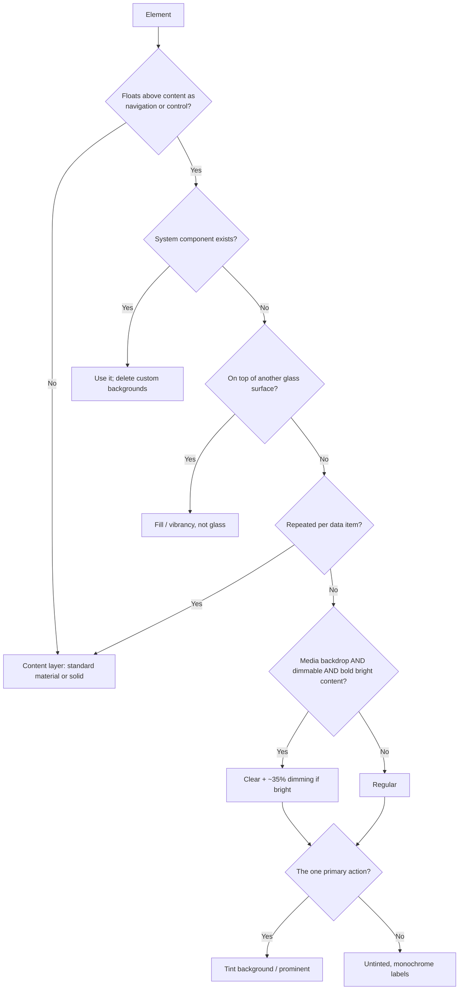

# Glass or not

```mermaid
flowchart TD
  A[Element] --> B{Floats above content as<br/>navigation or control?}
  B -->|No| C[Content layer: standard material or solid]
  B -->|Yes| D{System component exists?}
  D -->|Yes| E[Use it; delete custom backgrounds]
  D -->|No| F{On top of another glass surface?}
  F -->|Yes| G[Fill / vibrancy, not glass]
  F -->|No| H{Repeated per data item?}
  H -->|Yes| C
  H -->|No| I{Media backdrop AND dimmable AND bold bright content?}
  I -->|Yes| J[Clear + ~35% dimming if bright]
  I -->|No| K[Regular]
  J --> L{The one primary action?}
  K --> L
  L -->|Yes| M[Tint background / prominent]
  L -->|No| N[Untinted, monochrome labels]
```
