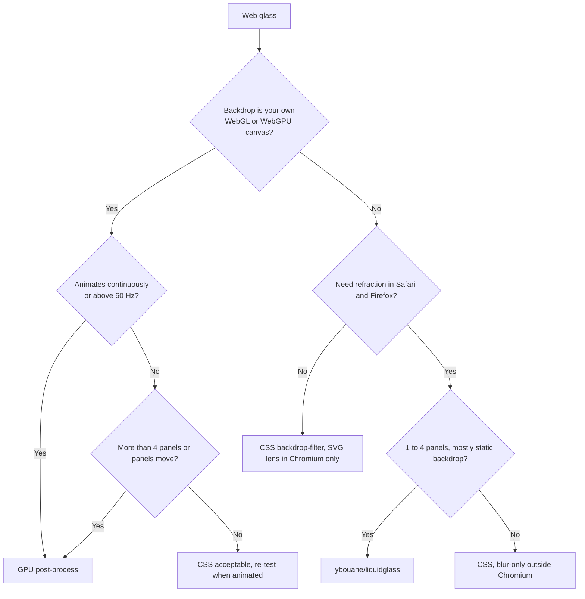

# Web route

```mermaid
flowchart TD
  A[Web glass] --> B{Backdrop is your own<br/>WebGL or WebGPU canvas?}
  B -->|Yes| C{Animates continuously<br/>or above 60 Hz?}
  C -->|Yes| GPU[GPU post-process]
  C -->|No| D{More than 4 panels or panels move?}
  D -->|Yes| GPU
  D -->|No| CSS1[CSS acceptable, re-test when animated]
  B -->|No| E{Need refraction in Safari and Firefox?}
  E -->|No| CSS[CSS backdrop-filter, SVG lens in Chromium only]
  E -->|Yes| F{1 to 4 panels, mostly static backdrop?}
  F -->|Yes| LIB[ybouane/liquidglass]
  F -->|No| CSS2[CSS, blur-only outside Chromium]
```
