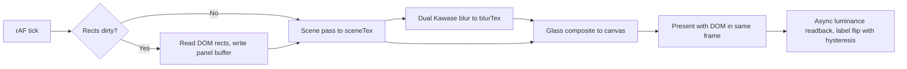

# GPU glass pipeline (one frame)

```mermaid
flowchart LR
  R[rAF tick] --> U{Rects dirty?}
  U -->|Yes| W[Read DOM rects, write panel buffer]
  U -->|No| S
  W --> S[Scene pass to sceneTex]
  S --> K[Dual Kawase blur to blurTex]
  K --> G[Glass composite to canvas]
  S --> G
  G --> P[Present with DOM in same frame]
  P --> L[Async luminance readback, label flip with hysteresis]
```
