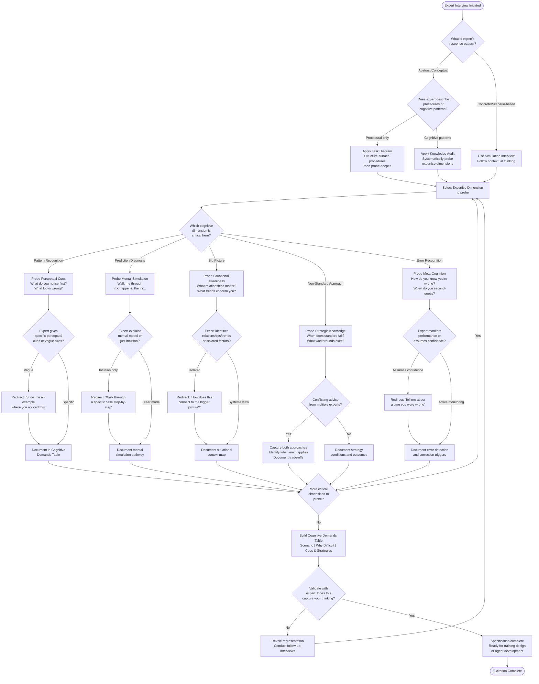

# ACTA Elicitation Protocol Decision Tree

```mermaid
flowchart TD
    Start([Expert Interview Initiated]) --> InitQ{What is expert's<br/>response pattern?}
    
    InitQ -->|Abstract/Conceptual| CheckProc{Does expert describe<br/>procedures or<br/>cognitive patterns?}
    InitQ -->|Concrete/Scenario-based| UseSimInt[Use Simulation Interview<br/>Follow contextual thinking]
    
    CheckProc -->|Procedural only| TaskDiag["Apply Task Diagram<br/>Structure surface procedures<br/>then probe deeper"]
    CheckProc -->|Cognitive patterns| KnowAudit["Apply Knowledge Audit<br/>Systematically probe<br/>expertise dimensions"]
    
    TaskDiag --> DimProbe["Select Expertise Dimension<br/>to probe"]
    KnowAudit --> DimProbe
    UseSimInt --> DimProbe
    
    DimProbe --> WhichDim{Which cognitive<br/>dimension is<br/>critical here?}
    
    WhichDim -->|Pattern Recognition| PercepProbe["Probe Perceptual Cues<br/>What do you notice first?<br/>What looks wrong?"]
    WhichDim -->|Prediction/Diagnosis| SimProbe["Probe Mental Simulation<br/>Walk me through<br/>if X happens, then Y..."]
    WhichDim -->|Big Picture| SitAwareProbe["Probe Situational Awareness<br/>What relationships matter?<br/>What trends concern you?"]
    WhichDim -->|Non-Standard Approach| StratProbe["Probe Strategic Knowledge<br/>When does standard fail?<br/>What workarounds exist?"]
    WhichDim -->|Error Recognition| MetaProbe["Probe Meta-Cognition<br/>How do you know you're wrong?<br/>When do you second-guess?"]
    
    PercepProbe --> ResponseCheck{Expert gives<br/>specific perceptual<br/>cues or vague rules?}
    ResponseCheck -->|Vague| Redirect1["Redirect: 'Show me an example<br/>where you noticed this'"]
    ResponseCheck -->|Specific| Document1["Document in Cognitive<br/>Demands Table"]
    
    SimProbe --> ResponseCheck2{Expert explains<br/>mental model or<br/>just intuition?}
    ResponseCheck2 -->|Intuition only| Redirect2["Redirect: 'Walk through<br/>a specific case step-by-step'"]
    ResponseCheck2 -->|Clear model| Document2["Document mental<br/>simulation pathway"]
    
    SitAwareProbe --> ResponseCheck3{Expert identifies<br/>relationships/trends<br/>or isolated factors?}
    ResponseCheck3 -->|Isolated| Redirect3["Redirect: 'How does this<br/>connect to the bigger picture?'"]
    ResponseCheck3 -->|Systems view| Document3["Document situational<br/>context map"]
    
    StratProbe --> ResponseCheck4{Conflicting advice<br/>from multiple experts?}
    ResponseCheck4 -->|Yes| Conflict["Capture both approaches<br/>Identify when each applies<br/>Document trade-offs"]
    ResponseCheck4 -->|No| Document4["Document strategy<br/>conditions and outcomes"]
    
    MetaProbe --> ResponseCheck5{Expert monitors<br/>performance or<br/>assumes confidence?}
    ResponseCheck5 -->|Assumes confidence| Redirect4["Redirect: 'Tell me about<br/>a time you were wrong'"]
    ResponseCheck5 -->|Active monitoring| Document5["Document error detection<br/>and correction triggers"]
    
    Redirect1 --> Document1
    Redirect2 --> Document2
    Redirect3 --> Document3
    Redirect4 --> Document5
    
    Document1 --> NextDim{More critical<br/>dimensions to<br/>probe?}
    Document2 --> NextDim
    Document3 --> NextDim
    Document4 --> NextDim
    Document5 --> NextDim
    Conflict --> NextDim
    
    NextDim -->|Yes| DimProbe
    NextDim -->|No| BuildTable["Build Cognitive Demands Table<br/>Scenario | Why Difficult | Cues & Strategies"]
    
    BuildTable --> Validate{Validate with<br/>expert: Does this<br/>capture your thinking?}
    
    Validate -->|No| Revise["Revise representation<br/>Conduct follow-up interviews"]
    Validate -->|Yes| Complete["Specification complete<br/>Ready for training design<br/>or agent development"]
    
    Revise --> DimProbe
    Complete --> End([Elicitation Complete])
```
