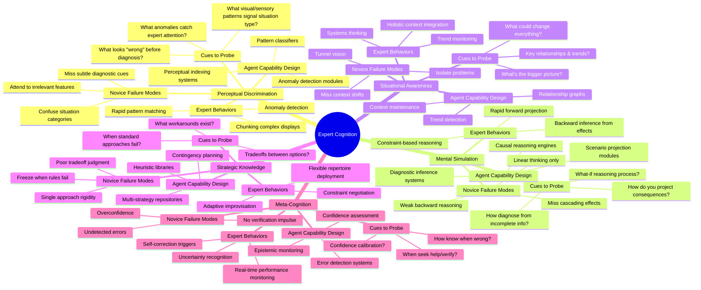

# Cognitive Dimensions of Expertise Framework

```mermaid
mindmap
  root((Expert Cognition))
    Perceptual Discrimination
      Cues to Probe
        What visual/sensory patterns signal situation type?
        What anomalies catch expert attention?
        What looks "wrong" before diagnosis?
      Expert Behaviors
        Rapid pattern matching
        Anomaly detection
        Chunking complex displays
      Agent Capability Design
        Pattern classifiers
        Anomaly detection modules
        Perceptual indexing systems
      Novice Failure Modes
        Miss subtle diagnostic cues
        Attend to irrelevant features
        Confuse situation categories
    
    Mental Simulation
      Cues to Probe
        How do you project consequences?
        What-if reasoning process?
        How diagnose from incomplete info?
      Expert Behaviors
        Rapid forward projection
        Constraint-based reasoning
        Backward inference from effects
      Agent Capability Design
        Causal reasoning engines
        Scenario projection modules
        Diagnostic inference systems
      Novice Failure Modes
        Linear thinking only
        Miss cascading effects
        Weak backward reasoning
    
    Situational Awareness
      Cues to Probe
        What's the bigger picture?
        Key relationships & trends?
        What could change everything?
      Expert Behaviors
        Systems thinking
        Trend monitoring
        Holistic context integration
      Agent Capability Design
        Relationship graphs
        Trend detection
        Context maintenance
      Novice Failure Modes
        Tunnel vision
        Miss context shifts
        Isolate problems
    
    Strategic Knowledge
      Cues to Probe
        When standard approaches fail?
        What workarounds exist?
        Tradeoffs between options?
      Expert Behaviors
        Flexible repertoire deployment
        Adaptive improvisation
        Constraint negotiation
      Agent Capability Design
        Multi-strategy repositories
        Contingency planning
        Heuristic libraries
      Novice Failure Modes
        Single approach rigidity
        Freeze when rules fail
        Poor tradeoff judgment
    
    Meta-Cognition
      Cues to Probe
        How know when wrong?
        Confidence calibration?
        When seek help/verify?
      Expert Behaviors
        Real-time performance monitoring
        Uncertainty recognition
        Self-correction triggers
      Agent Capability Design
        Confidence assessment
        Error detection systems
        Epistemic monitoring
      Novice Failure Modes
        Overconfidence
        Undetected errors
        No verification impulse
```
