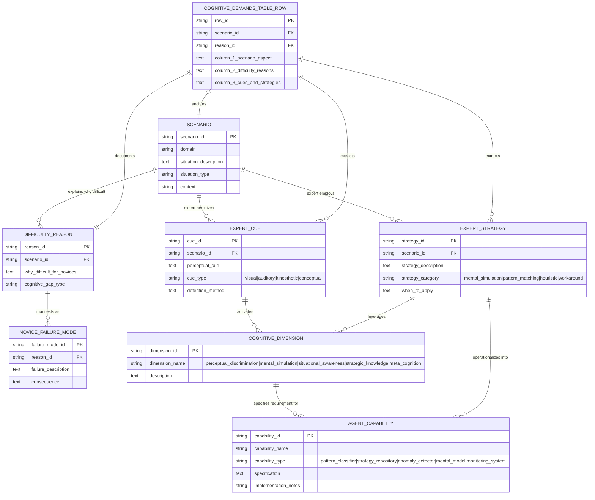

# Cognitive Demands Table Schema & Relationships

```mermaid
erDiagram
    SCENARIO ||--o{ DIFFICULTY_REASON : "explains why difficult"
    SCENARIO ||--o{ EXPERT_CUE : "expert perceives"
    SCENARIO ||--o{ EXPERT_STRATEGY : "expert employs"
    DIFFICULTY_REASON ||--o{ NOVICE_FAILURE_MODE : "manifests as"
    EXPERT_CUE ||--o{ COGNITIVE_DIMENSION : "activates"
    EXPERT_STRATEGY ||--o{ COGNITIVE_DIMENSION : "leverages"
    COGNITIVE_DIMENSION ||--o{ AGENT_CAPABILITY : "specifies requirement for"
    EXPERT_STRATEGY ||--o{ AGENT_CAPABILITY : "operationalizes into"
    COGNITIVE_DEMANDS_TABLE_ROW ||--|| SCENARIO : "anchors"
    COGNITIVE_DEMANDS_TABLE_ROW ||--|| DIFFICULTY_REASON : "documents"
    COGNITIVE_DEMANDS_TABLE_ROW ||--o{ EXPERT_CUE : "extracts"
    COGNITIVE_DEMANDS_TABLE_ROW ||--o{ EXPERT_STRATEGY : "extracts"

    SCENARIO {
        string scenario_id PK
        string domain
        text situation_description
        string situation_type
        string context
    }

    DIFFICULTY_REASON {
        string reason_id PK
        string scenario_id FK
        text why_difficult_for_novices
        string cognitive_gap_type
    }

    EXPERT_CUE {
        string cue_id PK
        string scenario_id FK
        text perceptual_cue
        string cue_type "visual|auditory|kinesthetic|conceptual"
        text detection_method
    }

    EXPERT_STRATEGY {
        string strategy_id PK
        string scenario_id FK
        text strategy_description
        string strategy_category "mental_simulation|pattern_matching|heuristic|workaround"
        text when_to_apply
    }

    COGNITIVE_DIMENSION {
        string dimension_id PK
        string dimension_name "perceptual_discrimination|mental_simulation|situational_awareness|strategic_knowledge|meta_cognition"
        text description
    }

    NOVICE_FAILURE_MODE {
        string failure_mode_id PK
        string reason_id FK
        text failure_description
        text consequence
    }

    AGENT_CAPABILITY {
        string capability_id PK
        string capability_name
        string capability_type "pattern_classifier|strategy_repository|anomaly_detector|mental_model|monitoring_system"
        text specification
        string implementation_notes
    }

    COGNITIVE_DEMANDS_TABLE_ROW {
        string row_id PK
        string scenario_id FK
        string reason_id FK
        text column_1_scenario_aspect
        text column_2_difficulty_reasons
        text column_3_cues_and_strategies
    }
```
