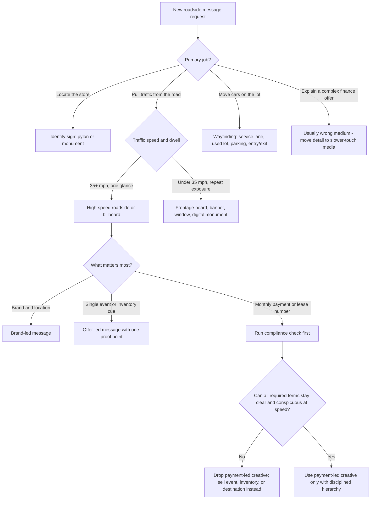

# Automotive Dealer Roadside Signage

Design roadside signs for people who are moving, distracted, and deciding fast. For dealers, that means every concept has to survive two filters at once:

1. Driver cognition and legibility at speed
2. Dealer advertising truthfulness when price, payment, or lease language appears

Your default stance: compress the message harder than the client wants, then defend that compression with visibility, actionability, and compliance.

## Decision Points

### Primary Format Triage

### Message Hierarchy Rules

Use this priority order unless the brief gives a compelling reason not to:

1. `Destination`: who or where is being advertised
2. `Single offer`: one event, one inventory claim, one service promise, or one proof point
3. `Action cue`: next exit, next right, call, QR only in pedestrian contexts, or visit today

If the concept needs a fourth layer to make sense, the medium is probably wrong or the message is still too broad.

### Dealer-Specific Choice Rules

If the dealership objective is:

- `Top-of-funnel awareness` -> use brand, store name, vehicle class, and location
- `Weekend event or inventory push` -> use one concrete hook: "CERTIFIED USED", "TRUCK MONTH", "OVER 150 USED CARS", or similar
- `Service retention` -> use service benefit plus direction, not general dealership branding
- `Finance or lease offer` -> treat compliance as a go/no-go gate, not a footer exercise

### Payment and Lease Red Flags

If the design mentions any of the following, stop and load `references/auto-ad-compliance.md` before finalizing:

- down payment or due-at-signing amount
- number of payments or repayment period
- monthly payment amount
- finance charge
- lease payment
- capitalized cost reduction
- "no money down" or similar financing phrase

## Failure Modes

### Offer Soup
**Symptoms**: APR, rebate, trade bonus, inventory count, and service promo all fighting on one board.  
**Detection**: More than one primary claim or more than two message elements.  
**Fix**: Keep one offer per face. Turn the rest into a campaign sequence across multiple boards or formats.

### Wrong Sign Type For The Job
**Symptoms**: Trying to make a pylon sign function like a flyer, or making lot wayfinding carry a sales pitch.  
**Detection**: The viewer must decode more than "where", "what", or "turn here" in one glance.  
**Fix**: Separate identity, promotion, and wayfinding into distinct signs.

### Payment-Led Billboard Trap
**Symptoms**: Billboard headline is "$299/mo" but the legally required context is too small to read at speed.  
**Detection**: Trigger terms appear, but the design cannot keep required terms clear and conspicuous.  
**Fix**: Remove the payment-led claim from the high-speed board. Sell the event, model family, or destination instead.

### Beautiful But Illegible
**Symptoms**: thin fonts, script lettering, low contrast, hero vehicle image with no focal point.  
**Detection**: Hard to read from a parking-lot mock test or from the expected approach distance.  
**Fix**: Use blunt type, stronger contrast, larger numerals, and one focal image or none.

### Parallel-Wall Visibility Miss
**Symptoms**: Building-mounted wall sign disappears until the driver is already passing the store.  
**Detection**: Sign is parallel to the road and sized like a perpendicular sign.  
**Fix**: Increase size significantly or move to perpendicular/monument placement. Load `references/roadside-legibility-and-placement.md`.

### Lot Confusion
**Symptoms**: customers miss service check-in, used inventory, or exit flow because directional signs also try to advertise.  
**Detection**: arrows and lane labels compete with promo copy.  
**Fix**: Treat on-lot wayfinding as operational signage first, advertising second.

## Worked Examples

### Example 1: Certified Used Event On A 45 MPH Arterial

**Brief**: "Honda dealer wants a roadside board for a weekend certified-used event."  

**Step 1 - Read the road context**: 45-50 mph traffic means high-speed viewing. The message must be read from far enough away for a driver to react.  
**Step 2 - Pick the job**: This is not a finance explanation. It is an event pull.  
**Step 3 - Compress the offer**: Use one proof point only. Good candidates: "CERTIFIED USED HONDAS" or "150+ USED CARS".  
**Step 4 - Build hierarchy**:

- Line 1: `CERTIFIED USED HONDAS`
- Line 2: `THIS WEEKEND`
- Line 3: `NEXT RIGHT`

**Why this works**: It tells the driver what the store is offering, why now, and what to do next.  
**What to reject**: "CERTIFIED USED HONDAS / $0 DOWN / LOW APR / BAD CREDIT OK / TRADE BONUS / NEXT RIGHT." That is not one sign; it is six competing ads pretending to be one.

### Example 2: Dealer Wants A "$299/Month Lease" Billboard

**Brief**: "Toyota dealer wants a highway billboard for a RAV4 lease special at $299/month."  

**Step 1 - Compliance gate**: A lease payment amount is a triggering term. That forces additional lease disclosures.  
**Step 2 - Medium check**: Highway billboard dwell time is too short to carry all required lease terms clearly and conspicuously.  
**Step 3 - Expert decision**: Do not lead the high-speed billboard with the payment amount.  
**Step 4 - Reframe the roadside message**:

- Billboard: `RAV4 LEASE EVENT / SMITH TOYOTA / NEXT EXIT`
- Frontage board, landing page, VDP, or slower-touch media: the full compliant payment stack

**Why this works**: The billboard becomes a destination/event cue instead of a non-compliant finance ad.  
**What novice designers do**: Add the required lease language as tiny footer dust.  
**Why that fails**: If the disclosure cannot actually be read and understood, it is not clear and conspicuous.

### Example 3: Service-Lane Congestion At A Multi-Franchise Store

**Brief**: "Customers keep missing the express-service entrance."  

**Correct move**:

- Use directional hierarchy first: `EXPRESS SERVICE ->`
- Add brand only if needed secondarily
- Remove sales copy entirely from the lane sign

**Reason**: Operational wayfinding reduces friction and captures revenue only if it is unambiguous. Promotional clutter lowers conversion here.

## Quality Gates

- [ ] The sign has one primary job: locate, pull traffic, or route traffic
- [ ] High-speed concepts use one offer and one action cue, not a stack of offers
- [ ] The strongest words or numerals are the most important business message
- [ ] Typeface is blunt and legible, not decorative
- [ ] Contrast is strong enough for quick roadside detection
- [ ] Expected approach distance and viewing speed have been checked
- [ ] Building-parallel signs were not sized like perpendicular signs
- [ ] If price, payment, APR, or lease terms appear, compliance was checked before layout lock
- [ ] If required terms cannot stay clear and conspicuous, the concept was changed instead of shrinking the legal text
- [ ] Service-lane and lot signs were field-checked from the actual driver approach
- [ ] Dealer claims are truthful and usually/customarily available

## Reference Files

| File | Read when | Why |
| --- | --- | --- |
| `references/roadside-legibility-and-placement.md` | You need sizing, distance, copy-density, digital-board, or placement guidance | Gives the hard visibility rules that constrain the creative |
| `references/dealer-offer-architecture.md` | You are choosing what kind of dealer message should go on which sign | Maps dealership objectives to sign types and offer stacks |
| `references/auto-ad-compliance.md` | Any price, payment, APR, lease, due-at-signing, or financing language appears | Explains FTC, Reg Z, and Reg M triggers that change the design |

## NOT-FOR Boundaries

Do not use this skill for:

- fabrication drawings, engineering, or installation specs
- zoning, permitting, local sign-code, or brightness-law review
- OEM co-op approval packets or brand-standard enforcement
- web banners, paid social, search ads, or email campaigns
- finance-heavy creative when the medium cannot carry the disclosure load

Escalate or delegate when:

- local code or landlord restrictions may control size, brightness, or placement
- the client insists on payment-led roadside creative that cannot be made legible and compliant
- multiple franchises or OEM brand systems introduce approval constraints
