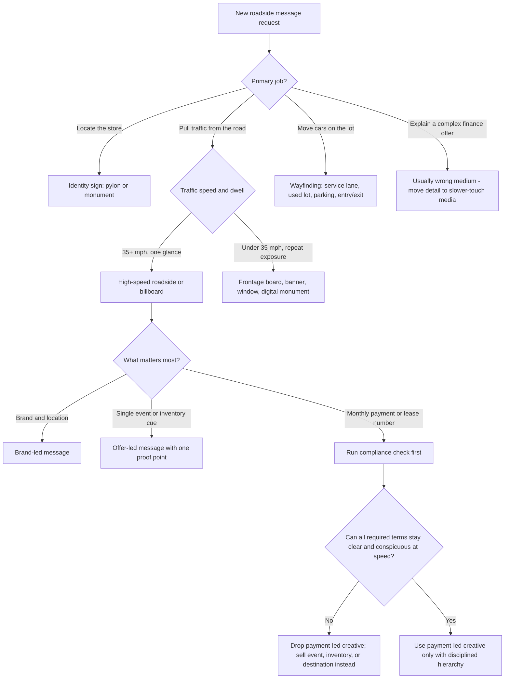

# Diagram 1: flowchart

```mermaid
flowchart TD
    A[New roadside message request] --> B{Primary job?}
    B -->|Locate the store| C[Identity sign: pylon or monument]
    B -->|Pull traffic from the road| D{Traffic speed and dwell}
    B -->|Move cars on the lot| E[Wayfinding: service lane, used lot, parking, entry/exit]
    B -->|Explain a complex finance offer| F[Usually wrong medium - move detail to slower-touch media]

    D -->|35+ mph, one glance| G[High-speed roadside or billboard]
    D -->|Under 35 mph, repeat exposure| H[Frontage board, banner, window, digital monument]

    G --> I{What matters most?}
    I -->|Brand and location| J[Brand-led message]
    I -->|Single event or inventory cue| K[Offer-led message with one proof point]
    I -->|Monthly payment or lease number| L[Run compliance check first]

    L --> M{Can all required terms stay clear and conspicuous at speed?}
    M -->|No| N[Drop payment-led creative; sell event, inventory, or destination instead]
    M -->|Yes| O[Use payment-led creative only with disciplined hierarchy]
```
