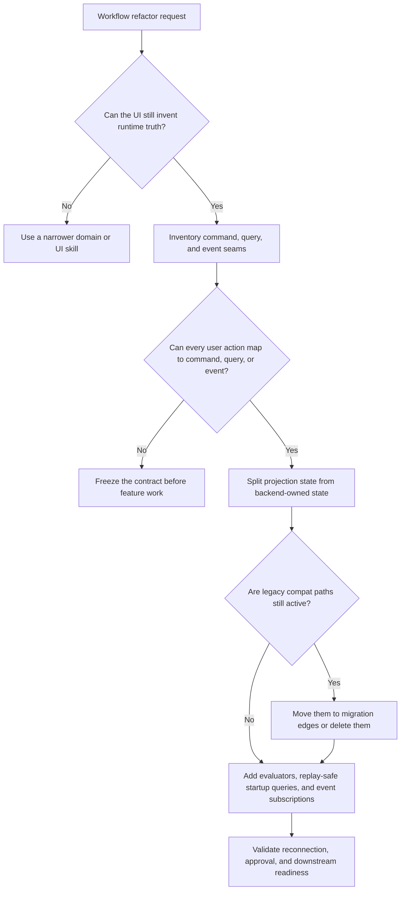

# Backend-Authoritative Runtime Refactor

Refactor only after you can say exactly where execution truth lives and how the UI reads it.

## When to Use

- The UI synthesizes graphs, phases, or provider choices that the backend does not understand.
- Relaunch or reconnect changes visible runtime state because the frontend cached authority.
- Old and new schemas, starter formats, or node types coexist in the active authoring path.
- Approval, review, or downstream execution depends on frontend-only reconstruction.

## NOT for

- Cosmetic visual cleanup with no change to runtime ownership.
- Isolated component refactors where the backend contract is already authoritative.
- Shipping new business features before deleting the split-authority seam.
- Pure backend performance work when the architecture already has one source of truth.

## Decision Points

Use this routing model first:

- If the UI cannot be described as `command -> backend transition -> query or event projection`, the seam is still wrong.
- If a "temporary compatibility" path sits in the hot path, treat it as refactor debt, not a feature.
- If restart or reconnect cannot reconstruct visible state from backend truth alone, the refactor is incomplete.

## Working Method

### 1. Inventory the split brain

Find all places where the UI:

- generates or mutates execution truth
- invents phases that the backend does not know about
- simulates execution in active code paths
- preserves both old and new schemas in the same authoring path
- mixes abstract routing tiers with exact provider IDs

### 2. Freeze the contract

Define three classes only:

- Commands: start, stop, approve, resume, mutate
- Queries: startup state, review payload, execution snapshot, provider health
- Events: authoritative transitions, evaluator verdicts, gate status, replay markers

If a UI action cannot be expressed as one of these, the architecture is still muddy.

### 3. Normalize state ownership

Split stores into:

- contract input state
- backend snapshot projection state
- UI layout state

Do not let any store own both runtime truth and layout concerns.

### 4. Delete active compatibility seams

Prefer deletion over "supporting both for now."

Typical deletions:

- singular and plural schema compatibility in active authoring
- browser or demo simulation in the active desktop runtime
- deprecated node types in the main path
- duplicate review summaries
- multiple starter or import formats

### 5. Add evaluators before trusting the refactor

Every implementation node should have:

- a local-output evaluator for correctness
- a downstream-readiness evaluator for contract safety
- a restart or reconnect path that rehydrates from backend truth, not frontend guesses

## Failure Modes

### Projection masquerading as authority

Symptom: the UI looks "read only" but quietly assembles phase, graph, or provider truth locally.

Fix: move that logic into backend commands or queries and treat the frontend as a projector.

### Compatibility seam calcification

Symptom: "support both for now" remains in the hot path for weeks and becomes the real architecture.

Fix: push compatibility to one-way migration edges with an explicit deletion date or remove it now.

### Approval without inspectability

Symptom: a human can approve work they cannot inspect because the review payload is partial or frontend synthesized.

Fix: backend must emit the exact review payload; the UI only renders it.

### Replay-hostile startup

Symptom: relaunching the app changes visible state or loses gate position because the frontend cached authority.

Fix: startup must be a query against backend truth plus event replay, not store reconstruction.

### Shibboleth

If relaunching the app changes visible runtime state without any new backend event, authority is still split.

## Worked Example

### Tauri workflow editor with frontend-owned phase logic

Problem:

- React stores authored the graph, inferred phase state, and normalized provider tiers.
- Backend execution used a different contract, so review and restart flows drifted.

Refactor path:

1. Inventory every place the UI invented execution truth.
2. Collapse runtime interactions to commands, queries, and events.
3. Move provider normalization and phase transitions behind backend commands.
4. Delete starter-format unions from the active authoring path.
5. Add evaluator gates so downstream work only proceeds from backend-validated outputs.

Success condition:

- On restart, the UI reconstructs the same visible state from backend snapshot plus events.
- Approval screens render a backend-emitted review payload, not a React recomposition.

## Fork Guidance

Fork when the work separates cleanly:

- Contract lane: inventory split-authority seams and define commands, queries, and events.
- Deletion lane: remove compatibility layers, deprecated node types, and starter-format unions.
- Verification lane: add evaluator gates, replay tests, and restart or reconnect coverage.

Keep final ownership decisions in the parent lane so one actor decides what the backend truly owns.

## Quality Gates

- [ ] The UI cannot fabricate graph, phase, provider, or gate truth locally.
- [ ] Every user action maps to a command, query, or event.
- [ ] Runtime state survives relaunch and reconnect from backend truth alone.
- [ ] Review and approval payloads are emitted by the backend and rendered by the UI.
- [ ] Compatibility logic lives only on migration edges, not in the active path.
- [ ] Downstream execution stops on upstream contract failure.
- [ ] Exact provider IDs and model choices are visible at the contract boundary.
- [ ] Tests cover restart, reconnect, approval, and evaluator failure paths.

## Reference Map

- `references/architecture-patterns.md` — backend-owned workflow contract patterns and state-ownership splits.
- `references/windags-lessons.md` — concrete lessons from a real split-authority runtime migration.
