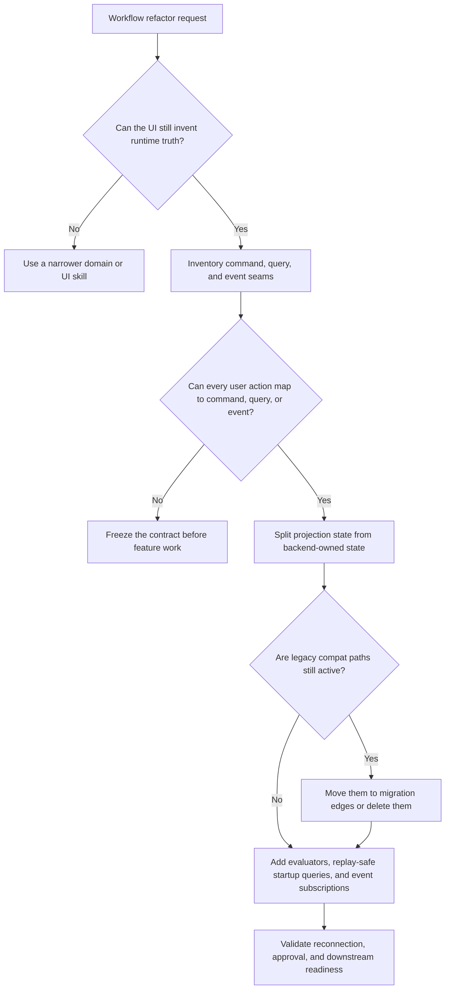

# Backend-Authority Decision Flow

```mermaid
flowchart TD
  A[Workflow refactor request] --> B{Can the UI still invent runtime truth?}
  B -->|No| C[Use a narrower domain or UI skill]
  B -->|Yes| D[Inventory command, query, and event seams]
  D --> E{Can every user action map to command, query, or event?}
  E -->|No| F[Freeze the contract before feature work]
  E -->|Yes| G[Split projection state from backend-owned state]
  G --> H{Are legacy compat paths still active?}
  H -->|Yes| I[Move them to migration edges or delete them]
  H -->|No| J[Add evaluators, replay-safe startup queries, and event subscriptions]
  I --> J
  J --> K[Validate reconnection, approval, and downstream readiness]
```
