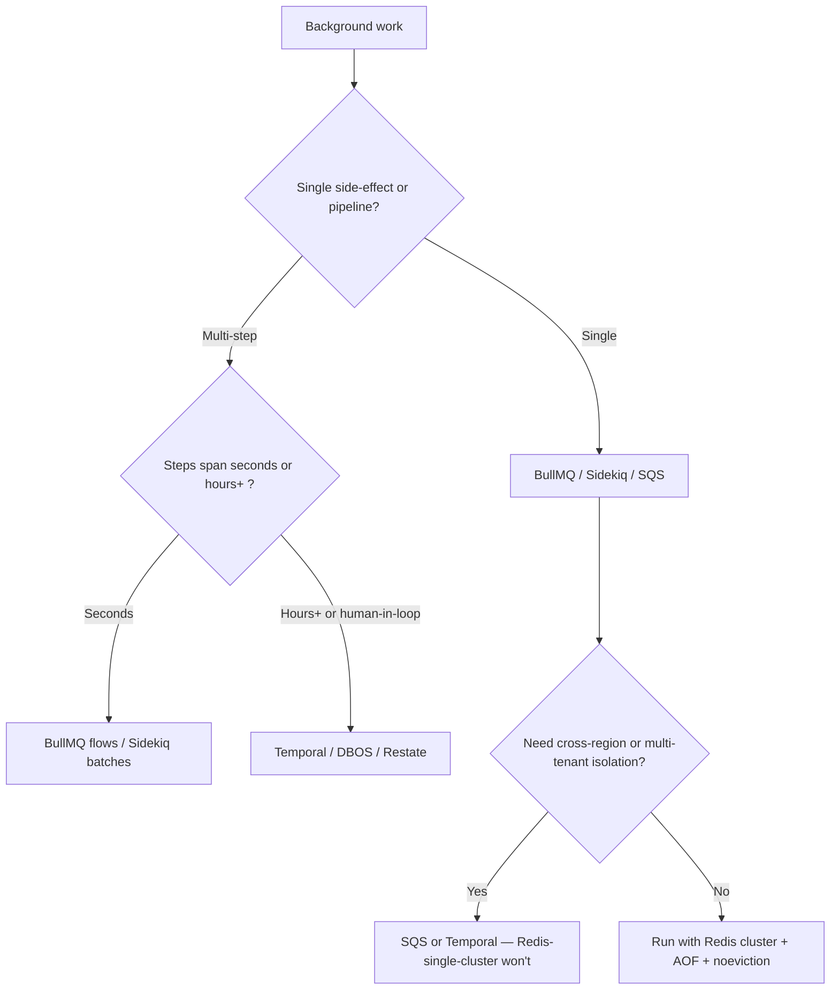

# Background Job Queue Design

A background-job system has three failure modes you have to design against from day one: **lost jobs**, **duplicate execution**, and **runaway retries**. Pick the wrong primitive and you'll spend the next year fixing all three. The recurring industry consensus, across BullMQ, Sidekiq, SQS, and Temporal docs alike, is **at-least-once is the only honest delivery semantic** — design every handler to be idempotent and stop chasing exactly-once. ([Caduh — Queues 101][caduh-queues])

**Jump to your fire:**
- Jobs ran twice on retry → [Idempotency](#idempotency)
- Worker crashed mid-job, job vanished → [Reliable fetch / visibility timeout](#reliable-fetch-and-visibility-timeout)
- DLQ is filling up, alerts firing → [Error classification + DLQ](#error-classification-and-dlq)
- Redis OOM during a backlog → [Memory hygiene](#memory-hygiene)
- "Should this be Temporal instead?" → [Queue vs workflow](#queue-vs-workflow-decision)
- Retry storms hitting downstream → [Backoff + jitter](#backoff-and-jitter)
- Concurrency overruns a rate limit → [Concurrency + limiter](#concurrency-and-limiter)

## When to use

- Designing a new background-job system in Node, Ruby, Python, or Go.
- Migrating from `setTimeout` / `cron` / homegrown queues to a real broker.
- Worker crashes are losing jobs.
- Production retries are causing duplicate side effects.
- Choosing between BullMQ (Node + Redis), Sidekiq (Ruby + Redis), RQ / Celery / Dramatiq (Python), Asynq (Go + Redis), SQS (managed), or Temporal (durable execution).

## Core capabilities

### Pick the primitive that matches the work

| You have | Reach for | Reason |
|---|---|---|
| Short, side-effecting jobs (send email, resize image) on Node | **BullMQ** | Redis-native, mature DLQ, flow patterns, ~~5k jobs/sec/node typical |
| Same on Ruby | **Sidekiq** (Pro for reliability) | Same shape; Pro `super_fetch` adds reliable fetch via LMOVE ([Sidekiq wiki][sidekiq-reliability]) |
| Multi-step workflows w/ external API fan-out, hours-to-days durations | **Temporal** | Durable execution; replays from event history ([Temporal docs][temporal-overview]) |
| AWS-native, simple fanout, don't want to run Redis | **SQS** + Lambda | Managed at-least-once; visibility timeout + DLQ first-class ([AWS SQS DLQ][aws-sqs-dlq]) |
| Cross-region, multi-tenant isolation | **Temporal** or **SQS** | Single Redis won't survive multi-region cleanly |
| Need exactly-once across DB + email + payments | **None — design for at-least-once + idempotent handlers** | "Exactly-once" inside the broker doesn't extend across systems ([Caduh][caduh-queues]) |

The hidden criterion: **how complex is the recovery story?** A simple BullMQ queue with retries is fine for "send a receipt." A 12-step purchase workflow that pauses for 24 hours waiting for a webhook is a Temporal workflow, not 12 chained queue jobs.

### Idempotency

The mandatory property. Every popular queue's docs lead with this. From the BullMQ idempotent-jobs page: *"it should not make a difference to the final state of the system if a job successfully completes on its first attempt, or if it fails initially and succeeds when retried."* ([BullMQ idempotent-jobs][bullmq-idempotent])

Practical patterns:

```ts
// 1. Idempotency key derived from the business event, not the queue.
//    Use the upstream event_id if you have one (Stripe event.id, Shopify hook id).
const job = await queue.add(
  'send-receipt',
  { orderId, amount },
  {
    jobId: `send-receipt:${orderId}`,   // BullMQ dedups by jobId in the queue.
    attempts: 5,
    backoff: { type: 'exponential', delay: 1000 },
    removeOnComplete: { age: 3600, count: 1000 },
    removeOnFail:     { age: 86400 },
  }
);

// 2. Inside the handler, dedupe at the side-effect site too.
async function processSendReceipt(job) {
  const { orderId, amount } = job.data;
  // If we already sent, do nothing.
  const sent = await db.queryOne(
    'INSERT INTO email_sends (idempotency_key, order_id) VALUES ($1, $2) ON CONFLICT DO NOTHING RETURNING id',
    [`send-receipt:${orderId}`, orderId]
  );
  if (!sent) return { skipped: 'already-sent' };
  await emailProvider.send({ to: ..., subject: ..., body: render(amount) });
}
```

The `jobId` dedupes adds while a duplicate is still queued. The DB unique constraint dedupes across worker crashes, retries, and replays. **Both are required**; jobId alone is insufficient because BullMQ removes completed jobs and the dedup window evaporates.

### Reliable fetch and visibility timeout

When a worker pulls a job and crashes, what happens?

| System | Default behavior | Recovery |
|---|---|---|
| BullMQ | Job has a `lockDuration` (default 30s). Stalled-job checker re-queues after expiry ([BullMQ production][bullmq-production]) | Workers MUST extend the lock or finish within `lockDuration`; otherwise it runs twice |
| Sidekiq OSS | Pop is non-atomic; if worker dies between pop and process, job is **lost** | Upgrade to Sidekiq Pro `super_fetch` (Redis 6.2+ `LMOVE` to a private working queue) |
| Sidekiq Pro super_fetch | LMOVE to per-process working list. Heartbeat expires at 60s; orphan check sweeps and re-enqueues ([Sidekiq wiki][sidekiq-reliability]) | Built-in |
| SQS | Visibility timeout (default 30s, max 12h). Message reappears after timeout if not deleted | Set timeout > p99 handler latency; extend with `ChangeMessageVisibility` for long jobs |
| Temporal | Activities have heartbeat + retry policies. Workflow history survives worker death | Replay from history; you don't think about this |

**The trap**: `lockDuration` / visibility timeout shorter than handler p99 → job runs twice. Longer than acceptable recovery time → crashed work waits too long. Measure your p99 first, set the timeout to ~3x that, and have the handler heartbeat / extend the lock for genuinely-long work.

### Error classification and DLQ

Not every error should retry forever. From SQS docs: *"Set the maximum receives... and the redrive policy to send messages to the DLQ once threshold is exceeded."* ([AWS SQS DLQ][aws-sqs-dlq])

```ts
// Classify before throwing. Permanent errors should NOT retry.
class PermanentError extends Error { constructor(m: string) { super(m); this.name = 'PermanentError'; } }
class TransientError extends Error { constructor(m: string) { super(m); this.name = 'TransientError'; } }

async function process(job) {
  try {
    const user = await db.user(job.data.userId);
    if (!user) throw new PermanentError('user-not-found');   // → DLQ on first try
    if (user.suspended) throw new PermanentError('user-suspended');
    await externalApi.call(user);
  } catch (e) {
    if (e instanceof PermanentError) {
      // Move to DLQ immediately — retrying won't help.
      job.discard();    // BullMQ: prevents retry
      throw e;
    }
    throw e;            // Network/timeout → retry per attempts policy
  }
}
```

DLQ then needs:
- An alert on rising count (not just nonzero — "DLQ has 3 things forever" is fine; "DLQ grew 100/min" is a fire).
- A replay tool (CLI or admin UI) so a human can fix the upstream bug, replay the dead-lettered jobs, and clear the DLQ.
- Dashboards (see `grafana-dashboard-builder`).

### Backoff and jitter

Exponential backoff alone isn't enough. If 1000 jobs all fail at 12:00:00 because a downstream service blipped, plain exponential backoff has all 1000 retry at exactly 12:00:01, 12:00:03, 12:00:07 — a thundering herd that may keep the downstream service down. Add **full jitter**:

```ts
// AWS-style "full jitter": delay = random(0, exp_backoff)
const baseDelay = Math.min(2 ** attempt * 1000, 30_000);
const delay = Math.random() * baseDelay;
```

For the BullMQ recommended baseline, the `going-to-production` doc suggests retry intervals between 1s and 20s with `retryStrategy`. ([BullMQ production][bullmq-production])

### Concurrency and limiter

Per-worker concurrency runs N jobs in parallel from one process. Multiple workers multiply that. Without a queue-level limiter, you can't cap aggregate calls to a downstream:

```ts
// BullMQ — global rate limit across all workers on this queue.
const queue = new Queue('outbound-emails', {
  connection,
  limiter: { max: 100, duration: 1000 }, // 100 emails/sec across the whole fleet
});
```

The right shape: many concurrent workers + a queue limiter for downstream contract limits. Sidekiq has equivalent rate limiters; SQS uses Lambda concurrency or per-message-rate.

### Memory hygiene

The single most-emphasized BullMQ production gotcha: **`maxmemory-policy noeviction`** on the Redis instance. Anything else (`allkeys-lru`, `volatile-lru`) will silently evict queued jobs under pressure. ([BullMQ production][bullmq-production])

Also:
- `removeOnComplete` aggressive (e.g. `{ age: 3600, count: 1000 }`).
- `removeOnFail` even more aggressive once you've moved to a DLQ pattern.
- Enable Redis AOF persistence — `appendfsync everysec` is the documented sweet spot for BullMQ. ([BullMQ production][bullmq-production])
- Worker `maxRetriesPerRequest: null` to prevent ioredis from throwing during transient disconnects. ([BullMQ production][bullmq-production])
- Queue side: `enableOfflineQueue: false` so producer fails fast instead of buffering.

### Graceful shutdown

```ts
process.on('SIGTERM', async () => {
  await worker.close();   // stop accepting; finish in-flight jobs.
  await connection.quit();
  process.exit(0);
});
process.on('SIGINT', async () => { /* same */ });
```

The BullMQ production guide explicitly notes: close workers before stopping the process; default stalling timeout is ~30s. ([BullMQ production][bullmq-production])

### Queue vs workflow decision

Useful framing from Temporal's docs: *"Unlike message queues which move data between services, Temporal orchestrates entire processes... knows where you are in a workflow, what's completed, what's pending, and what needs to retry."* ([Temporal blog][temporal-blog])



## Anti-patterns

### Idempotency via Redis SET-NX only

**Symptom:** During a Redis blip or restart, the same job runs twice and creates duplicate side effects (charge, email, ticket).
**Diagnosis:** Redis is a cache; it can be evicted, restarted, or partitioned. SET-NX dedup that lives only in Redis is best-effort.
**Fix:** Idempotency key with a DB unique constraint on the side-effect record (e.g. `email_sends.idempotency_key`). The DB transaction that creates the side-effect IS the dedup primitive.

### lockDuration shorter than handler p99

**Symptom:** Stalled-job log entries; same job processed by two workers. Customers complain.
**Diagnosis:** Default `lockDuration` is 30s; handler sometimes takes 45s; the second worker picks it up.
**Fix:** Measure p99, set `lockDuration` to ~3x p99, and call `job.extendLock()` inside long handlers. Or split the work.

### Plain exponential backoff (no jitter)

**Symptom:** A downstream blip becomes a downstream outage; 10k jobs hammer the recovering service in lockstep.
**Diagnosis:** Without jitter, retries are correlated.
**Fix:** Full-jitter backoff. Cap maximum delay to bound DLQ time-to-failure.

### `maxmemory-policy allkeys-lru` on Redis

**Symptom:** Queue mysteriously loses jobs under load. No errors. ([BullMQ production][bullmq-production])
**Diagnosis:** Redis evicted job keys to make room.
**Fix:** `CONFIG SET maxmemory-policy noeviction` AND assert it at startup. Workers should refuse to start otherwise.

### Pretending exactly-once across systems

**Symptom:** Charged customer twice; sent two of the same email. Engineer is sure "the broker is exactly-once."
**Diagnosis:** Even a FIFO/exactly-once broker doesn't extend its guarantee to your DB + email vendor + Stripe + ledger.
**Fix:** Treat the queue as at-least-once. Idempotency at every side-effect boundary.

### DLQ with no replay tool

**Symptom:** "We have 3,200 jobs in the DLQ. We don't know what's in there." DLQ becomes an unmonitored graveyard.
**Diagnosis:** Built the DLQ, didn't build the operator tool.
**Fix:** Replay-by-id, replay-by-time-range, drain-with-confirmation. CLI or admin UI. Tested.

### Long-blocking work on the event loop

**Symptom:** BullMQ worker process hangs; heartbeats stop; lock expires; job re-runs.
**Diagnosis:** CPU-bound work in the same process as the queue heartbeat; event loop blocks for > `lockDuration`.
**Fix:** Spawn a child process or worker thread for CPU-bound work. Or run a sandboxed processor (BullMQ supports per-job process sandboxing).

## Quality gates

- [ ] **Test:** chaos test — kill a worker mid-job; assert the job re-runs and the side-effect is not duplicated.
- [ ] **Test:** retry-storm test — fail downstream for 60s; assert backoff + jitter spreads retries (no thundering herd in metrics).
- [ ] Every handler is idempotent and uses a stable idempotency key derived from the business event.
- [ ] DB-level unique constraint backs up any in-Redis dedup (jobId, SET-NX).
- [ ] `lockDuration` / visibility timeout ≥ 3× measured p99 handler latency, AND long handlers extend the lock.
- [ ] Permanent errors (`PermanentError` class or equivalent) bypass retry and go straight to DLQ.
- [ ] DLQ alerts: page when growth rate > N per minute, not just count > 0.
- [ ] DLQ replay tool exists and is tested (one-off + range).
- [ ] Redis: `maxmemory-policy=noeviction`, AOF enabled (`appendfsync everysec`), asserted on worker startup. ([BullMQ production][bullmq-production])
- [ ] `removeOnComplete` and `removeOnFail` configured. Job count metric trended in `grafana-dashboard-builder`.
- [ ] Graceful shutdown on SIGTERM / SIGINT with `worker.close()` before exit.
- [ ] OTel spans around handler with `queue.name`, `job.id`, `job.attempts`, `job.outcome` (see `opentelemetry-instrumentation`).
- [ ] Concurrency × worker-count × downstream-rate-limit math reviewed; queue-level limiter in place where needed.

## NOT for

- **Outbound webhook publishing** — different domain (delivery guarantees, customer secrets). No dedicated skill yet.
- **Receiver-side webhook handling** — different domain. → `webhook-receiver-design`.
- **Event-streaming / Kafka topology** — different abstraction (log, not queue). No dedicated skill.
- **In-process async only** (no broker, single replica) — different operational profile. → `python-asyncio-pitfalls` for Python event-loop concurrency.
- **Cron-style scheduled jobs** without retry/DLQ semantics — simpler tooling fits.

## Sources

- BullMQ — *Going to production* (Redis policy, AOF, retryStrategy, maxRetriesPerRequest, lockDuration, graceful shutdown). [docs.bullmq.io/guide/going-to-production][bullmq-production]
- BullMQ — *Idempotent jobs* (atomic + simple + flow patterns). [docs.bullmq.io/patterns/idempotent-jobs][bullmq-idempotent]
- Sidekiq wiki — *Reliability* (super_fetch, LMOVE, 60s heartbeat, orphan check). [github.com/sidekiq/sidekiq/wiki/Reliability][sidekiq-reliability]
- AWS — *Using dead-letter queues in Amazon SQS*. [docs.aws.amazon.com/AWSSimpleQueueService/.../sqs-dead-letter-queues.html][aws-sqs-dlq]
- Temporal — *Workflow Execution overview*. [docs.temporal.io/workflow-execution][temporal-overview]
- Temporal blog — *Reliable data processing: Queues and Workflows*. [temporal.io/blog/reliable-data-processing-queues-workflows][temporal-blog]
- Caduh — *Queues 101: At-Least-Once (and Why "Exactly-Once" Is a Myth)*. [caduh.com/blog/queues-101][caduh-queues]

[bullmq-production]: https://docs.bullmq.io/guide/going-to-production
[bullmq-idempotent]: https://docs.bullmq.io/patterns/idempotent-jobs
[sidekiq-reliability]: https://github.com/sidekiq/sidekiq/wiki/Reliability
[aws-sqs-dlq]: https://docs.aws.amazon.com/AWSSimpleQueueService/latest/SQSDeveloperGuide/sqs-dead-letter-queues.html
[temporal-overview]: https://docs.temporal.io/workflow-execution
[temporal-blog]: https://temporal.io/blog/reliable-data-processing-queues-workflows
[caduh-queues]: https://www.caduh.com/blog/queues-101
