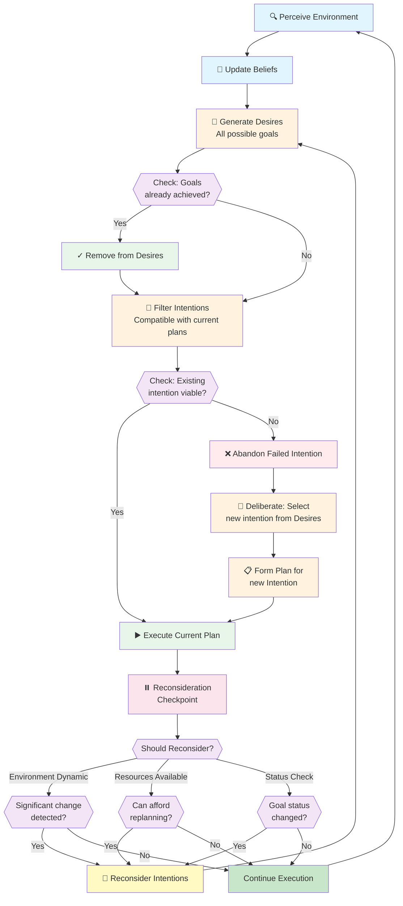

# BDI Agent Decision Cycle and Reconsideration Logic

```mermaid
flowchart TD
    A["🔍 Perceive Environment"] --> B["📝 Update Beliefs"]
    B --> C["🎯 Generate Desires<br/>All possible goals"]
    C --> D{{"Check: Goals<br/>already achieved?"}}
    D -->|Yes| E["✓ Remove from Desires"]
    D -->|No| F["🎪 Filter Intentions<br/>Compatible with current plans"]
    E --> F
    F --> G{{"Check: Existing<br/>intention viable?"}}
    G -->|Yes| H["▶️ Execute Current Plan"]
    G -->|No| I["❌ Abandon Failed Intention"]
    I --> J["🧠 Deliberate: Select<br/>new intention from Desires"]
    J --> K["📋 Form Plan for<br/>new Intention"]
    K --> H
    H --> L["⏸️ Reconsideration<br/>Checkpoint"]
    L --> M{{"Should Reconsider?"}}
    M -->|Environment Dynamic| N{{"Significant change<br/>detected?"}}
    M -->|Resources Available| O{{"Can afford<br/>replanning?"}}
    M -->|Status Check| P{{"Goal status<br/>changed?"}}
    N -->|Yes| Q["🔄 Reconsider Intentions"]
    N -->|No| R["Continue Execution"]
    O -->|Yes| Q
    O -->|No| R
    P -->|Yes| Q
    P -->|No| R
    Q --> C
    R --> A
    
    style A fill:#e1f5ff
    style B fill:#e1f5ff
    style C fill:#fff3e0
    style D fill:#f3e5f5
    style E fill:#e8f5e9
    style F fill:#fff3e0
    style G fill:#f3e5f5
    style H fill:#e8f5e9
    style I fill:#ffebee
    style J fill:#fff3e0
    style K fill:#fff3e0
    style L fill:#fce4ec
    style M fill:#f3e5f5
    style N fill:#f3e5f5
    style O fill:#f3e5f5
    style P fill:#f3e5f5
    style Q fill:#fff9c4
    style R fill:#c8e6c9
```
