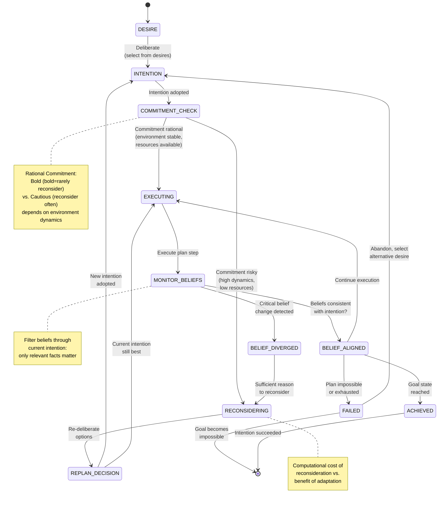

# Intention Lifecycle: Commitment-Reconsideration States

```mermaid
stateDiagram-v2
    [*] --> DESIRE
    
    DESIRE --> INTENTION: Deliberate<br/>(select from desires)
    
    INTENTION --> COMMITMENT_CHECK: Intention adopted
    
    COMMITMENT_CHECK --> EXECUTING: Commitment rational<br/>(environment stable,<br/>resources available)
    
    COMMITMENT_CHECK --> RECONSIDERING: Commitment risky<br/>(high dynamics,<br/>low resources)
    
    EXECUTING --> MONITOR_BELIEFS: Execute plan step
    
    MONITOR_BELIEFS --> BELIEF_ALIGNED: Beliefs consistent<br/>with intention?
    
    BELIEF_ALIGNED --> ACHIEVED: Goal state<br/>reached
    
    BELIEF_ALIGNED --> FAILED: Plan impossible<br/>or exhausted
    
    BELIEF_ALIGNED --> EXECUTING: Continue execution
    
    MONITOR_BELIEFS --> BELIEF_DIVERGED: Critical belief<br/>change detected
    
    BELIEF_DIVERGED --> RECONSIDERING: Sufficient reason<br/>to reconsider
    
    RECONSIDERING --> REPLAN_DECISION: Re-deliberate<br/>options
    
    REPLAN_DECISION --> INTENTION: New intention<br/>adopted
    
    REPLAN_DECISION --> EXECUTING: Current intention<br/>still best
    
    FAILED --> INTENTION: Abandon, select<br/>alternative desire
    
    FAILED --> [*]: Goal becomes<br/>impossible
    
    ACHIEVED --> [*]: Intention succeeded
    
    note right of COMMITMENT_CHECK
        Rational Commitment:
        Bold (bold=rarely reconsider)
        vs. Cautious (reconsider often)
        depends on environment dynamics
    end note
    
    note right of MONITOR_BELIEFS
        Filter beliefs through
        current intention:
        only relevant facts matter
    end note
    
    note right of RECONSIDERING
        Computational cost of
        reconsideration vs.
        benefit of adaptation
    end note
```
