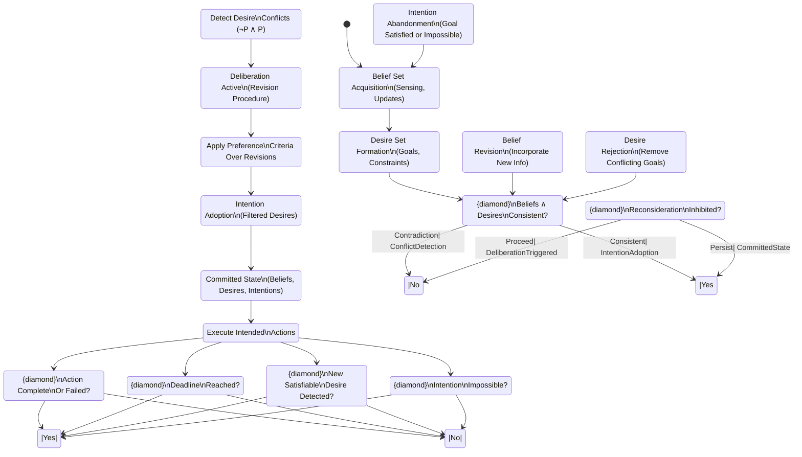

# BDI Agent Mental State Lifecycle

```mermaid
stateDiagram-v2
    [*] --> BeliefAcquisition
    
    BeliefAcquisition: Belief Set Acquisition\n(Sensing, Updates)
    DesireFormation: Desire Set Formation\n(Goals, Constraints)
    BeliefDesireConsistency: {diamond}\nBeliefs ∧ Desires\nConsistent?
    
    ConflictDetection: Detect Desire\nConflicts (¬P ∧ P)
    DeliberationTriggered: Deliberation Active\n(Revision Procedure)
    PreferenceApplication: Apply Preference\nCriteria Over Revisions
    IntentionAdoption: Intention Adoption\n(Filtered Desires)
    
    CommittedState: Committed State\n(Beliefs, Desires, Intentions)
    ActionExecution: Execute Intended\nActions
    
    ExecutionComplete: {diamond}\nAction Complete\nOr Failed?
    DeadlineReached: {diamond}\nDeadline\nReached?
    OpportunityUnblocked: {diamond}\nNew Satisfiable\nDesire Detected?
    ImpossibilityDetected: {diamond}\nIntention\nImpossible?
    
    ReconsiderationInhibited: {diamond}\nReconsideration\nInhibited?
    
    BeliefRevision: Belief Revision\n(Incorporate New Info)
    DesireRejection: Desire Rejection\n(Remove Conflicting Goals)
    IntentionDrop: Intention Abandonment\n(Goal Satisfied or Impossible)
    
    BeliefAcquisition --> DesireFormation
    DesireFormation --> BeliefDesireConsistency
    
    BeliefDesireConsistency -->|No: Contradiction| ConflictDetection
    BeliefDesireConsistency -->|Yes: Consistent| IntentionAdoption
    
    ConflictDetection --> DeliberationTriggered
    DeliberationTriggered --> PreferenceApplication
    PreferenceApplication --> IntentionAdoption
    
    IntentionAdoption --> CommittedState
    CommittedState --> ActionExecution
    
    ActionExecution --> ExecutionComplete
    ActionExecution --> DeadlineReached
    ActionExecution --> OpportunityUnblocked
    ActionExecution --> ImpossibilityDetected
    
    ExecutionComplete -->|Yes| IntentionDrop
    DeadlineReached -->|Yes| IntentionDrop
    OpportunityUnblocked -->|Yes| ReconsiderationInhibited
    ImpossibilityDetected -->|Yes| IntentionDrop
    
    ReconsiderationInhibited -->|No: Proceed| DeliberationTriggered
    ReconsiderationInhibited -->|Yes: Persist| CommittedState
    
    IntentionDrop --> BeliefAcquisition
    BeliefRevision --> BeliefDesireConsistency
    DesireRejection --> BeliefDesireConsistency
    
    ExecutionComplete -->|No| CommittedState
    DeadlineReached -->|No| CommittedState
    OpportunityUnblocked -->|No| CommittedState
    ImpossibilityDetected -->|No| CommittedState
```
