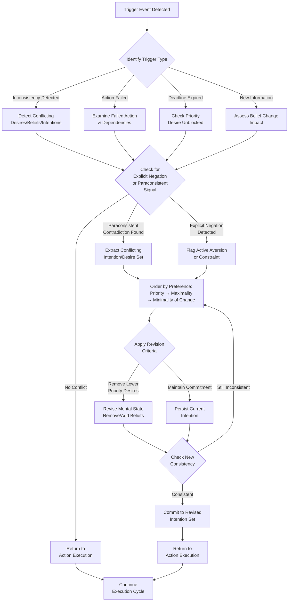

# Deliberation & Revision Procedure Decision Tree

```mermaid
graph TD
    A["Trigger Event Detected"] --> B{Identify Trigger Type}
    
    B -->|Inconsistency Detected| C["Detect Conflicting<br/>Desires/Beliefs/Intentions"]
    B -->|Action Failed| D["Examine Failed Action<br/>& Dependencies"]
    B -->|Deadline Expired| E["Check Priority<br/>Desire Unblocked"]
    B -->|New Information| F["Assess Belief Change<br/>Impact"]
    
    C --> G{Check for<br/>Explicit Negation<br/>or Paraconsistent<br/>Signal}
    D --> G
    E --> G
    F --> G
    
    G -->|Paraconsistent<br/>Contradiction Found| H["Extract Conflicting<br/>Intention/Desire Set"]
    G -->|Explicit Negation<br/>Detected| I["Flag Active Aversion<br/>or Constraint"]
    G -->|No Conflict| J["Return to<br/>Action Execution"]
    
    H --> K["Order by Preference:<br/>Priority → Maximality<br/>→ Minimality of Change"]
    I --> K
    
    K --> L{Apply Revision<br/>Criteria}
    
    L -->|Remove Lower<br/>Priority Desires| M["Revise Mental State<br/>Remove/Add Beliefs"]
    L -->|Maintain Commitment| N["Persist Current<br/>Intention"]
    
    M --> O{Check New<br/>Consistency}
    N --> O
    
    O -->|Consistent| P["Commit to Revised<br/>Intention Set"]
    O -->|Still Inconsistent| K
    
    P --> Q["Return to<br/>Action Execution"]
    J --> R["Continue<br/>Execution Cycle"]
    Q --> R
```
