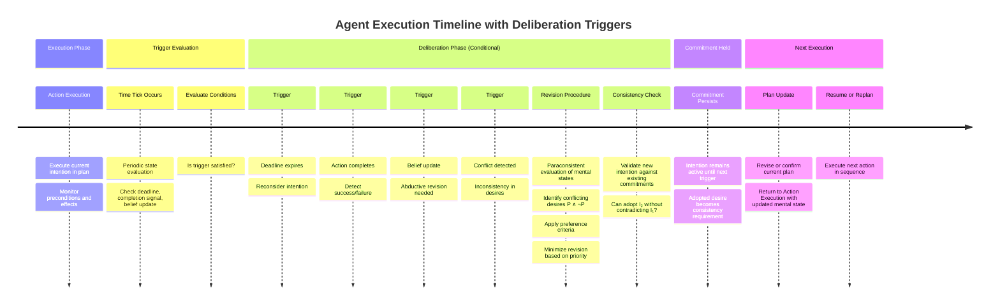

# Agent Execution Timeline with Deliberation Triggers

```mermaid
timeline
    title Agent Execution Timeline with Deliberation Triggers
    
    section Execution Phase
        Action Execution: Execute current intention in plan
        : Monitor preconditions and effects
    
    section Trigger Evaluation
        Time Tick Occurs: Periodic state evaluation
        : Check deadline, completion signal, belief update
        Evaluate Conditions: Is trigger satisfied?
    
    section Deliberation Phase (Conditional)
        Trigger: Deadline expires: Reconsider intention
        Trigger: Action completes: Detect success/failure
        Trigger: Belief update: Abductive revision needed
        Trigger: Conflict detected: Inconsistency in desires
        
        Revision Procedure: Paraconsistent evaluation of mental states
        : Identify conflicting desires P ∧ ¬P
        : Apply preference criteria
        : Minimize revision based on priority
        
        Consistency Check: Validate new intention against existing commitments
        : Can adopt I₂ without contradicting I₁?
    
    section Commitment Held
        Commitment Persists: Intention remains active until next trigger
        : Adopted desire becomes consistency requirement
    
    section Next Execution
        Plan Update: Revise or confirm current plan
        : Return to Action Execution with updated mental state
        Resume or Replan: Execute next action in sequence
```
