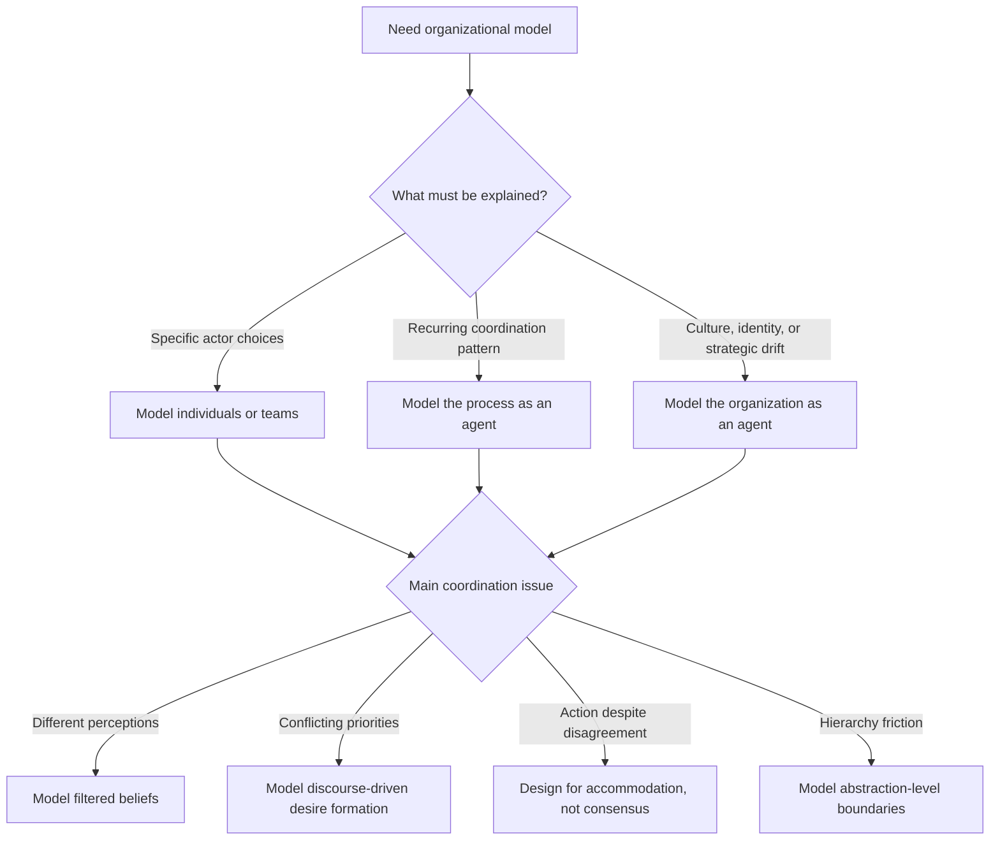

# BDI Soft Model for Organisations

Use this skill when the challenge is to model how messy organizations actually decide, coordinate, and resist change without pretending they are either fully rational machines or unknowable social fog.

## When to Use

- You have a human organization or socio-technical process that needs a cognitive model, not just a workflow map.
- Coordination succeeds or fails despite persistent disagreement, inconsistent perceptions, or mismatched incentives.
- Organizational goals seem to emerge through conversation rather than being simple top-down inputs.
- Technical systems are being introduced into a human process and the main risk is cognitive mismatch, not code correctness.
- You need to choose whether to model at the individual, process, or organization level.

## NOT for

- Purely mechanistic process mapping where internal beliefs, desires, and commitments do not matter.
- Individual psychology or therapy-oriented reasoning divorced from organizational dynamics.
- Fully centralized systems where one actor already defines goals, truth, and action without negotiation.
- Technical architecture work that does not involve human or organizational cognition.

## Core Mental Models

### Choose the Modeling Level Deliberately

You can model individuals, a recurring process, or the organization itself as the agent. The right level depends on what you need to explain, not on which level feels most intuitive.

### Intentions Bound Deliberation

Intentions are commitments that reduce future reconsideration. In organizations, that explains both useful focus and costly inertia.

### Perception Is Filtered

Different roles, expertise, and incentives produce different organizational realities. Do not assume a shared objective world state just because everyone sees the same dashboard.

### Desires Emerge Through Discourse

Organizational goals often come out of negotiation, rhetoric, and power, not from simple aggregation of individual preferences.

### Accommodation Often Matters More Than Consensus

Coordination frequently happens through workable accommodations while disagreement persists. Designs that demand full agreement before action often misread how organizations function.

## Decision Points

- Pick the smallest modeling level that still reveals the phenomenon you care about.
- If conflict keeps recurring, test whether it is perceptual mismatch, desire formation, or abstraction-level mismatch before blaming communication quality.
- Treat hierarchy as cognitive coordination across time horizons and abstraction levels, not only as a power map.

## Failure Modes

### Consensus Assumption

Cue: the model treats disagreement as a temporary obstacle that must disappear before action can happen.

Fix: model accommodations and partial alignment explicitly.

### Objective World-State Assumption

Cue: the design assumes all participants observe the same facts and only differ in preferences.

Fix: give roles their own filtered belief models.

### Desires as Fixed Inputs

Cue: goals are treated as pre-existing values rather than outputs of negotiation and discourse.

Fix: include the goal-formation process in the model.

### Single-Level Blindness

Cue: a process problem is analyzed only at the individual level, or a person-level conflict is forced into organization-level abstractions.

Fix: shift levels intentionally and compare what each view reveals.

### System-Is-the-Organization Thinking

Cue: a new platform is designed as if installing it will replace human cognition rather than support it.

Fix: treat technical systems as cognitive prosthetics that must fit existing organizational reasoning.

## Worked Examples

### Cross-Functional Product Launch

Marketing, legal, and engineering disagree on launch timing. The wrong move is to demand consensus on all facts. The right move is to map filtered perceptions, surface which desires emerge through stakeholder negotiation, and design an accommodation that permits action under persistent disagreement.

### Incident Response Process Redesign

A company wants to automate incident routing. Model the process at the meso level to understand recurring coordination patterns, but drop to the team level where filtered perceptions and abstraction-level mismatch explain handoff failures.

## Quality Gates

- The chosen modeling level is explicit and justified.
- The model distinguishes beliefs, desires, and intentions rather than reducing everything to "stakeholder opinion."
- Goal formation is represented when organizational desires are socially constructed.
- The design can explain coordination without requiring consensus.
- Technical systems are framed as support for organizational cognition, not replacement for it.

## Shibboleths

- If someone treats disagreement as evidence that one side simply has the wrong facts, they likely have not internalized filtered perception.
- If the model cannot say how organizational goals came into existence, it is smuggling in desires as primitives.
- If hierarchy is described only as authority and not as abstraction-level coordination, the analysis is too shallow.

## Reference Routing

- `references/soft-systems-cognitive-gap-formal-modeling.md`: load when you need the high-level bridge between soft systems and BDI.
- `references/intention-as-commitment-bounds-deliberation.md`: load when inertia, commitment, or reconsideration are central.
- `references/discourse-to-action-emergence-of-organizational-desires.md`: load when organizational goals seem to be socially produced.
- `references/accommodations-over-consensus-coordination-without-agreement.md`: load when action happens despite unresolved conflict.
- `references/hierarchies-abstraction-levels-expertise-coordination.md`: load when hierarchy and abstraction mismatch are central to the failure.
