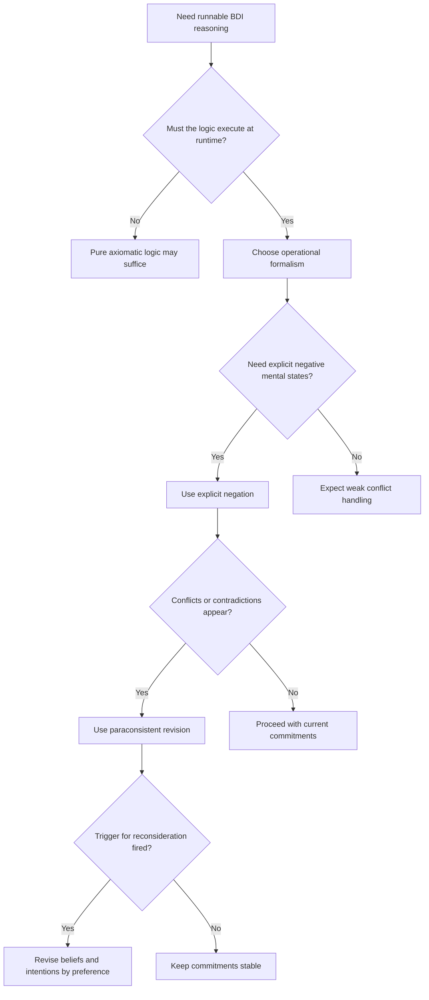

# Executable BDI Revision Semantics

Use this skill when the main problem is closing the gap between a pretty BDI theory and a reasoning engine that can actually run, revise commitments, and survive contradiction.

## When to Use

- You need a BDI formalism that doubles as a runtime reasoning mechanism.
- Desires can conflict and the system must deliberate without collapsing under inconsistency.
- Commitment persistence should be operational, trigger-based, and revisable.
- The agent needs explicit negative beliefs or negative intentions, not just absence of proof.
- Feasibility checking requires abductive reasoning over missing preconditions or blocked actions.

## NOT for

- Purely axiomatic modal or temporal logic work where executability is not required.
- Planner wrappers that hide all reasoning inside black-box services.
- Classical logic systems where contradiction should explode the theory instead of trigger revision.
- Simple task lists where commitment, revision, and explicit negation add no value.

## Core Mental Models

### The Gap Comes from Choosing the Wrong Formalism

The problem is not that BDI theory is too abstract. The problem is selecting specification formalisms with no proof procedure or operational semantics. Choose a computational formalism from the start if you want executable agents.

### Explicit Negation Is Not the Same as Failure to Prove

Agents need to represent "I believe not-P" and "I intend not-P" as positive negative information. That is different from merely lacking evidence for P.

### Contradiction Should Trigger Deliberation

Conflicting desires are normal. Paraconsistent semantics treat contradiction as a signal to revise beliefs or intentions, not as a fatal error.

### Commitment Lives in the Revision Rules

Intentions persist because the revision procedure constrains what new intentions can be adopted and when reconsideration is triggered.

### Preference over Revisions Is Deliberation Policy

Priority ordering, maximal satisfaction, and minimal change are not after-the-fact cleanups. They are the operational content of deliberation.

## Decision Points

- If the agent reasons at runtime, prefer a formalism with proof procedures rather than an elegant but non-executable theory.
- Use explicit negation whenever negative beliefs or negative intentions are part of the domain.
- Treat contradiction as input to a revision mechanism, not as a reason to abort reasoning.
- Specify the triggers that force reconsideration; everything else should preserve commitment by default.

## Failure Modes

### Modal Logic Without Runtime Semantics

Cue: the formal model is beautiful, but implementation requires inventing a separate reasoning engine from scratch.

Fix: move to or layer in an operational formalism with executable semantics.

### Negation-by-Failure Confusion

Cue: the system cannot distinguish active aversion from mere absence of evidence.

Fix: represent explicit negation separately from closed-world absence.

### Replanning on Every Cycle

Cue: the agent keeps recomputing intentions even when nothing important changed.

Fix: define explicit reconsideration triggers and preserve commitments between them.

### Contradiction as Exception

Cue: inconsistent desires crash the system or are forbidden before deliberation starts.

Fix: use paraconsistent semantics and revision to turn contradiction into useful signal.

### Preference as Post-Processing

Cue: the system enumerates all consistent subsets first and only then applies priorities.

Fix: encode preference into the revision procedure so it guides the search directly.

## Worked Examples

### Triage Agent with Conflicting Obligations

A healthcare triage agent must avoid interrupting one patient while escalating another urgent case. Represent the negative intention explicitly, allow contradictory candidate desires, and let priority-guided revision choose which intention set survives after new evidence arrives.

### Field Robotics with Deadlines

A robot intends to inspect a site before battery reserve drops below a threshold. New terrain beliefs make the route infeasible. The right move is not endless replanning, but trigger-based reconsideration with abductive reasoning about missing preconditions and alternative routes.

## Quality Gates

- The chosen formalism has an operational semantics or proof procedure.
- Explicit negation is used where the agent must actively represent negative mental states.
- Contradiction invokes revision rather than explosion or silent suppression.
- Reconsideration triggers are named concretely.
- Preference structure is part of the revision logic, not an afterthought bolted on later.

## Shibboleths

- If someone treats "not proved" as equivalent to "known false," they have not internalized the representational issue.
- If commitment is defined only as a persistence slogan and not as a constraint on revision, the model is still too abstract.
- If the agent cannot explain how contradictions become actionable rather than catastrophic, the design is not really using paraconsistent deliberation.

## Reference Routing

- `references/revision-mechanisms-as-non-monotonic-deliberation.md`: load when contradiction handling and revision are the main issue.
- `references/computational-commitment-through-revision-constraints.md`: load when operational commitment and reconsideration rules are central.
- `references/desires-as-search-space-not-commands.md`: load when the desire/intention distinction is collapsing.
- `references/abduction-as-intention-feasibility-check.md`: load when the main issue is whether current intentions are still achievable.
- `references/preference-over-consistency-restoring-revisions.md`: load when you need concrete preference structure for deliberation.
