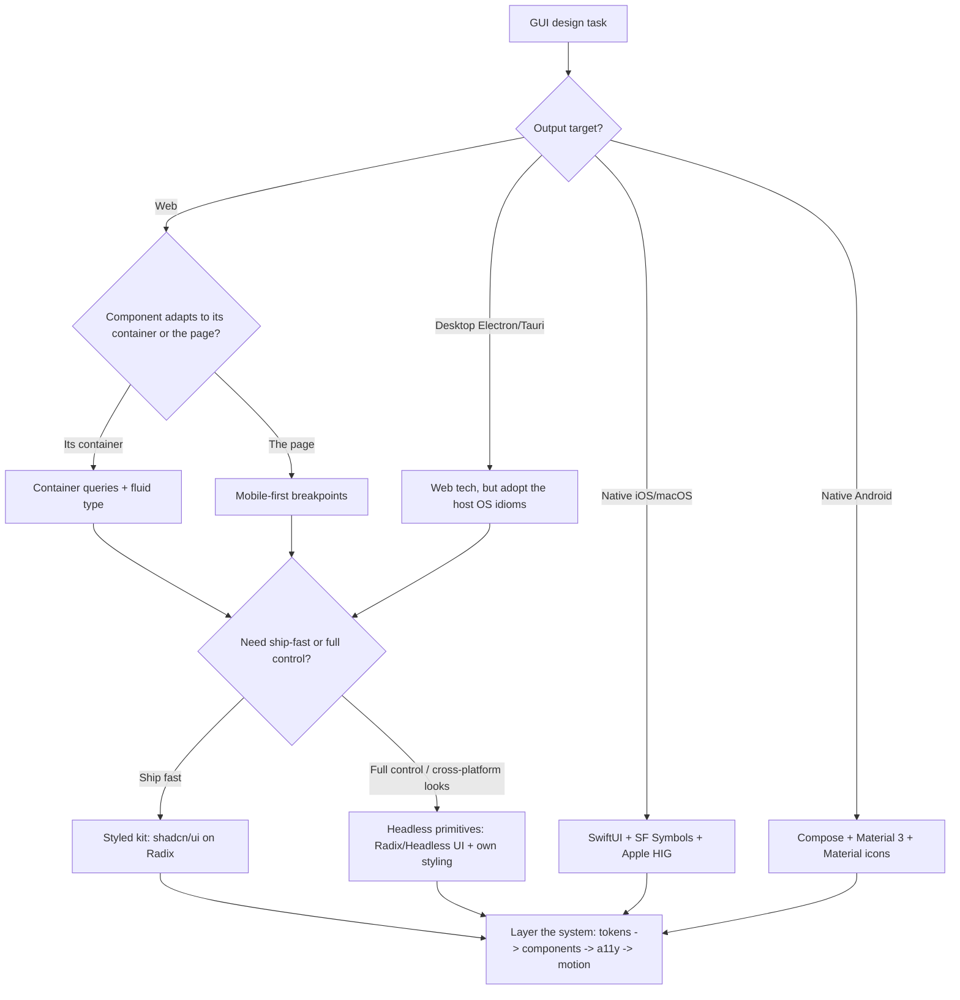

# Beautiful GUI Design

Treat the screen as a designed surface, not a dump of controls: hierarchy, color, type, motion, and accessibility are load-bearing, and every choice must survive light/dark mode, small and large viewports, keyboard and screen-reader use, and the conventions of the platform it ships on.

## When to Use

- Designing or reviewing a web app, marketing page, dashboard, or settings/onboarding flow.
- Building a desktop GUI (Electron/Tauri) or a native app (SwiftUI/AppKit, Jetpack Compose, WinUI).
- Establishing a design system: semantic color tokens, a type scale, spacing, elevation, component states.
- Adding light/dark themes, fixing contrast/accessibility failures, or making a layout responsive.
- Choosing a component approach (headless primitives vs. styled kit) or a design-to-code tool.

## NOT for

- Terminal/CLI output, TUIs, prompts, or ANSI rendering. Use `beautiful-cli-design`.
- API response schemas, wire formats, or machine-only output contracts.
- Backend architecture, data modeling, or non-visual logic.
- Brand strategy / copywriting (this is the visual + interaction layer).

## Decision Points



Route first:
- **Tokens before components, components before screens.** A screen built on ad-hoc values can't be themed or kept consistent. Build the three-tier token model (primitive → semantic → component) first. See `references/06-component-systems-tokens-and-platform-idioms.md`.
- **Headless primitives** (Radix/Headless UI) when you need full visual control or different looks per platform; **styled kits** (shadcn/ui) when you want 80% shipped with accessibility already handled. Never hand-roll an interactive control without the ARIA/keyboard logic a primitive gives you.
- **Container queries** when a component appears at multiple widths (sidebar vs. grid); **breakpoints** for page-level layout.
- **Native means native.** A web look shipped on iOS/Android reads as a web app. Adopt the platform's icons, spacing, type, and controls.

## Visual System Rules

- **Spacing is a system, not vibes.** Use an 8pt grid (4pt for micro-adjustments). One base per project. `references/01`.
- **Hierarchy needs contrast, not just color.** Distinguish tiers by ≥1.5–2× size plus weight/position — never color alone. `references/01`.
- **Color is semantic tokens, never raw hex in components.** Build a perceptually-uniform (OKLCH) ramp; derive light/dark and every state from it. `references/02`.
- **Type: `rem` not `px`, a modular scale, body ≥ 14px (0.875rem).** 45–75ch measure, role-based line-height. Honor OS Dynamic Type; never lock zoom. `references/03`.
- **Motion is communication, not decoration.** 100–300ms, ease-out to enter / ease-in to exit, animate only transform/opacity, always honor `prefers-reduced-motion`. `references/04`.
- **Accessibility is a design input, not a retrofit.** Semantic HTML/native controls first, visible focus always, 4.5:1 body contrast, 44/48pt touch targets, keyboard + screen-reader passes. `references/05`.
- **Icons are an icon system (SF Symbols / Lucide / Heroicons), never emoji.** Emoji as UI icons reads as cheap and renders inconsistently.

## Failure Modes

### Anti-Pattern: "Rainbow Vomit"
**Symptom**: Many unrelated colors; states (hover/error/focus) are indistinguishable from intent (primary/info).
**Detection rule**: Count unique colors in a 400×400px screenshot — more than ~8 is a smell.
**Fix**: One primary + one accent + semantic status colors; derive hover/active/disabled by lightness offset. `references/02`.

### Anti-Pattern: "Invisible in Light Mode" (or Dark)
**Symptom**: Looks fine in one theme, unreadable in the other (light text on light, low-contrast accents).
**Detection rule**: Hardcoded theme colors; contrast checker reports < 4.5:1 (text) or < 3:1 (UI) in either mode.
**Fix**: Semantic tokens with real light AND dark values (not an inversion); verify both with a contrast tool. `references/02`.

### Anti-Pattern: "Tiny Type / Locked Zoom"
**Symptom**: Body/caption text below 14px; `user-scalable=no` or `maximum-scale<2`; ignores OS text size.
**Detection rule**: Grep for `font-size: 0.[0-7]…`, Tailwind `text-xs` on prose, `user-scalable=no`.
**Fix**: `rem`-based scale, ≥14px body, honor Dynamic Type, never disable zoom. `references/03`, `references/05`.

### Anti-Pattern: "Decorative Motion / Layout Thrash"
**Symptom**: Animations on width/height/top/left, parallax, >300ms repeated transitions; janky on mobile.
**Detection rule**: DevTools Performance shows tall Layout/Recalc bars during animation; no `prefers-reduced-motion` path.
**Fix**: Animate transform/opacity only; tokenize durations/easing; honor reduced-motion. `references/04`.

### Anti-Pattern: "Web Look on Native"
**Symptom**: Material ripples on iOS, 4pt corners and emoji icons, centered controls that fight the HIG.
**Detection rule**: Side-by-side with a first-party app (Settings, Messages) — corners/spacing/icons/controls differ.
**Fix**: Use the platform's primitives, icon set, spacing, and type. `references/06`.

### Anti-Pattern: "Magic Numbers in Components"
**Symptom**: `padding: 13px`, one-off hex, hand-picked hover colors scattered through component files.
**Detection rule**: Grep components for numeric literals and `#[0-9a-f]{6}` — every hit is un-tokenized.
**Fix**: Three-tier tokens; components reference semantic tokens only. `references/06`.

### Anti-Pattern: "Stateless / Inaccessible Controls"
**Symptom**: A control with only default + click; no focus ring, no disabled/loading/error, `<div>`-as-button.
**Detection rule**: Tab through the UI — focus vanishes; render the control in all states — most are missing.
**Fix**: Full state machine (default/hover/active/focus/disabled/loading) on a semantic element or headless primitive. `references/05`, `references/06`.

## Worked Example: A Button, Done Right

**Before** — hardcoded, themeless, inaccessible:
```jsx
<button style={{ background: '#0066FF', color: '#fff', padding: '13px', borderRadius: 4 }}>Save</button>
```
Problems: raw hex (no theme), magic padding, no hover/active/focus/disabled, white text may fail contrast, no dark mode.

**After** — tokens + states + a11y:
```css
.btn-primary {
  background: var(--color-primary);
  color: var(--color-text-on-primary);
  padding: var(--space-2) var(--space-4);      /* 8pt grid */
  border-radius: var(--radius-md);
  font-size: 1rem;                              /* ≥14px */
  transition: background-color 150ms cubic-bezier(0,0,.2,1);  /* ease-out */
}
.btn-primary:hover    { background: var(--color-primary-hover); }   /* −10% L */
.btn-primary:active   { background: var(--color-primary-active); transform: scale(.98); }
.btn-primary:focus-visible { outline: 3px solid var(--color-focus-ring); outline-offset: 2px; }
.btn-primary:disabled { background: var(--color-surface-subtle); color: var(--color-text-disabled); cursor: not-allowed; }
@media (prefers-reduced-motion: reduce) { .btn-primary { transition: none; } }
```
Why it works: a semantic `<button>` (keyboard + SR for free), tokens that flip cleanly for dark mode, every state defined, contrast guaranteed by token design, motion that respects the user. The same tokens render natively via SF Symbols/SwiftUI on iOS and Compose on Android (`references/06`).

## Quality Gates

- [ ] **Spacing on an 8pt system**; one base; no magic numbers in components.
- [ ] **Hierarchy reads when squinting** — focal point obvious via size/weight/position, not color alone.
- [ ] **Color is semantic tokens**; light AND dark both designed and contrast-verified (4.5:1 text, 3:1 UI).
- [ ] **Type in `rem`, body ≥14px**, modular scale, 45–75ch measure; OS text-size honored; zoom never locked.
- [ ] **Every interactive element** has default/hover/active/focus-visible/disabled (+ loading where async).
- [ ] **Keyboard pass**: full operability, visible focus on every stop, modals trap + restore focus.
- [ ] **Screen-reader pass**: semantic elements/labels; ARIA only where needed and correct.
- [ ] **Motion**: transform/opacity only, tokenized duration/easing, `prefers-reduced-motion` honored.
- [ ] **Touch targets** ≥44×44pt (iOS) / 48dp (Android) / ≥24px (WCAG), adequately spaced.
- [ ] **Icons from an icon system** (SF Symbols/Lucide/Heroicons), never emoji-as-icon.
- [ ] **Native builds use native idioms** (controls, icons, spacing, type) — no web look shipped on native.
- [ ] **Tokens flow to all targets** from one source (web CSS vars, iOS Swift, Android Kotlin).

## Fork Guidance

Fork when the work has distinct lanes owned by different actors:
- **Visual-system lane**: hierarchy, color, type, spacing, elevation (`references/01`–`03`).
- **Interaction lane**: component states, motion, micro-interactions (`references/04`, `06`).
- **Accessibility lane**: keyboard, screen reader, contrast, targets, reduced-motion (`references/05`).
- **Platform lane**: native idioms, token flow, responsive/adaptive (`references/06`).

Keep final visual-language decisions in the parent so one actor owns coherence.

## Reference Map

- `references/01-visual-hierarchy-layout-spacing.md` — Gestalt, the 8pt/4pt system, layout grids and safe areas, focal point, density vs. whitespace, elevation, layout archetypes.
- `references/02-color-and-theming.md` — semantic tokens, OKLCH ramps, light/dark done right, WCAG contrast math, state colors, data-viz vs. chrome, theming architecture.
- `references/03-typography.md` — modular scales, `rem`, line-height/measure, pairing, variable fonts, web-font loading, fluid type, Dynamic Type, the 14px floor.
- `references/04-motion-and-microinteractions.md` — duration/easing tokens, spring vs. tween, purposeful motion, the compositor budget, honest progress, reduced-motion.
- `references/05-accessibility-and-inclusive-design.md` — WCAG 2.2 AA, semantic-first, keyboard + focus management, targets, live regions, forms, testing workflow.
- `references/06-component-systems-tokens-and-platform-idioms.md` — three-tier tokens, component anatomy/states, headless vs. styled, token flow web↔native, responsive/adaptive, iOS/macOS/Android/Windows idioms, design-to-code tooling.

<!-- BEGIN BUNDLE INDEX (auto: index_references.py) -->

## Skill Bundle Index

*Every file in this skill, and when to open it. Auto-generated; run `scripts/index_references.py --fix`.*

**`references/`**
- [`references/01-visual-hierarchy-layout-spacing.md`](references/01-visual-hierarchy-layout-spacing.md) — Visual Hierarchy, Layout & Spacing — **Visual hierarchy is the art of making some elements more prominent than others through spatial relationships, sizing, color, and alignment
- [`references/02-color-and-theming.md`](references/02-color-and-theming.md) — Color & Theming: Semantic Tokens, Accessible Contrast, and Multimode Systems — Raw hex colors in components are **the root of evil**.
- [`references/03-typography.md`](references/03-typography.md) — Typography Systems — A modular type scale anchors all typographic decisions.
- [`references/04-motion-and-microinteractions.md`](references/04-motion-and-microinteractions.md) — Motion & Micro-Interactions Reference — Motion is communication—feedback on state, guidance through hierarchy, reassurance during waits, and affordance signaling on interactive ele
- [`references/05-accessibility-and-inclusive-design.md`](references/05-accessibility-and-inclusive-design.md) — Accessibility & Inclusive Design: WCAG 2.2 AA Essentials — True accessibility is a design discipline, not a retrofit.
- [`references/06-component-systems-tokens-and-platform-idioms.md`](references/06-component-systems-tokens-and-platform-idioms.md) — Component Systems, Design Tokens & Platform-Native Idioms — A professional design system bridges the gap between **tokens** (semantic units of visual design), **components** (reusable building blocks 

<!-- END BUNDLE INDEX -->
