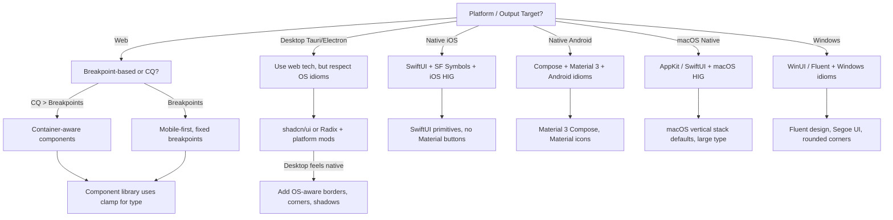

# Component Systems, Design Tokens & Platform-Native Idioms

## Overview

A professional design system bridges the gap between **tokens** (semantic units of visual design), **components** (reusable building blocks with documented states and anatomy), and **platforms** (web, desktop, mobile with radically different idioms). The mistake: treating tokens as a cosmetic layer or shipping a web aesthetic directly to native clients. The reality: tokens are the source of truth for both; components are platform-specific renderers; idioms are non-negotiable constraints.

This document covers the **three-tier token model** (primitive → semantic → component), component anatomy & state machines, the headless/styled component spectrum, token flow across platforms, responsive & adaptive layout strategies, and the platform idioms that separate shipping quality from shipping mediocrity.

---

## Decision Points: Routing Framework

Which layer are you designing for? Use this flowchart to route to the correct architecture.



**Key routing rule**: If the same component renders on web AND native, you are architecting wrong. Use **themed wrappers** that delegate to platform-native stacks, not a single monolithic component.

---

## Three-Tier Token Model

### Tier 1: Primitive Tokens (Design Constants)

Raw, platform-agnostic values: colors, spacing, type sizes, shadows, border radii. These **live in source files**, not in design tools (or sync from design tools via tooling like Tokens Studio / Style Dictionary).

**Example primitive token set** (source: `tokens/primitives.json`):
```json
{
  "color": {
    "gray": {
      "50": "#f9fafb",
      "100": "#f3f4f6",
      "200": "#e5e7eb",
      "500": "#6b7280",
      "900": "#111827"
    },
    "blue": {
      "600": "#2563eb",
      "700": "#1d4ed8"
    }
  },
  "space": {
    "xs": "4px",
    "sm": "8px",
    "md": "16px",
    "lg": "24px"
  },
  "type": {
    "size": {
      "sm": "12px",
      "base": "16px",
      "lg": "18px",
      "xl": "20px"
    },
    "weight": { "regular": 400, "medium": 500, "bold": 700 }
  },
  "radius": {
    "none": "0",
    "sm": "4px",
    "md": "8px",
    "lg": "12px",
    "full": "9999px"
  },
  "shadow": {
    "sm": "0 1px 2px rgba(0,0,0,0.05)",
    "md": "0 4px 6px rgba(0,0,0,0.1)",
    "lg": "0 10px 15px rgba(0,0,0,0.1)"
  }
}
```

**Why separate from Tier 2?** Primitives are immutable anchors. Tier 2 semantic tokens *combine* primitives based on context (dark mode, high-contrast, accessible themes). This decoupling means you can recolor an entire theme by editing 5 primitive values.

### Tier 2: Semantic Tokens (Intent-Based)

Map primitives to *purpose*: "interactive-bg-primary" (blue-600), "text-secondary" (gray-500), "surface-elevated" (white with shadow-md). These are theme-aware and platform-aware.

**Example semantic tokens** (web light theme):
```json
{
  "color": {
    "bg": {
      "primary": "{color.gray.50}",
      "secondary": "{color.gray.100}",
      "interactive": "{color.blue.600}",
      "success": "#10b981",
      "danger": "#ef4444"
    },
    "text": {
      "primary": "{color.gray.900}",
      "secondary": "{color.gray.500}",
      "on-interactive": "#ffffff",
      "disabled": "{color.gray.400}"
    },
    "border": {
      "default": "{color.gray.200}",
      "focus": "{color.blue.600}"
    }
  },
  "space": {
    "component-padding": "{space.md}",
    "section-gap": "{space.lg}",
    "input-padding": "{space.sm} {space.md}"
  },
  "type": {
    "body-lg": {
      "size": "{type.size.base}",
      "weight": "{type.weight.regular}",
      "lineHeight": "1.5"
    },
    "label-sm": {
      "size": "{type.size.sm}",
      "weight": "{type.weight.medium}",
      "lineHeight": "1.4"
    }
  }
}
```

Dark theme variants override at this tier; primitives stay constant.

### Tier 3: Component Tokens (Applied to Anatomy)

These tokens are **embedded in component definitions** and rarely exported separately. They specify the exact token usage per component state.

**Button component token attachment**:
```
Button.default:
  background: color.bg.interactive
  text: color.text.on-interactive
  padding: space.input-padding
  border-radius: radius.md
  
Button.hover:
  background: color.blue.700  // darkened interactive
  
Button.disabled:
  background: color.gray.100
  text: color.text.disabled
  opacity: 0.5
  cursor: not-allowed
```

**Why three tiers and not two?** Semantic tokens are *reusable across many components*; component tokens are *instance-specific overrides*. A button and an input both use `color.bg.interactive` (semantic), but the button adds `transform: scale(0.98) on:active` (component-tier animation token). Collapsing these layers forces either component bloat or semantic ambiguity.

---

## Component Anatomy & State Machines

Every component has a **fixed anatomy** (structure) and a **state machine** (transitions).

### Anatomy: Input Field Example

```
┌─────────────────────────────────────────────┐
│  Label (semantic: label-sm)                 │
├─────────────────────────────────────────────┤
│ ┌─ Icon (left)   ┌──────────┐   Icon (right)─┐
│ │               │  Input   │                 │
│ └─────────────────────────────────────────────┘
│  Error text (semantic: caption, color.danger) │
└─────────────────────────────────────────────┘
```

Each sub-part is a **slot** or **composition point**. Slots are either:
- **Fixed tokens** (label size is always `label-sm`)
- **Composable** (left/right icons accept any icon library, but must respect the icon size token `icon-sm: 16px`)

### State Machine: Button States

```
idle
 ├─ background: color.bg.interactive
 ├─ text-color: color.text.on-interactive
 └─ cursor: pointer
 
 ↓ :hover (desktop)
hover
 ├─ background: darkened(color.bg.interactive)
 └─ shadow: shadow-md
 
 ↓ :active
active
 ├─ transform: scale(0.98)
 └─ shadow: shadow-sm
 
disabled
 ├─ background: color.gray.100
 ├─ text-color: color.text.disabled
 ├─ cursor: not-allowed
 ├─ opacity: 0.5
 └─ pointer-events: none
 
focus
 ├─ outline: 2px solid color.border.focus
 ├─ outline-offset: 2px
 └─ (on web, via :focus-visible)

loading
 ├─ content: spinner icon
 └─ disabled: true
```

States are **mutually exclusive on any single render** (a button is either disabled OR hover, never both), but **independent across instances** (one button can be loading while another is idle).

---

## Headless & Styled: The Spectrum

### Headless Primitives (Radix UI, Headless UI)

**What**: Unstyled, accessible logic layers. Radix provides:
- `Dialog` → manages focus, backdrop, escape-key handling
- `Combobox` → keyboard navigation, item filtering, open/close state
- `Tabs` → tab selection, ARIA labeling, keyboard control

**Why**: 100% flexibility. You own the DOM. Integrates with *any* CSS framework.

**Cost**: You write state management and styling for every component. **Not viable for ship-fast teams.**

**When to use**: Design systems where design teams directly author components (stylists designing in CSS-in-JS, not designers in Figma); or cross-platform teams that need different visual treatments per platform.

### Styled Kits (shadcn/ui, Chakra, Mantine)

**What**: Headless logic + pre-built Tailwind/CSS themes. shadcn/ui ships React components that compose Radix primitives + Tailwind utility classes.

**Example**: A shadcn `<Button>` is Radix's button logic + Tailwind `bg-primary text-primary-foreground` tokens + your theme customization.

**Why**: 80% ready-to-ship, 20% customizable. Theming happens via CSS variable injection or Tailwind config.

**Trade-off**: Locked to Tailwind unless you fork the components (which shadcn/ui explicitly encourages).

### Theme-Aware Styled Kits

Modern evolution: Mantine, Chakra, or Material UI ship **theme objects** that populate CSS variables or Tailwind config at runtime.

```javascript
// Mantine theme object
const theme = {
  colors: {
    brand: ['#f0f9ff', ..., '#001f3f'],
    gray: ['#f9fafb', ..., '#111827'],
  },
  spacing: { xs: 4, sm: 8, md: 16, lg: 24 },
  typography: {
    fontSize: { sm: 12, md: 16, lg: 18 },
  },
  components: {
    Button: {
      defaultProps: { size: 'md' },
      styles: (theme) => ({
        root: { background: theme.colors.brand[6] },
      }),
    },
  },
};
```

Each component reads `theme` at render time; dark mode is `theme.colorScheme === 'dark'` → swap token values.

### The Anti-Pattern: Styled Without Headless Logic

Do NOT ship a custom Button component that only handles click + styling, ignoring accessibility (no aria-pressed, no focus management, no disabled state handling). This fails in three ways:
1. **Keyboard navigation** doesn't work (Tab doesn't focus, Enter doesn't activate).
2. **Screen readers** announce it as text, not a button.
3. **States are incomplete** (no way to disable without removing from DOM).

**Fix**: Use Radix (or ARIA primitives directly) as the foundation; layer styling on top.

---

## Token Flow: Web to Native

The same **semantic token set** must render on web *and* native. The routing happens at the **platform layer**, not the token layer.

### Web (Tailwind/CSS Variables)

```css
/* tokens/web.css */
:root {
  --color-bg-primary: #f9fafb;
  --color-text-primary: #111827;
  --space-md: 16px;
  --type-body-lg-size: 16px;
}

@media (prefers-color-scheme: dark) {
  :root {
    --color-bg-primary: #111827;
    --color-text-primary: #f9fafb;
  }
}

/* component usage */
.button {
  background: var(--color-bg-interactive);
  color: var(--color-text-on-interactive);
  padding: var(--space-input-padding);
}
```

### iOS (SwiftUI)

```swift
// tokens/colors.swift
struct TokenColors {
  static let bgPrimary = Color(red: 0.98, green: 0.98, blue: 0.98)
  static let textPrimary = Color(red: 0.07, green: 0.08, blue: 0.14)
}

struct TokenSpacing {
  static let md: CGFloat = 16
}

// component usage
struct TokenButton: View {
  var body: some View {
    Button(action: {}) {
      Text("Press me")
        .foregroundColor(TokenColors.textOnInteractive)
        .padding(.vertical, TokenSpacing.sm)
        .padding(.horizontal, TokenSpacing.md)
    }
    .background(TokenColors.bgInteractive)
    .cornerRadius(8)
  }
}
```

### Android (Compose)

```kotlin
// tokens/Colors.kt
object TokenColors {
  val bgPrimary = Color(0xFFF9FAFB)
  val textPrimary = Color(0xFF111827)
}

object TokenSpacing {
  val md = 16.dp
}

// component usage
@Composable
fun TokenButton(onClick: () -> Unit) {
  Button(
    onClick = onClick,
    modifier = Modifier
      .background(TokenColors.bgInteractive)
      .padding(horizontal = TokenSpacing.md, vertical = TokenSpacing.sm),
  ) {
    Text("Press me", color = TokenColors.textOnInteractive)
  }
}
```

**Architecture for shared tokens**: Store primitives + semantic mappings in a **language-agnostic format** (JSON, YAML). Generate platform-specific code via **Style Dictionary** (Salesforce) or **Tokens Studio** → Figma → JSON export → code generation.

Pipeline:
```
design/tokens.json
  ↓ (tokens-studio-plugin or hand-authored)
  ├→ web/tokens.css (CSS variables)
  ├→ ios/TokenColors.swift (Swift enums)
  └→ android/tokens.kt (Kotlin objects)
```

---

## Responsive & Adaptive Layout

### Mobile-First Breakpoints (Traditional Web)

Define tokens and components for mobile; add overrides at larger breakpoints.

```css
/* Base: mobile (0px and up) */
.card {
  padding: var(--space-sm);  /* 8px */
  gap: var(--space-sm);
  grid-template-columns: 1fr;
}

/* Tablet: 768px and up */
@media (min-width: 768px) {
  .card {
    padding: var(--space-md);  /* 16px */
    grid-template-columns: repeat(2, 1fr);
  }
}

/* Desktop: 1024px and up */
@media (min-width: 1024px) {
  .card {
    grid-template-columns: repeat(3, 1fr);
  }
}
```

**Breakpoint tokens** (semantic):
```json
{
  "breakpoint": {
    "sm": "640px",    // tablet portrait
    "md": "768px",    // tablet landscape
    "lg": "1024px",   // desktop
    "xl": "1280px"    // large desktop
  }
}
```

### Container Queries (Modern Web)

Breakpoints are *viewport* based; container queries are *container* based. A sidebar card doesn't care about viewport width—it cares about its container's width.

```css
.card {
  container-type: inline-size;
}

.card__title {
  font-size: var(--type-body-lg-size);  /* 16px */
}

/* If card is narrow (< 300px container width) */
@container (max-width: 300px) {
  .card__title {
    font-size: var(--type-body-sm-size);  /* 12px */
  }
}
```

**Decision rule**: Use CQ if components appear in multiple container widths (sidebars, modal dialogs, card grids). Use breakpoints if adapting the entire page layout.

### Fluid Type (Responsive Font Sizing)

Instead of discrete breakpoints, scale type smoothly between viewport widths using `clamp()`.

```css
/* Scale from 14px (mobile) to 20px (desktop) */
.heading-lg {
  font-size: clamp(
    14px,                      /* minimum */
    2vw,                       /* preferred (2% of viewport width) */
    20px                       /* maximum */
  );
}

/* Even more readable: scale from `--type-lg` to `--type-xl` */
.heading-lg {
  font-size: clamp(
    var(--type-size-lg),       /* 18px */
    5vw,
    var(--type-size-xl)        /* 24px */
  );
}
```

**Advantage**: No media queries; type scales naturally. **Pitfall**: Too aggressive vw scaling makes type illegible on ultra-wide monitors. Always cap with `max()` or `clamp()`.

### Adaptive Layout (Desktop/Mobile Divergence)

On mobile, stack vertically; on desktop, use a grid. Component behavior changes, not just visual size.

```jsx
// React example with Tailwind
function FeatureGrid({ items }) {
  return (
    <div className="grid grid-cols-1 md:grid-cols-2 lg:grid-cols-3 gap-md">
      {items.map(item => <FeatureCard key={item.id} {...item} />)}
    </div>
  );
}

// Token-driven: tokens define the grid, not hardcoded
function FeatureGrid({ items }) {
  return (
    <div style={{
      display: 'grid',
      gridTemplateColumns: 'repeat(auto-fit, minmax(var(--component-card-width), 1fr))',
      gap: 'var(--section-gap)',
    }}>
      {items.map(item => <FeatureCard key={item.id} {...item} />)}
    </div>
  );
}
```

---

## Platform-Native Idioms (The Hard Requirement)

Shipping a web-designed button on iOS looks like a web button on iOS. This is the cardinal sin.

### iOS & SwiftUI

**Non-negotiables**:
- **SF Symbols** only for icons (not Lucide, not emoji). SF Symbols are weight-aware (thin, light, regular, semibold, bold) and render crisply.
- **Haptic feedback** on interactions (`.sensoryFeedback(.selection, trigger: isSelected)` in SwiftUI 5.5+).
- **Vertical spacing** is preferred; stacks grow downward, not right.
- **Large touch targets** (minimum 44x44pt; 48x48pt is iOS 17+).
- **Rounded corners** default to medium (8-12pt), not 4pt.
- **No hover states** (iOS has no hover). Use tap feedback only.
- **System fonts** (SF Pro Display, SF Compact) are enforced at OS level.
- **Safe area** insets (notch, Dynamic Island, home indicator).

**Anti-pattern**: Centering a Material Design button on an iOS screen. The iOS HIG forbids centered UI in many contexts; prefer top/bottom safe area alignment.

**Fix**: Use `VStack` with `.top` alignment by default; override only for specific contexts (modal dialogs centered).

### macOS

**Non-negotiables**:
- **Large type**: macOS assumes large screens. Body text is 13pt+ (not 12pt web default).
- **No shadows by default**; use subtle separators.
- **Window chrome** (title bar, traffic lights) is managed by the system; don't reinvent.
- **Keyboard accessibility** is table stakes (Tab, arrow keys, Escape, Cmd+Q).
- **Menus** (right-click context menus, app menu bar) are OS-standard, not custom paints.

**Anti-pattern**: A touch-mobile UI (Material buttons, large spacing) on a 27" iMac. Users see it as a web app, not a native macOS app.

**Fix**: Use AppKit or SwiftUI with `macOS` target; increase default text to 13pt; reduce horizontal padding to 12px (not 24px).

### Android & Material 3

**Non-negotiables**:
- **Material Design 3** (not MD2, not flat design). Color is semantic; primary, secondary, tertiary, and their inverses.
- **Material icons** (Google's Material Icons) or Material Design 3 symbol set; never emoji-as-icon.
- **Haptic patterns** (`.hapticFeedback()` or `HapticFeedbackConstants.LONG_PRESS`).
- **Scrim overlays** (semitransparent dark overlay behind dialogs/modals, not a hard backdrop).
- **System fonts**: Roboto (system, default).
- **Elevation** via shadows and scrim, not borders; M3 uses tonal colors for layering instead of shadows.

**Anti-pattern**: A rounded-corner iPhone button on Android. Android uses filled tonal buttons by default, not outlined.

**Fix**: Use Material 3 `Button`, `FilledTonalButton`, or `ElevatedButton` per design spec; let Compose handle the rest.

### Windows & Fluent Design

**Non-negotiables**:
- **WinUI 3** or **Fluent Design** primitives.
- **Segoe UI** font (system default).
- **Rounded corners** (8px minimum on buttons/inputs; 4px on small elements).
- **Subtle shadows** (not iOS deep shadows; Fluent uses light acrylic).
- **Keyboard-first navigation** (Win + arrow keys, Alt + letter shortcuts).
- **Acrylic background** for depth (semitransparent material, not a solid color).

**Anti-pattern**: A flat Material Design card on Windows. Fluent expects layered depth.

**Fix**: Use `Windows.UI.Xaml.Controls.ContentDialog` or WinUI 3 `Button`; apply Acrylic brush to backgrounds.

### Web (No Native Constraint, But Respect Patterns)

**Non-negotiables**:
- **Keyboard accessibility** (Tab navigation, :focus-visible, Escape to close modals).
- **WCAG 2.1 AA** minimum (color contrast 4.5:1 for body text).
- **Semantic HTML** (`<button>`, `<input>`, `<label>`, `<article>`).
- **No vendor lock-in** (avoid `-webkit-`, `-moz-` in production; use `@supports` for fallbacks).
- **Icon system**: Lucide, Heroicons, or custom SVG; never emoji (can't control size/weight).

**Anti-pattern**: A 24px Material icon on a 12px web label. Icon and text are misaligned.

**Fix**: Use a consistent icon size token (16px standard, 20px large); scale text to match, not the reverse.

---

## Anti-Patterns & Failure Modes

### Pattern 1: Monolithic Token Set (No Semantic Layer)

**Symptom**: Your JSON has `gray-50`, `gray-100`, ..., `gray-900` but no `bg-primary`, `bg-secondary`. You're reaching for `gray-600` in Button, `gray-500` in Label, `gray-700` in Input.

**Detection rule**: Grep your CSS for 5+ raw primitive references (e.g., `color: var(--gray-600)`) in different components. Run a linter to count instances.

**Fix**: Extract a semantic layer. Create `bg-interactive: gray-600`, `text-secondary: gray-500`, etc. Update all components to use semantic tokens only. One day you'll need to rebrand from blue to teal; semantic tokens let you change one JSON value instead of hunting through 100 component files.

**Worked example**:
```json
// Before (primitives only)
{ "color": { "gray": { "500": "#6b7280", "600": "#4b5563" } } }

.button { background: var(--gray-600); }  // What does this *mean*?

// After (semantic layer)
{
  "color": {
    "gray": { "500": "#6b7280", "600": "#4b5563" },
    "interactive-bg": "{color.gray.600}",
    "text-secondary": "{color.gray.500}"
  }
}

.button { background: var(--interactive-bg); }  // Clear intent.
```

### Pattern 2: Platform Confusion (Web Idiom on Native)

**Symptom**: Your iOS app has 4pt rounded corners, centered 48px touch targets, and Material Design ripple animations.

**Detection rule**: Screenshot the app on device; compare to native Apple Music, Settings, or Messages. Corners, spacing, or shadows differ? You've drifted.

**Fix**: Audit against the respective HIG (iOS HIG, macOS HIG, Material 3). Redo the button: iOS uses system buttons (`.button(action:)` in SwiftUI), not custom styled containers. macOS uses `.controlSize(.large)` by default.

**Worked example**:
```swift
// Anti-pattern (iOS with Material vibes)
struct BadButton: View {
  var body: some View {
    Button(action: {}) { Text("Tap") }
      .frame(height: 48)  // Too tall for iOS
      .background(Color.blue)
      .cornerRadius(4)    // Too sharp
      .shadow(radius: 8)  // Too deep
  }
}

// iOS-native
struct GoodButton: View {
  var body: some View {
    Button(action: {}) { Text("Tap") }
      .buttonStyle(.borderedProminent)  // OS default style
  }
}
```

### Pattern 3: Component State Leaks (Missing Disabled/Loading/Error)

**Symptom**: An input field component only has an active/inactive style. No error state, no loading state, no required indicator, no help text slot.

**Detection rule**: Write a test that tries to render the input in 10 different states. If > 2 states break the rendering or lack visual distinction, you're missing state coverage.

**Fix**: Define a complete state machine. Input states:
- Default (idle, empty, unfocused)
- Focus (focused, empty)
- Filled (focused or unfocused, has value)
- Error (validation failed)
- Disabled (no interaction)
- Loading (async validation in progress)

Each state gets explicit tokens: background, text color, border, icon, helper text. Test all transitions (focus → blur, filled → error, error → focus, etc.).

**Worked example**:
```jsx
// Input state machine
<Input
  state="error"
  value="john@"
  helperText="Please enter a valid email"
  icon={<AlertCircle size={16} />}
  disabled={false}
/>

// Maps to tokens:
// background: color.bg-error (light red)
// border: color.border-error (red)
// text.icon: color.text-danger (red)
// helper text: color.text-danger
```

### Pattern 4: Overfit to One Platform

**Symptom**: Your design tokens JSON has `web` and `native` branches, but they're 80% different. You're maintaining two design systems, not one.

**Detection rule**: Diff your `tokens/web.json` and `tokens/native.json`. If > 30% of token values differ, you're not sharing semantics.

**Fix**: Separate concerns:
- **Primitives** (colors, spacing, type sizes) are platform-agnostic and shared.
- **Component mappings** (how Button uses primitives) are platform-specific.
- **Layout breakpoints** are platform-specific, but token values (space-md, space-lg) are shared.

```json
{
  "primitives": { /* shared */ },
  "semantic": { /* shared */ },
  "web": { "components": { /* Button: [...] */ } },
  "native": { "components": { /* Button: [...] */ } }
}
```

### Pattern 5: Magic Numbers in Component Code

**Symptom**: A Button component hardcodes `padding: 12px 16px` instead of using token references.

**Detection rule**: Grep for numeric literals in component files (pixels, percentages). Anything you find is a candidate for tokenization.

**Fix**: Extract to tokens. Even a single-use value deserves a token name; it documents intent and enables future theming.

```jsx
// Anti-pattern
function Button({ children }) {
  return <button style={{ padding: '12px 16px', borderRadius: '8px' }}>{children}</button>;
}

// Correct
function Button({ children }) {
  return <button style={{
    padding: `var(--space-sm) var(--space-md)`,
    borderRadius: 'var(--radius-md)',
  }}>{children}</button>;
}
```

### Pattern 6: Forgetting Container Queries

**Symptom**: A Card component looks good in a 400px sidebar but breaks in a 900px grid. You add 5 media queries to fix it.

**Detection rule**: Does this component appear in multiple container widths? If yes, and you're using breakpoints, you've chosen wrong.

**Fix**: Use container queries if the component needs to adapt to its container, not the viewport. Breakpoints stay for page-level layout.

---

## Design-to-Code Tooling

### Decision Matrix: Figma, v0, 21st.dev, or Hand-Code

| Tool | Best For | Trade-off |
|------|----------|-----------|
| **Figma** + tokens plugin (Tokens Studio) | Design systems at scale; multi-team; version control of design | Steep setup; designer-coder gap remains |
| **v0** (Vercel) | Rapid web prototyping; component discovery; Shadcn/ui export | No native; limited to web; AI-generated code needs review |
| **21st.dev** | Component ideation; inspiration; quick design feedback | Closed ecosystem; Figma-dependent |
| **Hand-code** (TypeScript + Tailwind) | Full control; platform parity (web + native); clean diff history | Slowest initial velocity; design review is code review |

### Tokens Studio → Figma → Code

Workflow:
1. Maintain tokens in **Tokens Studio** (JSON format, plugin for Figma).
2. Designers in Figma apply tokens to components (Design tokens → set variable).
3. Export tokens JSON via Tokens Studio API.
4. Run **Style Dictionary** to generate code (CSS, Swift, Kotlin).
5. Components import generated tokens.

Benefits:
- Single source of truth (Tokens Studio JSON).
- Designers see live tokens in Figma.
- Code is generated, not manually synced.
- Dark mode/theme variants handled in JSON, reflected everywhere.

### v0 for Rapid Web Prototyping

v0 (Vercel's design-to-code AI) is exceptional at churning out React components from Figma designs. Caveats:
- Generated code is often Shadcn/ui + Tailwind, which is web-only.
- Requires manual cleanup (state handling, accessibility, responsiveness).
- Great for "show a prototype to stakeholders"; not a production pipeline.
- No native output.

### 21st.dev for Component Inspiration

21st.dev (formerly "Beautiful UI") generates design variations, animations, and component ideas. Use it to:
- See multiple design treatments of a Button (Material, iOS, minimalist, dark, etc.).
- Validate that your design token choices match user expectations.
- Generate Figma designs or HTML/CSS code snippets.

Not a replacement for a design system; a creative accelerator.

---

## Quality Gates Checklist

Before shipping a component system, verify:

### Tokens
- [ ] **Primitives are immutable**. No design changes without a token change.
- [ ] **Semantic tokens exist**. No raw primitives in component code.
- [ ] **Token names are intent-based**. `interactive-bg-primary`, not `blue-600`.
- [ ] **Dark mode tokens are defined**. Test every semantic token in both light and dark.
- [ ] **Tokens generate code**. Run Style Dictionary; check that CSS variables match Figma designs.

### Components
- [ ] **State machine documented**. Every component has a states document (default, hover, focus, active, disabled, error, loading).
- [ ] **Anatomy is fixed**. Slots and composition points are immutable; only token values change per theme.
- [ ] **Accessibility baseline**. ARIA labels, keyboard navigation, focus management (use Radix primitives or ARIA spec).
- [ ] **Responsive variants exist**. Mobile (breakpoint sm), tablet (md), desktop (lg); test all.
- [ ] **Container queries used where appropriate**. Components in variable-width containers adapt.

### Platform Idioms
- [ ] **iOS components use SF Symbols, SwiftUI primitives, iOS HIG spacing/colors**.
- [ ] **Android components use Material 3, Material Icons, Compose**.
- [ ] **macOS components use large type, system menus, AppKit/SwiftUI conventions**.
- [ ] **Windows components use WinUI 3, Fluent design, Segoe UI**.
- [ ] **Web components use semantic HTML, Tailwind or CSS variables, Lucide/Heroicons**.
- [ ] **No web UI shipped on native** (no Material buttons on iOS, no iOS buttons on Android).

### Theming & Token Flow
- [ ] **Tokens sync across platforms**. Web CSS variables, iOS Swift enums, Android Kotlin objects all derive from the same source.
- [ ] **Dark mode switches tokens, not color values**. Toggling dark mode changes semantic token values (bg-primary), not primitive colors.
- [ ] **Breakpoint tokens are declared**. `sm: 640px`, `md: 768px`, etc., consistent across all components.
- [ ] **Type scale is consistent**. All components use named sizes (body-sm, body-lg, heading-xl) from semantic tokens, not hardcoded sizes.

### Tooling & Maintenance
- [ ] **Component library documented**. Storybook (web), SwiftUI Preview (iOS), Compose Preview (Android); every component has usage examples.
- [ ] **Token changes are trackable**. Design system uses git; token diffs are readable.
- [ ] **Build pipeline tests tokens**. Run linters to catch orphaned tokens, unused values, dark mode misses.

---

## Conclusion

A mature design system is **not** a component library. It's a **contract between design and engineering**: tokens define permissible values, components define permissible structures, and platform idioms define permissible aesthetics. Respect the three-tier token model (primitive → semantic → component), ship platform-native idiomatic interfaces, and use tooling to keep design and code in sync. The teams that get this right scale to hundreds of components across web, iOS, Android, macOS, and Windows without maintaining five separate design systems.
