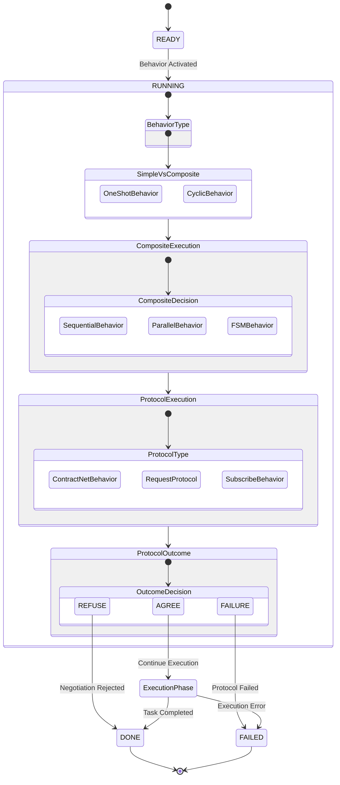

# Agent Behavior State Machine Composition

```mermaid
stateDiagram-v2
    [*] --> READY

    READY --> RUNNING: Behavior Activated

    state RUNNING {
        [*] --> BehaviorType

        state BehaviorType {
            [*] --> SimpleVsComposite
            
            state SimpleVsComposite {
                OneShotBehavior
                CyclicBehavior
            }
        }

        SimpleVsComposite --> CompositeExecution

        state CompositeExecution {
            [*] --> CompositeDecision

            state CompositeDecision {
                SequentialBehavior
                ParallelBehavior
                FSMBehavior
            }
        }

        CompositeExecution --> ProtocolExecution

        state ProtocolExecution {
            [*] --> ProtocolType

            state ProtocolType {
                ContractNetBehavior
                RequestProtocol
                SubscribeBehavior
            }
        }

        ProtocolExecution --> ProtocolOutcome

        state ProtocolOutcome {
            [*] --> OutcomeDecision

            state OutcomeDecision {
                AGREE
                REFUSE
                FAILURE
            }
        }
    }

    AGREE --> ExecutionPhase: Continue Execution
    REFUSE --> DONE: Negotiation Rejected
    FAILURE --> FAILED: Protocol Failed

    ExecutionPhase --> DONE: Task Completed
    ExecutionPhase --> FAILED: Execution Error

    DONE --> [*]
    FAILED --> [*]
```
