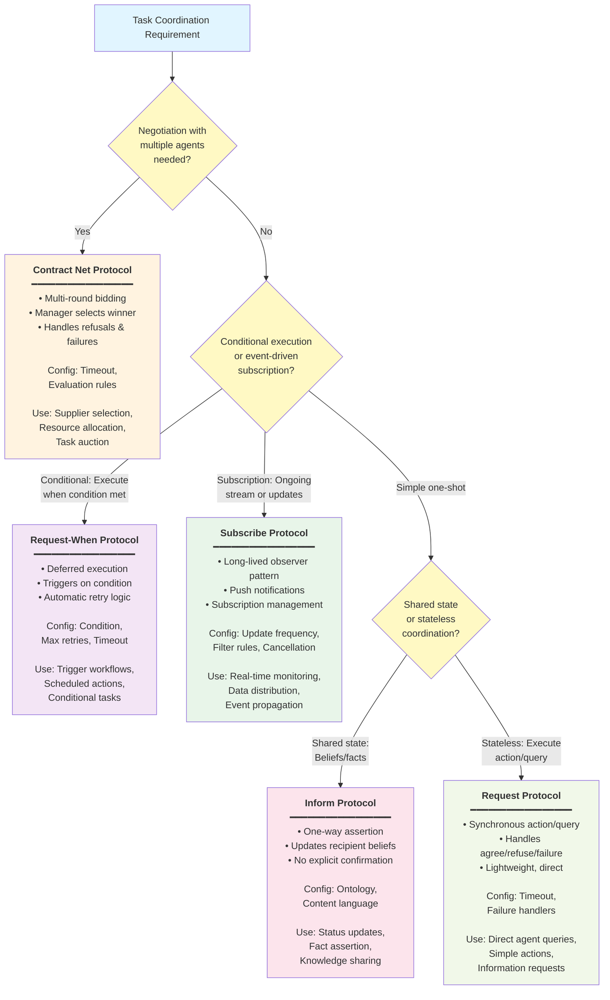

# Decision Tree: Which JADE Coordination Mechanism to Use

```mermaid
flowchart TD
    Start["Task Coordination Requirement"] --> Q1{Negotiation with<br/>multiple agents<br/>needed?}
    
    Q1 -->|Yes| ContractNet["<b>Contract Net Protocol</b><br/>━━━━━━━━━━━━━━━━━<br/>• Multi-round bidding<br/>• Manager selects winner<br/>• Handles refusals & failures<br/><br/>Config: Timeout,<br/>Evaluation rules<br/><br/>Use: Supplier selection,<br/>Resource allocation,<br/>Task auction"]
    
    Q1 -->|No| Q2{Conditional execution<br/>or event-driven<br/>subscription?}
    
    Q2 -->|Conditional: Execute<br/>when condition met| RequestWhen["<b>Request-When Protocol</b><br/>━━━━━━━━━━━━━━━━━<br/>• Deferred execution<br/>• Triggers on condition<br/>• Automatic retry logic<br/><br/>Config: Condition,<br/>Max retries, Timeout<br/><br/>Use: Trigger workflows,<br/>Scheduled actions,<br/>Conditional tasks"]
    
    Q2 -->|Subscription: Ongoing<br/>stream or updates| Subscribe["<b>Subscribe Protocol</b><br/>━━━━━━━━━━━━━━━━━<br/>• Long-lived observer pattern<br/>• Push notifications<br/>• Subscription management<br/><br/>Config: Update frequency,<br/>Filter rules, Cancellation<br/><br/>Use: Real-time monitoring,<br/>Data distribution,<br/>Event propagation"]
    
    Q2 -->|Simple one-shot| Q3{Shared state<br/>or stateless<br/>coordination?}
    
    Q3 -->|Shared state:<br/>Beliefs/facts| Inform["<b>Inform Protocol</b><br/>━━━━━━━━━━━━━━━━━<br/>• One-way assertion<br/>• Updates recipient beliefs<br/>• No explicit confirmation<br/><br/>Config: Ontology,<br/>Content language<br/><br/>Use: Status updates,<br/>Fact assertion,<br/>Knowledge sharing"]
    
    Q3 -->|Stateless: Execute<br/>action/query| Request["<b>Request Protocol</b><br/>━━━━━━━━━━━━━━━━━<br/>• Synchronous action/query<br/>• Handles agree/refuse/failure<br/>• Lightweight, direct<br/><br/>Config: Timeout,<br/>Failure handlers<br/><br/>Use: Direct agent queries,<br/>Simple actions,<br/>Information requests"]
    
    style Start fill:#e1f5ff
    style ContractNet fill:#fff3e0
    style RequestWhen fill:#f3e5f5
    style Subscribe fill:#e8f5e9
    style Inform fill:#fce4ec
    style Request fill:#f1f8e9
    style Q1 fill:#fff9c4
    style Q2 fill:#fff9c4
    style Q3 fill:#fff9c4
```
