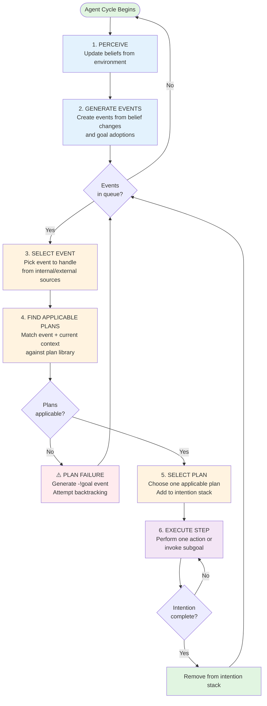

# BDI Reasoning Cycle

```mermaid
flowchart TD
    Start([Agent Cycle Begins]) --> Perceive["1. PERCEIVE<br/>Update beliefs from environment"]
    Perceive --> GenEvents["2. GENERATE EVENTS<br/>Create events from belief changes<br/>and goal adoptions"]
    GenEvents --> EventQueue{Events<br/>in queue?}
    EventQueue -->|No| Start
    EventQueue -->|Yes| SelectEvent["3. SELECT EVENT<br/>Pick event to handle<br/>from internal/external sources"]
    SelectEvent --> FindPlans["4. FIND APPLICABLE PLANS<br/>Match event + current context<br/>against plan library"]
    FindPlans --> PlansExist{Plans<br/>applicable?}
    PlansExist -->|No| HandleFailure["⚠️ PLAN FAILURE<br/>Generate -!goal event<br/>Attempt backtracking"]
    HandleFailure --> EventQueue
    PlansExist -->|Yes| SelectPlan["5. SELECT PLAN<br/>Choose one applicable plan<br/>Add to intention stack"]
    SelectPlan --> Execute["6. EXECUTE STEP<br/>Perform one action or<br/>invoke subgoal"]
    Execute --> CheckIntention{Intention<br/>complete?}
    CheckIntention -->|Yes| PopStack["Remove from intention stack"]
    CheckIntention -->|No| Execute
    PopStack --> EventQueue
    
    style Start fill:#e1f5e1
    style Perceive fill:#e3f2fd
    style GenEvents fill:#e3f2fd
    style SelectEvent fill:#fff3e0
    style FindPlans fill:#fff3e0
    style SelectPlan fill:#fff3e0
    style Execute fill:#f3e5f5
    style HandleFailure fill:#ffebee
    style PopStack fill:#e1f5e1
```
