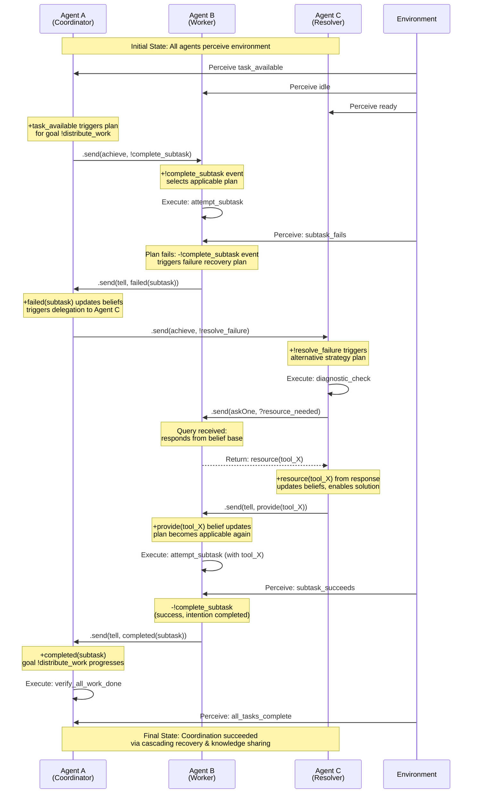

# Multi-Agent Coordination via Speech Acts

```mermaid
sequenceDiagram
    participant AgentA as Agent A<br/>(Coordinator)
    participant AgentB as Agent B<br/>(Worker)
    participant AgentC as Agent C<br/>(Resolver)
    participant Env as Environment

    Note over AgentA,AgentC: Initial State: All agents perceive environment

    Env->>AgentA: Perceive task_available
    Env->>AgentB: Perceive idle
    Env->>AgentC: Perceive ready

    Note over AgentA: +task_available triggers plan<br/>for goal !distribute_work

    AgentA->>AgentB: .send(achieve, !complete_subtask)
    Note over AgentB: +!complete_subtask event<br/>selects applicable plan

    AgentB->>AgentB: Execute: attempt_subtask
    Env->>AgentB: Perceive: subtask_fails

    Note over AgentB: Plan fails: -!complete_subtask event<br/>triggers failure recovery plan

    AgentB->>AgentA: .send(tell, failed(subtask))
    Note over AgentA: +failed(subtask) updates beliefs<br/>triggers delegation to Agent C

    AgentA->>AgentC: .send(achieve, !resolve_failure)
    Note over AgentC: +!resolve_failure triggers<br/>alternative strategy plan

    AgentC->>AgentC: Execute: diagnostic_check
    AgentC->>AgentB: .send(askOne, ?resource_needed)
    
    Note over AgentB: Query received:<br/>responds from belief base

    AgentB-->>AgentC: Return: resource(tool_X)
    Note over AgentC: +resource(tool_X) from response<br/>updates beliefs, enables solution

    AgentC->>AgentB: .send(tell, provide(tool_X))
    Note over AgentB: +provide(tool_X) belief updates<br/>plan becomes applicable again

    AgentB->>AgentB: Execute: attempt_subtask (with tool_X)
    Env->>AgentB: Perceive: subtask_succeeds

    Note over AgentB: -!complete_subtask<br/>(success, intention completed)

    AgentB->>AgentA: .send(tell, completed(subtask))
    Note over AgentA: +completed(subtask)<br/>goal !distribute_work progresses

    AgentA->>AgentA: Execute: verify_all_work_done
    Env->>AgentA: Perceive: all_tasks_complete

    Note over AgentA,AgentC: Final State: Coordination succeeded<br/>via cascading recovery & knowledge sharing
```
