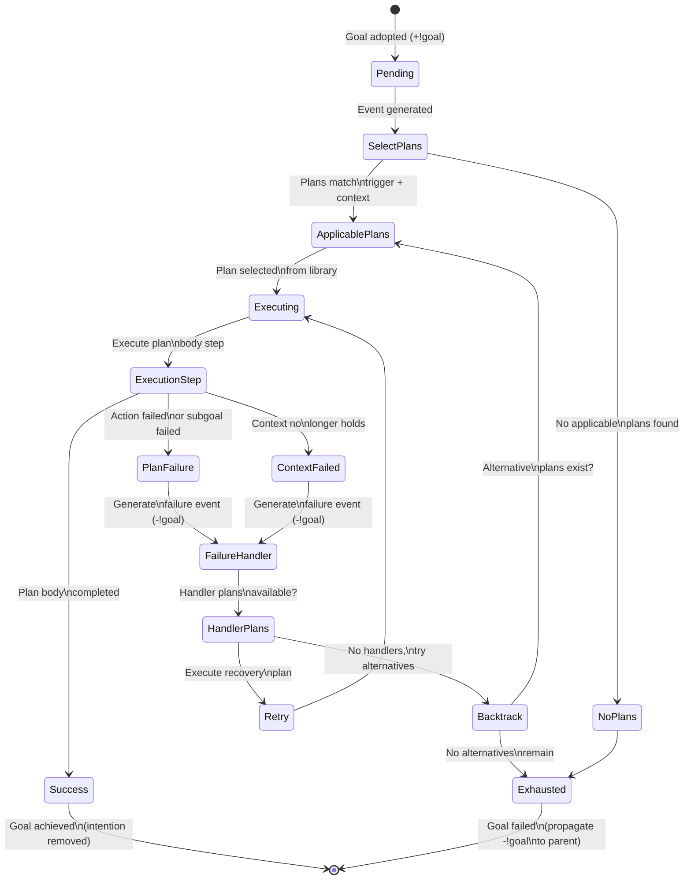

# Plan Execution & Failure Recovery State Machine

```mermaid
stateDiagram-v2
    [*] --> Pending: Goal adopted (+!goal)
    
    Pending --> SelectPlans: Event generated
    
    SelectPlans --> ApplicablePlans: Plans match\ntrigger + context
    SelectPlans --> NoPlans: No applicable\nplans found
    
    ApplicablePlans --> Executing: Plan selected\nfrom library
    
    Executing --> ExecutionStep: Execute plan\nbody step
    
    ExecutionStep --> Success: Plan body\ncompleted
    ExecutionStep --> PlanFailure: Action failed\nor subgoal failed
    ExecutionStep --> ContextFailed: Context no\nlonger holds
    
    Success --> [*]: Goal achieved\n(intention removed)
    
    PlanFailure --> FailureHandler: Generate\nfailure event (-!goal)
    ContextFailed --> FailureHandler: Generate\nfailure event (-!goal)
    
    FailureHandler --> HandlerPlans: Handler plans\navailable?
    
    HandlerPlans --> Retry: Execute recovery\nplan
    HandlerPlans --> Backtrack: No handlers,\ntry alternatives
    
    Retry --> Executing
    
    Backtrack --> ApplicablePlans: Alternative\nplans exist?
    Backtrack --> Exhausted: No alternatives\nremain
    
    NoPlans --> Exhausted
    
    Exhausted --> [*]: Goal failed\n(propagate -!goal\nto parent)
```
