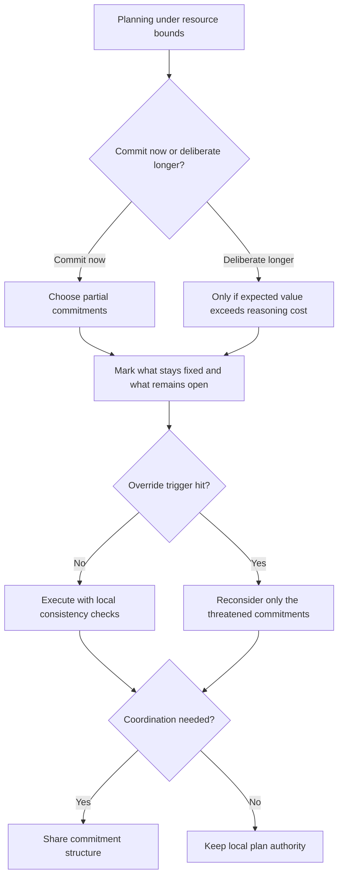

# Plans and Resource-Bounded Practical Reasoning

Source basis: Bratman, Israel, and Pollack on why plans matter mainly because they constrain future reasoning, not because they fully specify perfect action.

## When to Use

- Deliberation time is expensive and the world changes while the agent is still thinking.
- You need to decide when to commit, defer detail, or reconsider a plan.
- A planner is thrashing between options or freezing in analysis paralysis.
- You are designing multi-agent coordination without constant message passing.
- Task decomposition needs to stay executable before all details are known.

## NOT for

- Exhaustive planning in toy domains where the world can be treated as frozen.
- Static optimization problems where deliberation cost does not materially matter.
- Flat task queues that do not need commitment structure, revision policy, or means-end coherence.

## Decision Points

1. Decide whether a partial commitment now will save more reasoning than it risks in later revision.
2. Choose what stays fixed and what remains open; structural partiality is a design decision, not a temporary defect.
3. Set an override threshold for when incompatible options deserve costly reconsideration.
4. Check whether coordination depends on shared commitment structure or on explicit communication.

## Decision Flow

## Working Model

- Plans are computational constraints. They narrow later search, filter incompatible options, and provide assumptions for follow-on reasoning.
- Partiality is a feature. Commit high enough to organize work, but defer details whose stability horizon is short.
- Stability and revisability are in tension. A plan that never filters is useless, and a plan that never bends is brittle.
- Filter override is the meta-reasoning valve. It should trigger reconsideration for meaningful opportunities or failures, not every novelty.
- Means-end coherence turns "what should I do?" into smaller subproblems attached to an already chosen end.

## Failure Modes

- Trying to build a complete plan before acting, so the world changes before execution begins.
- Reconsidering so often that commitments never produce computational savings.
- Treating commitments as sacred and missing obvious opportunities or violated assumptions.
- Refining low-level details long before they are needed.
- Ignoring deliberation cost when evaluating whether more planning is worth it.

## Anti-Patterns and Shibboleths

- Anti-pattern: treating every new signal as grounds for full replanning.
- Anti-pattern: calling a plan "flexible" when it is really too weak to filter any downstream choices.
- Shibboleth: if the design never prices deliberation cost, it is still doing idealized planning, not bounded practical reasoning.

## Worked Examples

- An on-call remediation agent keeps reopening its plan every time a new metric moves. The repair is a stronger filter plus explicit override triggers for only the metrics that threaten the current intention.
- A multi-agent workflow needs independent progress without constant chatter. The repair is to give each agent compatible partial commitments and local consistency checks instead of forcing every step through a central coordinator.

## Fork Guidance

- Stay in-process when you are tuning one plan's level of commitment and one override policy.
- Fork only when you need a small number of rival partial plans evaluated independently for expected deliberation cost and failure exposure.

## Quality Gates

- Deliberation cost is explicit, not assumed free.
- The plan states which commitments are fixed now and which details remain intentionally open.
- Override triggers are named clearly enough to distinguish useful reconsideration from noise.
- Monitoring covers the assumptions that would invalidate the current plan.
- The design explains how commitments reduce later reasoning load.

## Reference Routing

- `references/plans-as-computational-constraints.md`: load when you need the strongest account of why plans constrain future reasoning.
- `references/structural-partiality-and-hierarchical-commitment.md`: load when deciding what to commit now versus later.
- `references/filter-override-mechanisms.md`: load when reconsideration is either too frequent or too rare.
- `references/deliberation-as-expensive-operation.md`: load when resource budgets, deadlines, or interruption policy matter.
- `references/consistency-maintenance-as-coordination-mechanism.md`: load when multiple agents need to stay compatible without continuous communication.
- `references/temporal-dynamics-of-commitment.md`: load when timing of commitment, refinement, or abandonment is the hard part.
- `references/failure-modes-of-resource-bounded-reasoning.md`: load when diagnosing which bounded-reasoning failure mode you are actually seeing.
