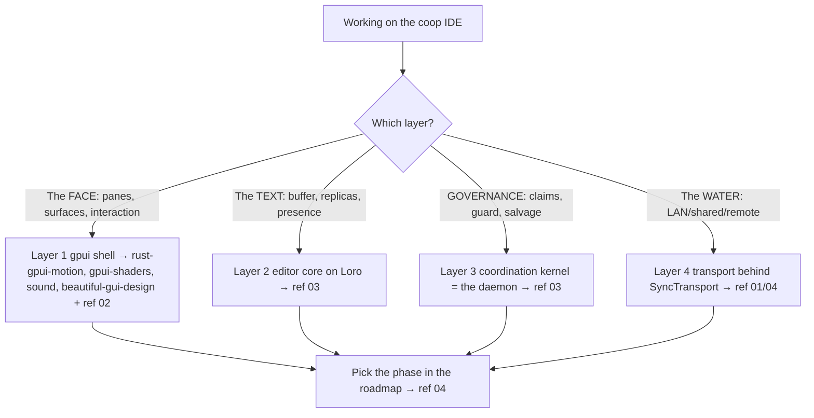

# Build an M-Agent + N-Human Cooperative IDE in Rust gpui

This is the **capstone**: the whole-system skill for building the Harbor — an editor where **M autonomous agents and N humans edit the same files at once, as co-equal replicas**, on a native Rust gpui shell, governed by a daemon that already exists. It is an **index/orchestration** skill: it holds the architecture and dispatches each slice into the sibling rust skills. The thesis (from the battle plan) is the load-bearing wall: *make the CRDT governable — Loro merges bytes, claims govern intent, the harbor card decides who may write the region at all.*

## DEPENDS ON (pull these as you work)

| Sibling skill | Pull it when you're working on… |
|---|---|
| **rust-gpui-motion** | any transition/animation — pane expand, board/hop, the spawn→fullscreen→diff flow, presence pulses. The no-transform constraint lives here. |
| **gpui-shaders** | bespoke GPU surfaces — the living-harbor water, dithered chrome, sonar sweep, biofield. |
| **sound-design-and-audio** | the fleet audio cues (board/steer/hop/approve/fail) and how to ship them in Rust. |
| **beautiful-gui-design** | the visual system — hierarchy, semantic tokens, light/dark, contrast, the 8pt grid, a11y. |
| **vello-parley-rendering** / **metal-text-pipeline** | vector viz + bare-metal text/glyph rendering when you go below the widget layer. |

Plus the canon docs: `docs/strategy/harbor-editor-battle-plan.md` (the spine) and `docs/design/harbor-interaction-model.md` (the Quay/board/steer interaction).

## When to Use

- Building any part of the cooperative IDE / Harbor editor.
- Adding a new collaborative surface (editor, Quay, transcript, diff, commission).
- Wiring agents-as-peers, claims/conflict UX, salvage, or a harbor transport.

## NOT for

- A single, non-collaborative gpui screen — compose the sibling skills directly.
- Web-based collaborative editors (different stack).
- Non-editor apps.

## Decision Points

## Core Rules

- **Governable CRDT.** Loro v1.13.x is the buffer; a **claim is a presence range the guard can refuse to merge across**. Bytes merge automatically; *intent* is governed above the CRDT.
- **Agents are peers, not tools.** Every actor (human or agent) is a Loro replica with a PeerID minted from its PD identity, rendered identically (cursor, claimed range, name), with provenance.
- **Claims govern intent, not bytes.** "Merges cleanly" ≠ "merges correctly" — surface logical conflict (`POST /conflicts/predict`) as a `Conflicted`/`Gated` band *before* a byte is written; never a silent auto-merge.
- **Salvage is the wedge.** A dead replica's op-log + claim persist and replay; a successor inherits and finishes. Build it, don't skip it — a buffer without salvage is a Potemkin editor.
- **The daemon IS the collab server** — no new sync backend. Loro Protocol over the existing tube; snapshots→`/blob`; op-log→immutable notes.
- **Topology behind a trait.** `SyncTransport` abstracts Shared (daemon HTTP+SSE) / LAN (iroh) / Remote (relay+E2E); the editor never knows which.
- **Reuse, don't reinvent.** Layers 1, 3, 4 assemble shipped PD assets; the only genuinely from-scratch cost is Layer 2's buffer.
- **One motion owner per surface** (see rust-gpui-motion). **No UI merges without visual artifacts** in the test plan (screenshot + motion clip) — full stop.

## Failure Modes

### Anti-Pattern: "Agents as tools, not peers"
**Symptom**: agents are a side-panel that edits *for* the human; no shared cursor/claim/provenance.
**Detection**: agent edits don't appear as a replica in the buffer; no PeerID identity.
**Fix**: make every agent a first-class Loro replica keyed to its PD identity (ref 03).

### Anti-Pattern: "Trusting CRDT auto-merge for correctness"
**Symptom**: two actors edit the same symbol; it merges cleanly and silently produces wrong code.
**Detection**: no claim/conflict layer above Loro; no `/conflicts/predict` call.
**Fix**: claim-before-edit; predict overlap; render `Conflicted` band + nudge before any write (ref 03).

### Anti-Pattern: "Building the editor before the coordination"
**Symptom**: a beautiful buffer with no claims/salvage — demos well, fails the moment two actors touch one file.
**Detection**: P1 buffer done, P3 claims/salvage indefinitely deferred.
**Fix**: the wedge IS coordination; sequence per the roadmap (ref 04); refuse the Potemkin editor.

### Anti-Pattern: "Transport-first"
**Symptom**: weeks sunk into iroh/NAT traversal before the buffer or claims exist.
**Detection**: P4/P5 work happening before P1–P3.
**Fix**: abstract topology behind `SyncTransport` from day one but prove the buffer+coordination over the daemon bus first (ref 04).

## Worked Example: add a collaborative surface end-to-end

Adding the **Editor** surface (battle plan P0→P1), composing the siblings:
1. **Shell (Layer 1)** — add `SurfaceKind::Editor { path, region }` to `mux.rs`; implement the object-safe `Pane` (one pane, two faces). *Pull `beautiful-gui-design`* for hierarchy/tokens, *`rust-gpui-motion`* for the open transition (no transform — layout-fraction zoom).
2. **Text (Layer 2)** — back it with one `LoroDoc`/`LoroText`; mint a PeerID from `pd whoami`; authorship gutter colored by replica (ref 03).
3. **Governance (Layer 3)** — claim the edited region; `/conflicts/predict`; paint overlap `Tone::Conflicted`; guard the commit; persist op-log for salvage.
4. **Polish** — *pull `gpui-shaders`* for the living-harbor water behind it; *`sound-design-and-audio`* for the `board`/`approve` cues.
5. **Land** — visual artifacts (screenshot + a board→steer→diff clip) in the PR test plan, per the standing rule.

## Quality Gates (phased)

- [ ] Every actor is a Loro replica with a PD identity + provenance (agents = peers).
- [ ] Claims/`/conflicts/predict` gate edits; logical conflict is surfaced, never silently merged.
- [ ] Salvage implemented (dead-replica op-log replays; claim inherits) — not deferred away.
- [ ] Daemon is the collab server (no new sync backend); topology behind `SyncTransport`.
- [ ] Build order respected (buffer+coordination before transport polish).
- [ ] Each surface composes the right siblings (motion/shaders/audio/visual-system).
- [ ] No UI merge without visual artifacts in the test plan.

## Fork Guidance

Fork by layer: **shell** (ref 02 + the three visual siblings) · **editor core** (ref 03 / Loro) · **coordination** (ref 03 / daemon) · **transport** (ref 01/04). Keep the architecture (the four layers + the dependency map) in the parent so one actor owns coherence.

## Reference Map

- `references/01-architecture-and-the-stack.md` — the whole-system view: the four layers (gpui shell → Loro editor core → coordination kernel → transport), the dependency map onto the sibling skills, what's load-bearing vs polish.
- `references/02-the-gpui-app-skeleton.md` — structuring a large gpui app: the mux/Workspace pane tree, the `Pane`/`Surface` contract, `SurfaceKind` variants, the refresh→channel→view pipeline; how to add a surface end-to-end.
- `references/03-collaboration-coordination-salvage.md` — the heart: agents+humans as co-equal Loro replicas, presence-as-claims, the daemon as collab server, conflict UX, agents-as-peers via MCP, salvage; the M×N model + three harbor topologies.
- `references/04-build-order-and-composing-the-skills.md` — the phased roadmap (P0 skeleton → P1 buffer → P2 LAN → P3 agents+claims → P3.5 salvage → P4 shared → P5 remote+viz), each phase naming which sibling skill it pulls; the "you are here / read next" map.

**Sibling skills (dependencies):** `rust-gpui-motion`, `gpui-shaders`, `sound-design-and-audio`, `beautiful-gui-design`, `vello-parley-rendering`, `metal-text-pipeline`.

<!-- BEGIN BUNDLE INDEX (auto: index_references.py) -->

## Skill Bundle Index

*Every file in this skill, and when to open it. Auto-generated; run `scripts/index_references.py --fix`.*

**`references/`**
- [`references/01-architecture-and-the-stack.md`](references/01-architecture-and-the-stack.md) — Architecture & The Stack — The Whole-System View — This is the load-bearing wall of the capstone.
- [`references/02-the-gpui-app-skeleton.md`](references/02-the-gpui-app-skeleton.md) — The gpui App Skeleton — > *Capstone reference 02 of the "Build an M-Agent + N-Human Cooperative IDE in Rust gpui" skill.* > This is the **structural** chapter: how 
- [`references/03-collaboration-coordination-salvage.md`](references/03-collaboration-coordination-salvage.md) — Collaboration, Coordination & Salvage — the heart of the M×N IDE — This is the capstone's load-bearing chapter.
- [`references/04-build-order-and-composing-the-skills.md`](references/04-build-order-and-composing-the-skills.md) — Build Order & Composing the Skills — This is the **index card for the whole capstone**.

<!-- END BUNDLE INDEX -->
