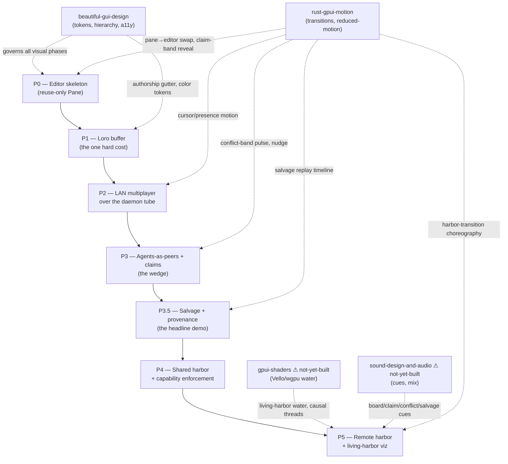

# Build Order & Composing the Skills

This is the **index card for the whole capstone**. The other reference docs in this
skill tell you *what* the Harbor Editor is and *why* the CRDT must be governable.
This one tells you the **order to build it in**, and — at each phase — **which sibling
skill you stop and read before you write a line of that phase's code**. Treat it as a
dispatcher: a phase is a node, each node names its dependency skill, and you do not
start a node until you have read the skill it points at.

The build order is not negotiable and it is not the obvious one. The
`harbor-editor-battle-plan.md` is explicit about the trap:

> "Build order corrects Design C's fatal inversion: **the buffer is the risk, not the
> transport.** Prove the editor + coordination over the daemon bus we already have;
> abstract topology behind `SyncTransport` from day one but defer iroh/relay until the
> wedge is demoed."
> — `docs/strategy/harbor-editor-battle-plan.md` §5

Everything below enforces that ordering and wires each phase to the skill that de-risks it.

---

## The dependency graph (you are here)

**The read-next rule:** before you open the editor crate for a phase, read that phase's
named skill section below, then read the skill's own `references/` it points you at.
Skipping the skill read is the single most common way this capstone ships ugly,
janky, or inaccessible work that then has to be torn out.

---

## How a builder uses THIS skill

This capstone is a **composition skill**: it owns the *sequence and the seams*, and it
**delegates the craft** to four sibling Rust/GUI skills. Three of those siblings exist
or are being built in this same skill family:

- **`beautiful-gui-design`** — the visual-system spine. Tokens before components,
  components before screens; 8pt grid; `body ≥ 14px`; semantic color, never raw hex;
  icons from an icon system, never emoji. **Governs every phase that paints anything.**
  Quote: *"Tokens before components, components before screens."*
- **`rust-gpui-motion`** — the motion field manual for native gpui. The hard constraint:
  *"gpui 0.2.x has no fluent transform on `div`"* — no `scale/translate/rotate`. Every
  "lift/slide/zoom" is re-derived from opacity, `BoxShadow`, color, and an animated
  **layout fraction**. **Governs every transition, presence pulse, and reveal.**
- **`gpui-shaders`** ⚠ *(planned — capstone task #13, not yet on disk)* — Metal/wgpu/Vello
  shader-toy surfaces: pixelated waves, boats, scanlines, the living-harbor water.
  Until it ships, P5's bespoke viz uses the `pd-timeline-proto` Vello prototype directly
  and the `rust-gpui-motion` §`05-bespoke-graphics-vello-wgpu.md` escape-hatch guidance.
- **`sound-design-and-audio`** ⚠ *(planned — capstone task #14, not yet on disk)* — the
  audio cue vocabulary (board, claim-granted, conflict, salvage-recovered). Until it
  ships, P5 ships **silent**; do not improvise ad-hoc audio.

> **Decision Point — do not invent the sibling's craft inline.** If you find yourself
> hand-rolling an easing curve, a color ramp, or a paint shader *inside* a Harbor phase,
> stop: that work belongs in the sibling skill. Read it (or, for the two unbuilt ones,
> flag the dependency and ship the degraded-but-honest path). The capstone's job is the
> seam, not the shader.

A builder's loop for any phase is: **(1)** read this phase's section, **(2)** read the
named sibling skill + its pointed-at reference, **(3)** confirm the PD asset the phase
reuses still exists at the quoted `file:line`, **(4)** build only that phase's scope,
**(5)** run the phase's Quality Gate. Then advance.

---

## P0 — Editor skeleton (reuse-only, ~1 week)

**Goal.** An editor *surface* that hosts a file, with **zero buffer work**. This de-risks
the surface before you pay the hard from-scratch cost.

**What you build.** A new `core/pd-console/src/editor.rs` implementing the existing
object-safe `Pane` trait. The plan is precise about the reuse:

> "Add `SurfaceKind::Editor { path, region }` to `core/pd-console/src/mux.rs` (the enum
> is at **mux.rs:33** … beside the existing `FileTree` variant). The split/tab/zoom
> `Workspace` tree … is unit-tested and GPUI-free — **do not rebuild a window manager.**"
> — battle-plan §3

Confirmed in the live tree: `SurfaceKind` is at `mux.rs:33`, `FileTree { root }` at
`mux.rs:41`, `split` at `mux.rs:179`, `swap_surface` at `mux.rs:257`, `bind_entity` at
`mux.rs:266`. The `Pane` trait (`pane.rs:79`) is object-safe with `view()` emitting
render-agnostic `Block`s (`pane.rs:42`) — **one pane, two faces**: GPUI paints rich, the
ratatui TUI paints the same `Block`s read-only. That contract already exists; you are
filling it, not inventing it.

**Sibling skill this phase pulls:** `beautiful-gui-design` (lightly) + `rust-gpui-motion`
(for the open-into-pane transition).

- From **`beautiful-gui-design`**: the editor pane's gutter, line-number column, and
  selection chrome are *components* — build them on the existing OKLCH semantic tokens
  (`theme.rs` / `Tone` in `pane.rs:16`), never raw hex. The `Tone` enum already gives you
  `Default/Accent/Engaged/Gated/Conflicted` — map editor states onto those, do not add a
  parallel color path. Body text in the editor is code: still honor the `≥14px` floor and
  never lock zoom.
- From **`rust-gpui-motion`**: when a `FileTree` selection opens a file into the editor
  pane, that's a **surface swap** (`swap_surface`, `mux.rs:257`) — animate it as a
  *one-shot micro-motion* (opacity + a small `BoxShadow` settle), **not** a layout
  animation. Quote: *"Animate compositor-friendly properties only — opacity, BoxShadow,
  color; never width/height/px/insets in a hot render."*

**Exit criterion (from §7):** open a file from the tree into a real editor pane in the
GPUI window; the same file shows read-only in the TUI. No buffer yet.

**Quality Gate P0:**
- [ ] `SurfaceKind::Editor { path, region }` added at `mux.rs:33`; `title()` match
      (`mux.rs:59`) and `bind_entity` (`mux.rs:266`) handle it; new mux path unit-tested
      next to `split_creates_two_panes` (`mux.rs:417`).
- [ ] `editor.rs` impls `Pane` (`pane.rs:79`), emits `Block`s, renders in **both** GPUI and
      ratatui.
- [ ] Editor chrome uses semantic tokens / `Tone`, zero raw hex, `≥14px`.
- [ ] Open-into-pane uses an opacity/shadow micro-motion, no layout animation, reduced-motion safe.

---

## P1 — Loro buffer (the one hard from-scratch cost, 4–6 weeks)

**Goal.** One human edits one local file, backed by a real CRDT. **No networking.**

**Why it's the gate.** The plan is blunt:

> "The buffer (P1) is the only genuinely-from-scratch cost and it is hard. GPUI text
> editing is not a public, documented widget the way Loro is a documented CRDT. Real risk
> of reimplementing more of an editor (selection, IME, wrapping, large-file
> virtualization) than scoped."
> — battle-plan §6

**The CRDT choice is Loro v1.13.x** (battle-plan §3): fastest in 2026 benches
(~290ms apply on the B4 260K-char trace vs Yjs 430 / Automerge 680; 68kB encoded vs
160/250), a *documented embeddable Rust crate* (Zed's CRDT is internal and not reusable),
Fugue + Eg-Walker lineage, and it ships `EphemeralStore`, `Awareness`, stable cursors
(`get_cursor`/`get_cursor_pos`), and the multiplexed Loro Protocol you need later. Each
open file = one `LoroDoc` holding a `LoroText`; each actor gets a **PeerID minted from its
PD identity** (`pd whoami` for humans, `project:stack:context` for agents).

> **Web-check before you pin.** Loro's API surface moves; before coding, confirm the
> current `loro` crate version, that `LoroText` + `EphemeralStore` + `Cursor` are stable
> (not behind an unstable feature), and the encode/snapshot format. The plan names
> v1.13.x — verify it's still the right pin and that the Swift bindings (future macOS
> path) haven't diverged. Search "Loro CRDT rust crate changelog" + "Loro EphemeralStore"
> at build time, not from memory.

**Sibling skill this phase pulls:** `rust-gpui-motion` (the Loro↔GPUI binding is a
motion/render-budget problem) + `beautiful-gui-design` (the authorship gutter is a
color-token problem).

- From **`rust-gpui-motion`** — this is the load-bearing one. Wiring Loro's delta stream
  into GPUI's entity/render model **must do viewport-diff rendering, not full re-layout per
  op**. The skill's whole thesis applies: *"every re-render walks the entire element tree
  top-to-bottom — so the frame budget here is an architecture concern."* Read
  `references/04-frame-budget-and-reduced-motion.md` first. The cursor and authorship
  spans animate via opacity/color only. **Do NOT try to out-edit Zed on latency** — the
  plan says so explicitly; win on coordination later.
- From **`beautiful-gui-design`** — the **per-PeerID authorship gutter** (color each span
  by its replica) is the *visible proof that "agent vs human" is a first-class buffer
  concept from day one* (§7). That coloring is a semantic-token job: derive a stable,
  WCAG-contrasting hue per PeerID from the OKLCH ramp; never random hex. This is where
  "Rainbow Vomit" (the skill's anti-pattern) will bite if you let each peer pick a free color.

**Exit criterion (§7):** a single human edits one local file backed by Loro, undo works,
the gutter shows authorship.

**Quality Gate P1:**
- [ ] `loro` crate pinned + version re-verified by web-check; `Buffer` wraps one
      `LoroDoc`/`LoroText`; PeerID minted from PD identity.
- [ ] Local edit → Loro op → **viewport-diff re-render only** (proven: idle = 0 re-renders,
      no frame-time climb with doc length).
- [ ] Authorship gutter colors spans from OKLCH tokens, contrast-checked, ≤ ~8 hues in view.
- [ ] Undo via Loro undo-map; tree-sitter incremental reparse on CRDT deltas.
- [ ] **Property-test harness scaffolded** for Loro op-replay convergence (the
      salvage-correctness foundation — start it here even though salvage lands in P3.5).

---

## P2 — LAN multiplayer over the bus (3–4 weeks)

**Goal.** Two humans co-edit one file, **self-hosted, no vendor cloud**. This reaches
Zed's LAN baseline — but on infra you already own.

**What you build (§5 table).** The Loro Protocol multiplexed **over the daemon's existing
tube SSE** — *not a new sync backend*. The plumbing is already proven: the
`AgentTranscript` surface already folds an SSE stream via `on_stream()` (`pane.rs:114`,
and `lane_pane.rs:11` documents `agent.tube` frames folding into scrollback). Cursors and
selections ride `EphemeralStore` (timestamp-LWW); snapshots → content-addressed `/blob`;
op-log deltas → immutable notes. Add a `Subscription::Editor` variant beside the existing
`Subscription::Agent` (`pane.rs:67`).

> "Loro Protocol multiplexes doc-ops + ephemeral cursors + claim-awareness over the
> **existing tube pub/sub** … the exact plumbing the `AgentTranscript` surface already
> folds via `on_stream()`."
> — battle-plan §3

**Sibling skill this phase pulls:** `rust-gpui-motion` (remote presence).

- From **`rust-gpui-motion`**: remote cursors and selections are *presence* — animate
  their movement with short opacity/position eases, and **scope any breathing/pulse to the
  smallest leaf view** so N remote cursors don't each mount a window-wide `.repeat()`. The
  skill's failure mode *"`repeat()` that never stops re-rendering … CPU/GPU stays hot on an
  idle screen"* is exactly what a naive cursor-blink-per-peer produces. Follow-mode
  (camera follows another peer) is a layout-fraction transition, one owner, retargetable.

> **Web-check.** Collaborative-editing presence is a well-trodden design space (Figma's
> multiplayer cursors, Yjs awareness, Liveblocks). Before designing the presence debounce
> and the ephemeral→durable mirror cadence, skim current practice on awareness LWW + cursor
> debounce intervals so you don't reinvent a known-bad cadence.

**Exit criterion:** two humans co-edit one file over the daemon tube; cursors visible;
reconnect replays from `/blob` + notes.

**Quality Gate P2:**
- [ ] Loro Protocol frames ride the tube SSE; `Subscription::Editor` added; `on_stream`
      folds remote ops.
- [ ] Ephemeral cursor lane is debounced and **mirrored into the durable claims table** so
      presence survives reconnect (battle-plan §3).
- [ ] Snapshots → `/blob`, op-log deltas → immutable notes.
- [ ] No per-peer window-wide `repeat()`; idle screen = 0 re-renders with 2+ remote cursors.
- [ ] **Edit-sync channel isolated from the coordination control plane** so editor load
      never regresses claim latency (the explicit §6 "daemon must stay lean" risk).

---

## P3 — Agents-as-peers + claims (the wedge, 4–5 weeks)

**Goal.** Two agents + a human reach for adjacent regions; PD **surfaces and resolves the
overlap before a byte is written.** This is *the demo that beats Zed* — a CRDT guarantees
bytes merge, never that intent agrees.

**What you build.** Region/symbol claims rendered as **Loro awareness ranges**;
a `Conflicted`-tone guard band + `pd nudge` on overlap; `claim_region` / `release_region` /
`coordination_preflight` exposed as agent-neutral MCP tools; `agent.rs` (the 8-backend
conversation mux — `agent.rs:1` confirms "ON THE PD BUS, backend-agnostic (ADR-0046)")
drives a dispatched agent editing a claimed region inline. The wedge primitive already
exists daemon-side:

> "Symbol/region claims + the wedge: `POST /symbols/parse`, **`POST /conflicts/predict`
> (routes/symbols.ts:216)**."
> — battle-plan §3

The co-edit model (§4): claim *before* keystroke; daemon runs `conflicts/predict` against
live claims; overlap → `Conflicted` band + nudge, **not** a silent merge; default
ownership = **first granted, non-revoked claim wins**. Crucially (and this is a hard rule
from PD memory): **the guard message points ONLY to the correct action (request handoff),
never names a bypass flag.**

**Sibling skill this phase pulls:** `rust-gpui-motion` (the conflict band is the most
delicate motion in the app) + `beautiful-gui-design` (the band is a status component).

- From **`rust-gpui-motion`**: the conflict guard-band must *announce* without *nagging*.
  The plan's own UX risk: *"over-warning trains actors to ignore the guard."* So: a
  **single, brief** `Conflicted`-tone pulse on overlap-detected (`with_animation`,
  `ease_in_out`, one-shot — **not** a `.repeat()` that throbs forever and becomes
  wallpaper), then the band rests as a static colored range. The `Tone::Conflicted`
  already exists (`pane.rs:23`) — render the band from it. Debounce: predict on
  **claim-acquire / region-enter**, not per-keystroke (battle-plan §6).
- From **`beautiful-gui-design`**: the claim range is a *named, labeled* component
  ("agent A — parse_header"), colored by actor PeerID (reuse the P1 authorship ramp), with
  a clear claimed-by chip. It must be legible in both themes — run the contrast pass.

**Exit criterion:** two agents + a human reach for adjacent regions; the overlap surfaces
as a `Conflicted` band + a nudge; the guard rejects an out-of-claim edit and re-checks
staged ranges on commit (`pd guard check --staged`).

**Quality Gate P3:**
- [ ] Claims render as Loro awareness ranges, labeled + actor-colored, legible in light+dark.
- [ ] `conflicts/predict` fires on claim-acquire/region-enter (debounced), **not** per-keystroke.
- [ ] Conflict band is a one-shot pulse → resting static; **no infinite `repeat()` throb**.
- [ ] `claim_region`/`release_region`/`coordination_preflight` shipped as **agent-neutral**
      MCP tools (never Claude-specific — PD memory hard rule).
- [ ] Guard refusal message names the correct action only, **never** a bypass flag.
- [ ] Commit gate refuses when an edited region's claim is held by another *live* actor.

---

## P3.5 — Salvage + provenance (2 weeks, folds into the P3 demo)

**Goal.** Kill an agent mid-edit; a successor recovers the work with full attribution.
**This is the headline demo — structurally impossible in Zed's trust-the-room, cloud-only,
ephemeral-session model.**

**What you build.** A dead actor's op-log + claim + scope note persist (`/blob` snapshot +
session record); `POST /recovery/request` surfaces "agent A left dirty work on
parse_header (claim held, snapshot `blob:…`)"; `POST /recovery/consume` replays A's ops
onto the live doc, inherits the claim, and finishes — every span authored in an immutable
note. Reuses `routes/recovery.ts`, `/blob`, immutable notes, ADR-0028 salvage envelope.

**The correctness risk is real and named (§6):**

> "Replaying a dead replica's op-log onto a doc that advanced after its death must converge
> deterministically — needs **property tests on Loro op-replay ordering**, not a
> happy-path demo."

This is why P1 scaffolds the property-test harness early. Lamport-clock ordering of
concurrent inserts is what makes replay deterministic; prove it, don't assume it.

**Sibling skill this phase pulls:** `rust-gpui-motion` (the replay visualization).

- From **`rust-gpui-motion`**: showing "agent A's stranded ops replaying onto the live doc"
  is a **transition** — an interruptible state machine in the view, opacity-fading the
  recovered spans in over the settled layout (stagger by `i * 0.04` like the worked
  fleet-reflow example), **never** a per-op layout animation. Reduced-motion path must still
  show *which* spans were recovered (final state + author tint), per the skill's
  *"reduced-motion deletes orientation"* failure mode.

**Exit criterion:** kill a dispatched agent mid-edit; `/recovery/request` surfaces the
dirty buffer+claim; `/recovery/consume` replays and inherits; an immutable note records
who-wrote-which-span.

**Quality Gate P3.5:**
- [ ] Dead-replica op-log + claim + note persist to `/blob` + session record.
- [ ] `/recovery/consume` replays + inherits the claim; provenance lands in an immutable note.
- [ ] **Property tests on Loro op-replay convergence pass** (the P1 harness, now exercised
      against a doc that advanced post-death) — not a happy-path demo.
- [ ] Replay viz is a staggered opacity transition, reduced-motion preserves "which spans recovered".

---

## P4 — Shared harbor + capability enforcement (4–5 weeks)

**Goal.** Join-by-link; **capability-scoped per path/region**, not trust-the-room.

**What you build (§3, §5).** Formalize the `SyncTransport` trait (grafted from Design C,
*proven last*); the host daemon is authoritative for the claim/governance ledger + `/blob`;
`PUT /harbors/:name/envelope` scopes a per-region edit capability; signed Ed25519 cards
(`core/harbor-card-rs/src/lib.rs`, `HarborCardClaims{sub,harbor,cap[],iat,exp,jti}`, 218
LOC, Kani proof targets) gate join; `POST /harbors/:name/check` is the in-editor dry-run.
The enforcement is **structural, not advisory**:

> "An agent without a write-cap for `src/auth/*.rs` has its Loro ops **rejected at daemon
> ingress** — structural, not advisory. ADR-0053 DOM DADDY is the out-of-band ENFORCE path."
> — battle-plan §3

**Sibling skill this phase pulls:** `beautiful-gui-design` (the refusal UX) + a nod to
`ostrom-commons-governance` (capability scoping is commons governance — graduated sanction,
not a binary kick).

- From **`beautiful-gui-design`**: a capability refusal is a *state*, not an error dump.
  Render it as a `Gated`-tone component (`Tone::Gated`, `pane.rs:21`) with the missing cap
  named and the request-access affordance one click away. Honor the PD hard rule: **the
  refusal points to the correct action, never to a bypass.**

**Exit criterion:** join a harbor by link; an actor lacking a write-cap for a region is
refused *at ingress* before any op; the dry-run `/harbors/:name/check` shows the result
in-editor.

**Quality Gate P4:**
- [ ] `SyncTransport` trait formalized; host daemon authoritative for ledger + `/blob`.
- [ ] Per-region edit cap via `PUT /harbors/:name/envelope`; Ed25519 card gates join.
- [ ] Out-of-cap Loro op **rejected at daemon ingress**, not surfaced-then-allowed.
- [ ] Refusal UX = `Gated`-tone component, names the missing cap, no bypass advertised.

---

## P5 — Remote harbor + the living harbor (5–6 weeks)

**Goal.** Three-topology parity (LAN / shared / remote) + the bespoke living-harbor viz.
**This is the phase that pulls the two heaviest sibling skills.**

**What you build (§3, §5).** iroh 1.0 P2P/LAN-direct transport behind the `SyncTransport`
trait (**net-new — iroh appears nowhere in the codebase today**, so it stays isolated
behind the trait and never on the critical path); an E2E-encrypted remote-harbor relay over
the partially-built `lib/relay-client.ts` / `routes/relay.ts` (ADR-0027/0049 — *design-plus-
partial, not the full NAT-traversal stack*); the Vello living-harbor presence/causal
overlay (`pd-timeline-proto`, Vello 0.3 + Parley + wgpu, **workspace-excluded with its own
Cargo.lock** so heavy GPU deps never hit the Linux CI gate); and the ACP/MCP bridge so PD
coordinates agents inside Zed/JetBrains.

**Sibling skills this phase pulls — all four:**

- **`gpui-shaders`** ⚠ *(planned — task #13)* — the living-harbor *water*: pixelated waves,
  boats, the causal-thread overlay rendered as anti-aliased beziers. This is precisely the
  "genuinely inexpressible by the element tree" work that `rust-gpui-motion`'s
  `references/05-bespoke-graphics-vello-wgpu.md` says to reserve the paint/Vello/wgpu escape
  hatch for. **Until `gpui-shaders` ships, use the `pd-timeline-proto` Vello prototype
  directly and that reference doc** — do not improvise a shader pipeline freehand.
- **`sound-design-and-audio`** ⚠ *(planned — task #14)* — the cue vocabulary: a soft chime on
  *board*, a click on *claim-granted*, a low double-tone on *conflict-detected*, a rising
  cue on *salvage-recovered*. These map onto the same lifecycle the maritime flags already
  encode (`maritime.rs`: Foxtrot = HITL gate, Juliett = agent on fire, Kilo = wants to
  communicate, Papa = fleet-healthy). **Until this skill ships, P5 ships silent** — an
  honest no-audio path beats improvised audio.
- **`rust-gpui-motion`** — the **harbor-transition choreography**: moving between LAN /
  shared / remote topologies, and the camera moves over the living-harbor overlay, are
  interruptible transition state machines (§`references/03-transition-architecture.md`), one
  owner, retargetable mid-flight, reduced-motion-preserving-orientation.
- **`beautiful-gui-design`** — still governs: the living harbor is a *data visualization*,
  and the skill's data-viz-vs-chrome color separation keeps the causal threads legible
  against the water in both themes.

> **Web-check before P5.** iroh's NAT-traversal maturity and API have moved fast; confirm
> the current `iroh` crate version, its mDNS/QUIC story, and the symmetric-NAT fallback
> reality. The plan is explicit: *"iroh NAT traversal is not 100% — symmetric-NAT remote
> harbors fall back to a (self-hostable) relay hop; the 'pure P2P everywhere' story must be
> honest, not hidden."* Search current iroh docs at build time.

**Exit criterion:** the same buffer co-edits across LAN, shared, and remote topologies
(buffer contents never transit a vendor cloud); the living-harbor overlay renders presence +
causal threads from `GET /activity/timeline`; ACP agents in Zed/JetBrains are coordinated by
PD claims.

**Quality Gate P5:**
- [ ] `SyncTransport` resolves LAN(iroh) / shared / remote; iroh stays workspace-isolated,
      never on the Linux CI gate.
- [ ] Remote buffer is E2E-encrypted; **only ciphertext + signed claim metadata transit the relay.**
- [ ] iroh symmetric-NAT fallback to a self-hostable relay hop is **honest and visible**, not hidden.
- [ ] Vello living-harbor viz is workspace-excluded with its own `Cargo.lock`; uses the
      paint/Vello escape hatch only for genuinely inexpressible work (water, beziers).
- [ ] Audio cues either ship via `sound-design-and-audio` **or** the phase ships honestly silent.
- [ ] Harbor-transition + camera motion is one-owner, interruptible, reduced-motion-safe.

---

## Anti-Patterns

### Anti-Pattern: Transport-first build order
- **Symptom:** You start P5 (iroh/relay) or P2 (networking) before the Loro buffer (P1)
  works locally; weeks vanish into NAT traversal while there is still no editor.
- **Detection:** Any networking, iroh, relay, or multiplayer code lands before a single
  human can edit one local file backed by Loro with a working authorship gutter.
- **Fix:** Honor the plan's correction of "Design C's fatal inversion" — *the buffer is the
  risk, not the transport* (§5). Build P0→P1 to the exit criteria first. Abstract topology
  behind `SyncTransport` from day one, but defer the actual iroh/relay to P5.

### Anti-Pattern: Inventing the sibling skill's craft inline
- **Symptom:** Hand-rolled easing curves, a freehand color ramp, or a bespoke shader
  pipeline appear *inside* a Harbor phase file.
- **Detection:** Motion code that isn't one of gpui's confirmed easings
  (`ease_in_out`/`bounce`/`pulsating_between`/`linear`); component colors that are raw hex
  instead of OKLCH tokens; a `paint`/Vello surface that re-implements `div().shadow()`.
- **Fix:** Stop and read the sibling skill. Motion → `rust-gpui-motion`. Color/type/tokens
  → `beautiful-gui-design`. Shaders → `gpui-shaders` (or its escape-hatch reference until
  built). The capstone owns the seam, the sibling owns the craft.

### Anti-Pattern: The conflict band that throbs forever
- **Symptom:** The `Conflicted` guard band uses a `.repeat()` pulse; the screen never stops
  re-rendering and operators learn to ignore the band.
- **Detection:** An `Animation::new(..).repeat()` on the conflict range; CPU hot on an idle
  conflict; the plan's *"over-warning trains actors to ignore the guard"* risk realized.
- **Fix:** One-shot `ease_in_out` pulse on overlap-detected, then a resting static
  `Tone::Conflicted` band. Predict on claim-acquire/region-enter, not per-keystroke.

### Anti-Pattern: Potemkin editor (buffer without claims/salvage)
- **Symptom:** A pretty editor that co-edits but has no claims, no conflict prediction, no
  salvage — i.e. you've rebuilt Zed's co-presence and stopped exactly where Zed stopped.
- **Detection:** P2 ships and the project drifts toward "polish the editor" instead of P3.
- **Fix:** *"The wedge IS the coordination — a buffer without claims/salvage is a Potemkin
  editor, not the product. Refuse it."* (§6). The headline demo is P3.5 salvage; that is
  the reason the project exists.

### Anti-Pattern: Guard message that advertises its bypass
- **Symptom:** A refusal ("claimed by agent A") helpfully mentions `--no-verify` /
  `--allow-main-worktree` / `--force`.
- **Detection:** Any agent-facing refusal string naming an override flag.
- **Fix:** Point only to the correct action (request handoff / request access). Bypass lives
  in `--help` for humans, never in the refusal. (PD memory hard rule.)

### Anti-Pattern: Claude-specific agent tooling
- **Symptom:** The claim/salvage MCP tools or identity binding assume a Claude backend.
- **Detection:** Tool names, prompts, or identity logic that branch on Claude;
  `agent.rs` is explicitly backend-agnostic (ADR-0046) but a new tool re-introduces a vendor.
- **Fix:** `claim_region`/`release_region`/`coordination_preflight`/`salvage` are
  **agent-neutral** first-class MCP tools. Every backend the spawner accepts gets them.

---

## Quality Gates (capstone-level, across all phases)

- [ ] Build order is P0→P1→P2→P3→P3.5→P4→P5; **no networking before P1's local buffer works.**
- [ ] Every phase that paints reads `beautiful-gui-design`: OKLCH tokens not hex, `≥14px`,
      icon-system not emoji, light+dark contrast-verified.
- [ ] Every transition reads `rust-gpui-motion`: zero `scale/translate/rotate`, no layout
      animation in a hot render, one owner per surface, reduced-motion preserves orientation,
      idle = 0 re-renders.
- [ ] The mux tree (`mux.rs`) is **reused, never rebuilt** — `split`/`swap_surface`/
      `bind_entity`/`resize` are the verbs; new work is additive `SurfaceKind`/`Subscription`
      variants + an `editor.rs` `Pane`.
- [ ] Loro version re-verified by web-check at build time, not pinned from this doc.
- [ ] Salvage convergence is **property-tested**, not happy-path-demoed.
- [ ] iroh/relay maturity is stated honestly (symmetric-NAT fallback visible); buffer never
      transits a vendor cloud.
- [ ] P5's two unbuilt sibling skills (`gpui-shaders`, `sound-design-and-audio`) are either
      shipped-and-pulled or their absence is an honest degraded path (Vello prototype direct;
      silent audio) — never improvised inline.

---

## Read next

- **Building P0/P1 right now?** → `rust-gpui-motion` (`references/01-gpui-animation-primitives.md`,
  `04-frame-budget-and-reduced-motion.md`) and `beautiful-gui-design` (`references/02-color-and-theming.md`,
  `06-component-systems-tokens-and-platform-idioms.md`).
- **Need the *what* and *why*?** → this skill's `references/01`–`03` and
  `docs/strategy/harbor-editor-battle-plan.md` (the spine) + `docs/design/harbor-interaction-model.md`
  (the Quay / board / steer / drag-resize interaction model).
- **At P5?** → `gpui-shaders` (when built; else `rust-gpui-motion` §`05-bespoke-graphics-vello-wgpu.md`)
  and `sound-design-and-audio` (when built; else ship silent).
- **The live code you reuse:** `/Users/erichowens/coding/tmp/pd-console-mux/core/pd-console/src/`
  — `mux.rs` (`SurfaceKind`:33, `split`:179, `swap_surface`:257, `bind_entity`:266),
  `pane.rs` (`Pane`:79, `Block`:42, `Tone`:16, `Subscription`:67, `on_stream`:114),
  `agent.rs` (8-backend mux, `StreamEnvelope`), `lane_pane.rs` (tube-frame folding).
  New file you create: `editor.rs`.
