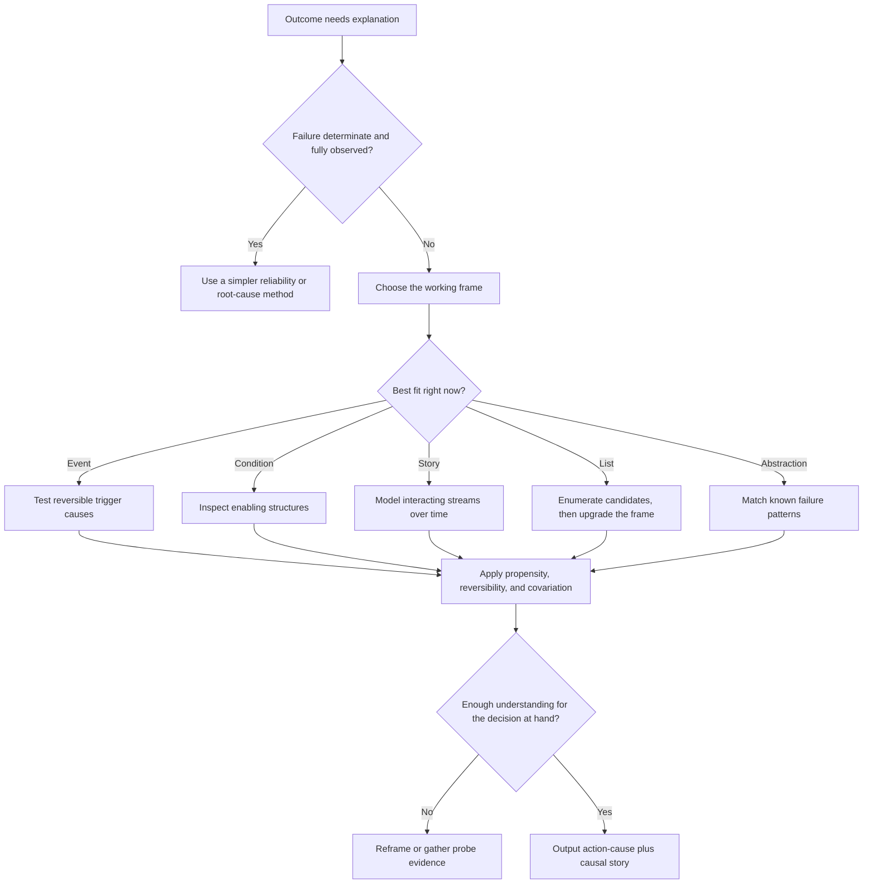

# Causal Reasoning: Initial Report of a Naturalistic Study

Use this skill when the point is not just to name a cause, but to choose the right explanatory frame and stop at the right level of closure.

## When to Use

Load this skill when:

- **Diagnosing failures** — a system, process, decision, or outcome went wrong and you need to explain why
- **Causal attribution is contested** — multiple competing explanations exist and you need a framework for evaluating them
- **The "obvious" cause feels too simple** — someone is reaching for a single root cause in a situation that is clearly complex
- **Designing diagnostic agents** — an agent or orchestration system must investigate and explain failures
- **Closure is hard** — analysis keeps expanding and you need principled criteria for when to stop
- **Explanation type matters** — you need to choose *how* to explain something, not just *what* to explain
- **Postmortems or retrospectives** — organizational, technical, or strategic failure reviews
- **Experts disagree about cause** — different framings produce different cause-sets and you need to understand why

## NOT for

- Pure statistical causal inference or do-calculus.
- Formal fault-tree analysis with known component failure rates.
- Situations where the cause is fully observed and unambiguous.
- Implementation-only debugging where the causal frame is already obvious.

## Decision Points



Use this routing model first:

- If the "obvious" cause feels too clean, switch frames before digging harder.
- If the decision is time-sensitive, keep an action-cause and a fuller causal story separate.
- If experts disagree, inspect the frames they are using before comparing their evidence.

## Core Mental Models

### 1. Five explanation types

Real-world causal reasoning uses five structurally different explanation forms. The form chosen is not neutral; it determines what counts as a relevant cause to search for.

| Type | What it looks like | Domain bias |
| --- | --- | --- |
| **Event** | "X happened, which caused Y" — counterfactual and reversible | Sports, military decisions |
| **Abstraction** | "This is an instance of pattern P" — category-based | Law, medicine, science |
| **Condition** | "The environment made this likely or inevitable" — structural | Policy, safety analysis |
| **List** | "Factors A, B, C contributed" — enumeration without mechanism | Journalism, early diagnosis |
| **Story** | "A complex interaction of X, Y, Z unfolded over time" — mechanistic narrative | Economics, complex failures |

Why it matters: an analyst using only event-type reasoning in a systemic failure will miss structural conditions. An analyst stuck in list-type reasoning will enumerate causes without modeling interaction.

### 2. Reciprocal framing

The search for causes and the construction of an explanatory frame happen **simultaneously**, not sequentially. The frame determines what counts as a relevant cause; the causes found reshape the frame.

```
[Candidate Causes] <-> [Explanatory Frame]
        each reshapes the other in real time
```

If you start with the wrong frame, you will systematically miss causes that do not fit it. Changing the frame is not "trying harder"; it is accessing a different search space.

### 3. Three attribution criteria

These are the workhorses of causal judgment. They operate independently and can produce conflicting verdicts:

- **Propensity**: could this plausibly lead to that?
- **Reversibility**: would removing this cause eliminate the effect?
- **Covariation**: do cause and effect travel together across cases?

Always apply all three. Context can flip the verdict of each.

### 4. Reduction is both necessary and dangerous

Humans compress dynamic, nonlinear, simultaneous causality into linear chains. This is both:

- **Cognitively necessary** — you cannot act on a fully simultaneous multi-causal model
- **Epistemically dangerous** — the compression creates a fiction that becomes invisible

The right move is to know which register you are in:

- **Diagnostic mode**: resist reduction, hold complexity, and prefer story-type explanation
- **Action mode**: accept reduction, identify the actionable cause, and document what remains unresolved

### 5. Indeterminate causation is normal

In organizational, political, military, and economic domains, there is often no single true cause. Multiple interacting partial causes are the rule. The right output in complex domains is a **partial-cause set** with explicit uncertainty, not a falsely precise single root cause.

## Failure Modes

### Root Cause Fundamentalism

Treating "find the single root cause" as the goal of causal analysis. In complex domains, this produces a named cause that absorbs blame while leaving structural vulnerabilities intact.

### Frame Blindness

Searching harder inside a failing frame instead of changing the frame. When the search stalls, the failure is often in the framing choice, not in the analyst's effort.

### Sequential Compression of Simultaneous Causation

Describing processes that happened in parallel and interacted as though they happened one after another. This is the reductive tendency in its most dangerous form.

### Explanation-Type Mismatch

Using event-type reasoning for condition-caused failures, or using a list of factors when a story of interaction is required.

### Premature Closure

Achieving closure at the action-cause level and pretending it is the same as structural understanding. Immediate intervention and durable prevention need different outputs.

### Shibboleth

If every cause in your answer fits into a clean single-file chain with no enabling conditions, you probably compressed a story into a slogan.

## Worked Examples

### Example 1: Production outage with a tempting single trigger

Situation:

- A deploy coincides with a payments outage.
- Teams want to call the deploy "the root cause."
- Logs also show queue saturation and a degraded dependency.

Better framing:

- **Event frame**: the deploy is a plausible trigger.
- **Condition frame**: queue configuration and dependency fragility made the outage likely.
- **Story frame**: the deploy altered traffic shape enough to expose those conditions.

Output:

- **Action-cause**: roll back or mitigate the deploy-induced traffic change.
- **Causal story**: fix queue saturation thresholds and dependency resilience so the same trigger no longer causes collapse.

### Example 2: Strategy postmortem with disputed blame

Situation:

- Sales says pricing caused the miss.
- Marketing says positioning caused the miss.
- Leadership says execution discipline caused the miss.

Better move:

- Fork one lane per frame.
- Compare which candidate causes each frame surfaces and which ones it cannot see.
- Keep a partial-cause set instead of forcing a single verdict.

## Fork Guidance

Fork when contested attribution or high stakes justify frame diversity:

- Event lane: isolate reversible decisions and immediate triggers.
- Condition lane: look for structural enablers and systemic vulnerabilities.
- Story lane: reconstruct interaction across time.

Keep closure decisions in the parent lane so one actor decides when the evidence is sufficient for action.

## Quality Gates

- [ ] The answer names the current explanatory frame and why it fits.
- [ ] Candidate causes are tested with propensity, reversibility, and covariation.
- [ ] Trigger causes are separated from enabling conditions.
- [ ] Uncertainty is explicit when causation is indeterminate.
- [ ] The output includes both an action-cause and a fuller causal story.
- [ ] Closure depth matches the stakes of the decision.
- [ ] Alternative frames are noted when they would surface different causes.

## Reference Map

Load these files **on demand** when the specific sub-problem arises. Do not load all at once.

| File | Load When... |
| --- | --- |
| `diagrams/01_flowchart_decision-points.md` | You need the decision flow as a standalone artifact for review or handoff. |
| `references/five-forms-of-causal-explanation.md` | You need to identify or choose the right explanation type. |
| `references/reciprocal-framing-and-causal-search.md` | The search for causes is stalling or producing thin results. |
| `references/three-causal-criteria-for-agent-diagnosis.md` | You are evaluating specific candidate causes. |
| `references/reductive-tendency-and-when-to-resist-it.md` | The causal account feels too linear or too simple. |
| `references/indeterminate-causation-and-partial-explanations.md` | Multiple causes are present and "root cause" pressure is distorting the analysis. |
| `references/domain-expertise-and-causal-frame-selection.md` | An expert's framing choice seems opaque or contested. |
| `references/causal-stories-as-system-models.md` | The failure is complex, systemic, or organizational. |
| `references/closure-decisions-and-the-action-understanding-tradeoff.md` | Analysis must end and action must begin. |
