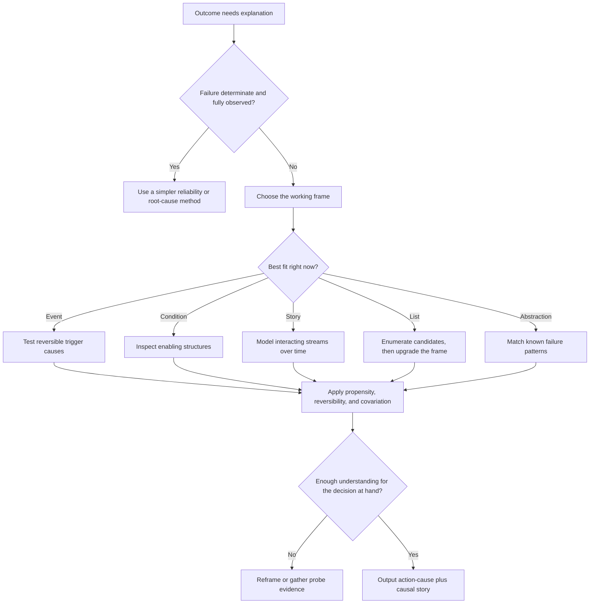

# Naturalistic Causal Reasoning Decision Flow

```mermaid
flowchart TD
  A[Outcome needs explanation] --> B{Failure determinate and fully observed?}
  B -->|Yes| C[Use a simpler reliability or root-cause method]
  B -->|No| D[Choose the working frame]
  D --> E{Best fit right now?}
  E -->|Event| F[Test reversible trigger causes]
  E -->|Condition| G[Inspect enabling structures]
  E -->|Story| H[Model interacting streams over time]
  E -->|List| I[Enumerate candidates, then upgrade the frame]
  E -->|Abstraction| J[Match known failure patterns]
  F --> K[Apply propensity, reversibility, and covariation]
  G --> K
  H --> K
  I --> K
  J --> K
  K --> L{Enough understanding for the decision at hand?}
  L -->|No| M[Reframe or gather probe evidence]
  L -->|Yes| N[Output action-cause plus causal story]
```
