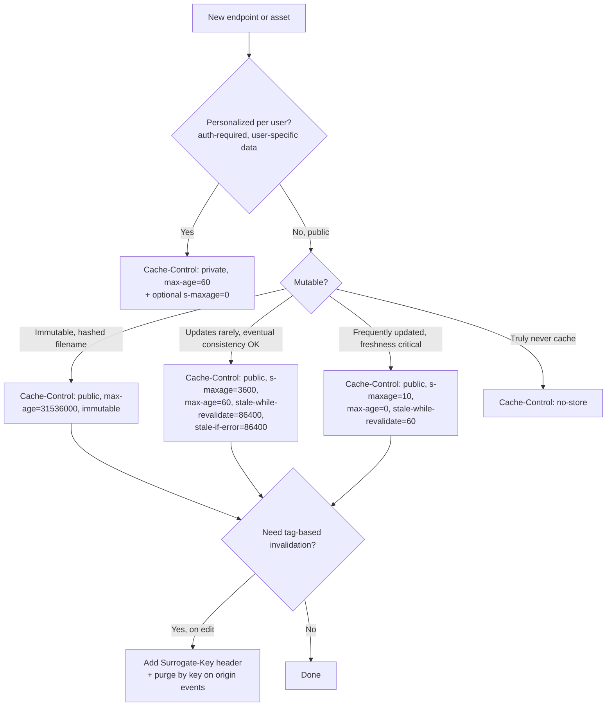

# CDN & Cache-Control Headers

> **TL;DR**: Pick `max-age` for browsers, `s-maxage` for CDNs (it wins on shared caches per RFC 9111). Add `stale-while-revalidate` to hide origin latency; add `stale-if-error` to survive origin outages. Use `Vary` *only* on headers you actually serve different content for, or you'll fragment the cache. Tag-based purging (surrogate keys) is the only practical way to invalidate by content type at scale.

---

## Jump to your fire

| Symptom | Section |
|---|---|
| "What goes in `Cache-Control`?" | [Directive cheat sheet](#1-the-directive-cheat-sheet) |
| "User saw stale content for 6 hours" | [SWR + invalidation](#3-stale-while-revalidate--stale-if-error) |
| "CDN cache hit rate is 5%" | [Common reasons](#5-why-your-cache-hit-rate-is-low) |
| "Need to invalidate all blog posts after edit" | [Surrogate keys](#6-surrogate-keys-tag-based-purging) |
| "Different responses per user — what's the right cache?" | [private vs Vary](#4-vary-and-private-vs-public) |

---

## Decision diagram



---

## 1. The directive cheat sheet

From [RFC 9111 §5.2.2](https://datatracker.ietf.org/doc/html/rfc9111#section-5.2.2), with the directives that matter for CDN work:

| Directive | Applies to | Meaning (verbatim where possible) |
|---|---|---|
| `max-age=N` | All caches | "The response is to be considered stale after its age is greater than the specified number of seconds." |
| `s-maxage=N` | Shared caches only | "For a shared cache, the maximum age specified by this directive **overrides** the maximum age specified by either the max-age directive or the Expires header field." |
| `public` | Marker | "A cache MAY store the response even if it would otherwise be prohibited." |
| `private` | Shared caches | "A shared cache MUST NOT store the response (i.e., the response is intended for a single user)." |
| `no-store` | All caches | "A cache MUST NOT store any part of either the immediate request or the response." |
| `no-cache` | All caches | "The response MUST NOT be used to satisfy any other request without forwarding it for validation." (i.e., must revalidate, but can store) |
| `must-revalidate` | All caches | "Once the response has become stale, a cache MUST NOT reuse that response to satisfy another request until it has been successfully validated." |
| `proxy-revalidate` | Shared caches | Same as must-revalidate but only for shared caches. |
| `immutable` | All caches | (Extension) "The response will not change for the duration of `max-age`." Browsers skip even revalidation. |

### Stale extensions (RFC 5861)

| Directive | Meaning |
|---|---|
| `stale-while-revalidate=N` | "Caches MAY serve the response in which it appears after it becomes stale, up to the indicated number of seconds." Background revalidation. |
| `stale-if-error=N` | "When an error is encountered, a cached stale response MAY be used to satisfy the request, regardless of other freshness information." Applies to 500/502/503/504. |

### Precedence rules (RFC 9111 §4.2.1)

> If the cache is shared and the `s-maxage` response directive is present, use its value, or if the `max-age` response directive is present, use its value.

> If directives conflict (e.g., both `max-age` and `no-cache` are present), the most restrictive directive should be honored.

**Common gotcha**: setting `Cache-Control: private` *and* expecting CDN caching to work for a different sub-resource. The directive applies to the response it's on; the CDN obeys.

---

## 2. The canonical recipes

| Asset | Header | Why |
|---|---|---|
| Hashed JS/CSS bundle (e.g. `app.[hash].js`) | `Cache-Control: public, max-age=31536000, immutable` | Filename changes on rebuild; safe to cache forever; `immutable` skips revalidation entirely |
| HTML page (anonymous, mostly static) | `Cache-Control: public, s-maxage=300, max-age=60, stale-while-revalidate=86400, stale-if-error=86400` | CDN refresh every 5 min; browser refresh every 1 min; serve stale up to 1 day on origin slowness or errors |
| API JSON (mostly read-only, eventually consistent) | `Cache-Control: public, s-maxage=60, max-age=0, stale-while-revalidate=600` | Browser revalidates always; CDN caches 60s; serves stale while revalidating up to 10 min |
| Authenticated user dashboard | `Cache-Control: private, max-age=0, no-store` | Don't cache anywhere shared; don't cache at all if it has secrets |
| Real-time / personalized feed | `Cache-Control: no-store` | Never cache |
| Login form (HTML) | `Cache-Control: no-store` | Prevents back-button leaks of credentials in form fields |

The `s-maxage=N, max-age=M` (where M < N) split is the most-effective default: short browser TTL keeps users-seeing-fresh-on-reload, longer CDN TTL keeps origin load down. SWR/SIE turn the CDN into a buffer against origin failure.

---

## 3. `stale-while-revalidate` & `stale-if-error`

`stale-while-revalidate=N` is the single highest-value addition you can make to a typical web stack. From [RFC 5861](https://datatracker.ietf.org/doc/html/rfc5861):

> Caches MAY serve the response in which it appears after it becomes stale, up to the indicated number of seconds.

The flow:

```
T+0s     Request arrives at CDN. Cache miss. Origin fetch. Response stored. Served fresh.
T+0-60s  Request arrives. Cache hit (within max-age). Served fresh.
T+61s    Request arrives. Cache stale, but within stale-while-revalidate window.
         CDN serves the STALE response immediately (zero added latency)
         AND kicks off a background fetch to refresh the cache.
T+62s    Background fetch completes. Cache refreshed.
T+63s    Next request arrives. Now-fresh cache hit. Served fresh.
```

The user-perceived latency for the T+61s request is *zero* — they get the stale value instantly. Without SWR, that request would have eaten a full origin roundtrip.

`stale-if-error=N` is the same idea for the failure case:

> When an error is encountered, a cached stale response MAY be used to satisfy the request, regardless of other freshness information.

If origin returns 500/502/503/504, CDN serves the last known good cached response (up to `stale-if-error` seconds past expiry). Origin outage becomes invisible to users. No-brainer to set on every cacheable response.

---

## 4. `Vary` and `private` vs `public`

`Vary` tells caches "this response varies based on the value of these request headers." Common cases:

```
Vary: Accept-Encoding              # Different responses for gzip vs br vs identity
Vary: Accept-Language              # i18n
Vary: Accept                        # Content negotiation
```

**The trap**: every distinct value of every header you `Vary` on creates a separate cache entry. `Vary: User-Agent` is the canonical disaster — every browser version gets its own copy, and your hit rate craters.

**Rules**:
- Vary only on headers you *demonstrably* serve different content for.
- Never `Vary: Cookie` on a public asset — every session ID is a unique cache key. Use `private` instead.
- Normalize before varying: if you Vary on `Accept-Encoding`, normalize to `gzip|br|identity` at the edge so `gzip;q=1, br;q=0.5` and `br;q=0.5, gzip;q=1` hit the same entry.

`private` vs `public`:

- **`public`**: any cache may store. Use for shared content.
- **`private`**: only end-user caches (browsers) may store. Shared caches (CDNs, corporate proxies) must not. Use for personalized content where leak-across-users is a security failure.

**Don't** combine `private` with `s-maxage` — the directives describe different audiences. Pick one.

---

## 5. Why your cache hit rate is low

Common offenders, in order of prevalence:

| Cause | Detection | Fix |
|---|---|---|
| `Set-Cookie` on cacheable responses | Many CDNs default-decline to cache anything with `Set-Cookie` | Strip cookies on read endpoints; or configure CDN to ignore them |
| `Cache-Control: private` on responses you wanted shared | grep your handlers for `res.setHeader('Cache-Control', 'private')` | Switch to `public` and verify no per-user data leaks |
| `Vary: User-Agent` or `Vary: Cookie` | Inspect actual response headers via `curl -I` | Drop the Vary, or normalize before varying |
| Query-string fragmentation (UTM params) | `?utm_source=...` creates new cache key per source | Configure CDN to ignore tracking params (Cloudflare: "Cache Level: Standard" handles many) |
| `Expires: 0` or `Pragma: no-cache` from old code | Headers from copy-pasted snippets | Replace with `Cache-Control` directives |
| Origin returns no `Cache-Control` at all | CDN falls back to default heuristic (often cache nothing) | Always set explicit `Cache-Control` |
| Auth token in path | `/api/user/abc123/orders` instead of `/api/orders` | Move auth to header, identifier to query/header |
| TTL too short for the volume | High request rate but max-age=10 means most requests miss | Increase TTL + add SWR; cache hit rate is often a TTL math problem |

A common diagnostic:

```bash
# Three identical requests; second should be a cache HIT
for i in 1 2 3; do
  curl -sI https://example.com/page | grep -E 'cf-cache-status|x-cache|age'
  sleep 1
done
```

`cf-cache-status: MISS` then `HIT` then `HIT` is what you want. `MISS, MISS, MISS` means the response isn't cacheable.

---

## 6. Surrogate keys: tag-based purging

URL-based purging (`PURGE /article/123`) breaks down when a single content change affects many URLs (an author edits a tag → all articles with that tag change). Surrogate keys solve this.

The pattern (Fastly originated; Cloudflare supports as "Cache Tags"):

```http
HTTP/1.1 200 OK
Cache-Control: public, s-maxage=3600, stale-while-revalidate=86400
Surrogate-Key: article-123 author-456 tag-rust tag-systems
Cache-Tag: article-123,author-456,tag-rust,tag-systems
```

When the author edits, the origin emits a purge by key:

```bash
# Fastly
curl -X POST -H "Fastly-Key: TOKEN" \
  https://api.fastly.com/service/SERVICE_ID/purge/author-456

# Cloudflare
curl -X POST -H "Authorization: Bearer TOKEN" \
  https://api.cloudflare.com/client/v4/zones/ZONE_ID/purge_cache \
  --data '{"tags":["author-456"]}'
```

Every cached response tagged `author-456` is invalidated atomically. URL-based purging cannot do this without enumerating thousands of URLs.

**Naming convention**: use prefix-based namespaces (`article-`, `author-`, `tag-`, `homepage`) so a single purge can target a logical group. Keep tag count per response under your CDN's limit (Cloudflare: 16; Fastly: ~20).

---

## Anti-patterns

| Anti-pattern | Why it bites | Fix |
|---|---|---|
| `Cache-Control: max-age=0` to "disable cache" | Browsers may still cache; only revalidates | Use `no-store` for truly uncacheable |
| `no-cache` thinking it means "don't cache" | It actually means "cache, but always revalidate" | `no-store` is the disable-all directive |
| `must-revalidate` on every response | Burns origin on every stale request, even when SWR would hide it | Use SWR/SIE instead, reserve `must-revalidate` for safety-critical responses |
| `private, max-age=0` on a public asset | CDN refuses to cache → origin gets every request | `public, s-maxage=N` for shared content |
| `Vary: User-Agent` | Cache hit rate near zero | Drop it; normalize feature detection at app layer |
| Setting `Expires: 0` and `Cache-Control` together | Conflicting signals, behavior varies | Drop `Expires`; only use `Cache-Control` |
| Purging by URL when content tags change | Hundreds of URLs to enumerate | Surrogate keys |
| Long `max-age` on mutable HTML without invalidation | Stale content sticks for hours | Pair long TTL with surrogate-key purge on edit |
| Setting `s-maxage` for browser caching | Browsers ignore it; only shared caches honor it | Use `max-age` for browsers |

---

## Novice / Expert / Timeline

| | Novice | Expert |
|---|---|---|
| **First cache header** | `Cache-Control: max-age=3600` | `public, s-maxage=3600, max-age=60, stale-while-revalidate=86400, stale-if-error=86400` |
| **Sees low hit rate** | Increases TTL | Inspects `Vary`, `Set-Cookie`, query-string handling first |
| **Origin outage** | Users see 502s | SIE serves stale; outage invisible |
| **Content edit** | Wait for TTL to expire (no purge) | Surrogate-key purge → instant invalidation |
| **i18n** | `Vary: Accept-Language` raw | URL-based locale (`/en/`, `/de/`); cache per URL |

**Timeline test**: an author edits a popular article. How long until the change is visible globally? Expert: <5s (instant purge by surrogate key). Novice: up to TTL (often hours).

---

## Quality gates

A caching change ships when:

- [ ] **Test:** Every response sets explicit `Cache-Control` (no defaults). Verified by an HTTP integration test.
- [ ] **Test:** Static hashed assets carry `immutable, max-age=31536000`.
- [ ] **Test:** SWR + SIE on every public cacheable response (no naked `s-maxage` without resilience extensions).
- [ ] **Test:** No `Vary: Cookie` or `Vary: User-Agent` on cached responses; lint with `curl -I` in CI.
- [ ] **Test:** `Set-Cookie` does not appear on responses intended for shared caching; CI grep on cacheable handlers.
- [ ] **Test:** Surrogate-key purges actually invalidate; integration test that edits content, purges, and verifies a fresh response within 5 seconds.
- [ ] **Test:** Cache hit rate dashboard exists (`cf-cache-status` distribution, x-cache header histogram); alarm on hit rate below threshold.
- [ ] **Manual:** Login pages and authenticated dashboards carry `no-store` (verify by curl on production).

---

## NOT for this skill

- Service worker caching (use `service-worker-cache-strategies`)
- Browser-only caching (use `browser-cache-strategies`)
- Application-level caching with Redis/memcached (use `redis-patterns-expert` or `cache-strategy-invalidation-expert`)
- Edge functions / compute-at-edge (use `cloudflare-worker-dev`)
- Image optimization specifically (use `image-optimization-engineer`)
- HTTP/2 push or 103 Early Hints (use `http-modern-features`)

---

## Sources

- IETF: [RFC 9111 — HTTP Caching](https://datatracker.ietf.org/doc/html/rfc9111) — Cache-Control directives, freshness, precedence rules
- IETF: [RFC 5861 — HTTP Cache-Control Extensions for Stale Content](https://datatracker.ietf.org/doc/html/rfc5861) — `stale-while-revalidate`, `stale-if-error`
- IETF: [RFC 8246 — HTTP Immutable Responses](https://datatracker.ietf.org/doc/html/rfc8246) — the `immutable` directive
- MDN: [Cache-Control header reference](https://developer.mozilla.org/en-US/docs/Web/HTTP/Headers/Cache-Control)
- Cloudflare: [Cache Tags / Surrogate keys](https://developers.cloudflare.com/cache/how-to/purge-cache/purge-by-tags/)
- Fastly: [Surrogate Keys](https://www.fastly.com/documentation/guides/concepts/surrogate-keys/)
- web.dev: [stale-while-revalidate explained](https://web.dev/stale-while-revalidate/) — Jeff Posnick's canonical explainer
