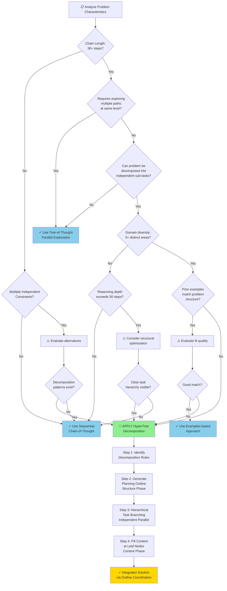

# HyperTree Decomposition Decision Protocol

```mermaid
flowchart TD
    A["📋 Analyze Problem Characteristics"] --> B{"Chain Length:<br/>30+ steps?"}
    
    B -->|No| C{"Multiple Independent<br/>Constraints?"}
    C -->|No| D["✓ Use Sequential<br/>Chain-of-Thought"]
    C -->|Yes| E["⚠️ Evaluate alternatives"]
    
    B -->|Yes| F{"Requires exploring<br/>multiple paths<br/>at same level?"}
    F -->|Yes| G["✓ Use Tree-of-Thought<br/>Parallel Exploration"]
    F -->|No| H{"Can problem be<br/>decomposed into<br/>independent sub-tasks?"}
    
    H -->|No| G
    H -->|Yes| I{"Domain diversity:<br/>3+ distinct areas?"}
    
    I -->|No| J{"Reasoning depth<br/>exceeds 50 steps?"}
    J -->|No| D
    J -->|Yes| K["⚠️ Consider structural<br/>optimization"]
    
    I -->|Yes| L{"Prior examples<br/>match problem<br/>structure?"}
    L -->|Yes| M["⚠️ Evaluate fit quality"]
    L -->|No| N["🎯 APPLY HyperTree<br/>Decomposition"]
    
    N --> O["Step 1: Identify<br/>Decomposition Rules"]
    O --> P["Step 2: Generate<br/>Planning Outline<br/>Structure Phase"]
    P --> Q["Step 3: Hierarchical<br/>Task Branching<br/>Independent Parallel"]
    Q --> R["Step 4: Fill Content<br/>at Leaf Nodes<br/>Content Phase"]
    R --> S["✓ Integrated Solution<br/>via Outline Coordination"]
    
    E --> T{"Decomposition<br/>patterns exist?"}
    T -->|Yes| N
    T -->|No| D
    
    M --> U{"Good match?"}
    U -->|Yes| V["✓ Use Examples-based<br/>Approach"]
    U -->|No| N
    
    K --> W{"Clear task<br/>hierarchy visible?"}
    W -->|Yes| N
    W -->|No| D
    
    style N fill:#90EE90
    style D fill:#87CEEB
    style G fill:#87CEEB
    style V fill:#87CEEB
    style S fill:#FFD700
```
