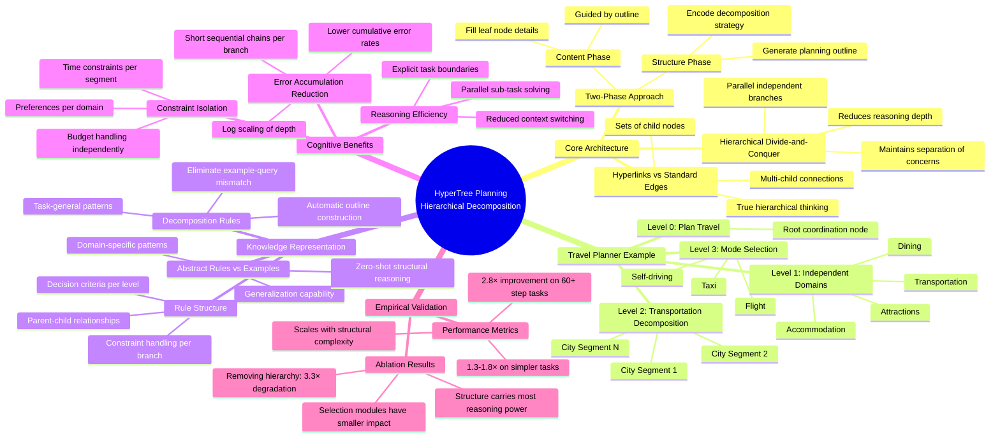

# HyperTree Hierarchical Decomposition Structure

```mermaid
mindmap
  root((HyperTree Planning<br/>Hierarchical Decomposition))
    Core Architecture
      Hierarchical Divide-and-Conquer
        Reduces reasoning depth
        Maintains separation of concerns
        Parallel independent branches
      Hyperlinks vs Standard Edges
        Multi-child connections
        True hierarchical thinking
        Sets of child nodes
      Two-Phase Approach
        Structure Phase
          Generate planning outline
          Encode decomposition strategy
        Content Phase
          Fill leaf node details
          Guided by outline
    Travel Planner Example
      Level 0: Plan Travel
        Root coordination node
      Level 1: Independent Domains
        Transportation
        Accommodation
        Dining
        Attractions
      Level 2: Transportation Decomposition
        City Segment 1
        City Segment 2
        City Segment N
      Level 3: Mode Selection
        Self-driving
        Taxi
        Flight
    Knowledge Representation
      Abstract Rules vs Examples
        Generalization capability
        Domain-specific patterns
        Zero-shot structural reasoning
      Decomposition Rules
        Task-general patterns
        Eliminate example-query mismatch
        Automatic outline construction
      Rule Structure
        Parent-child relationships
        Decision criteria per level
        Constraint handling per branch
    Cognitive Benefits
      Error Accumulation Reduction
        Short sequential chains per branch
        Log scaling of depth
        Lower cumulative error rates
      Constraint Isolation
        Budget handling independently
        Time constraints per segment
        Preferences per domain
      Reasoning Efficiency
        Parallel sub-task solving
        Reduced context switching
        Explicit task boundaries
    Empirical Validation
      Performance Metrics
        2.8× improvement on 60+ step tasks
        1.3-1.8× on simpler tasks
        Scales with structural complexity
      Ablation Results
        Removing hierarchy: 3.3× degradation
        Structure carries most reasoning power
        Selection modules have smaller impact
```
