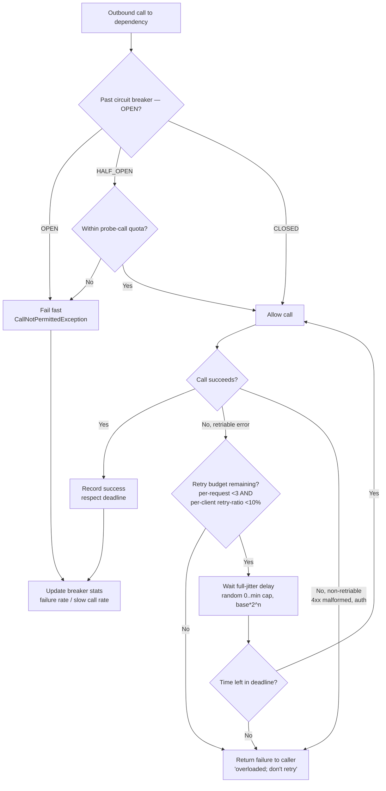

# Circuit Breakers and Retries

> **TL;DR**: Retries amplify exponentially across layers (3 retries × 4 layers = 64× origin load). Always pair retries with a circuit breaker, full-jitter exponential backoff (`random(0, min(cap, base * 2^attempt))`), a per-request attempt cap (3), and a per-client retry-ratio budget (10% per Google SRE). Set absolute deadlines at the edge and propagate them — *"you don't get credit for late assignments with RPCs."* Hystrix is dead since 2018; use Resilience4j (JVM) or Polly (.NET).

---

## Jump to your fire

| Symptom | Section |
|---|---|
| "Cascading failures took down everything" | [Retry amplification math](#1-the-retry-amplification-math) |
| "What state machine should the breaker have?" | [Circuit breaker states](#2-the-circuit-breaker-state-machine) |
| "How long to wait between retries?" | [Backoff with jitter](#3-backoff-with-jitter-full-jitter-wins) |
| "When NOT to retry?" | [Retry decision rules](#4-when-not-to-retry) |
| "Deadline propagation" | [Deadlines](#5-deadline-propagation) |
| "Slow calls dragging down the system" | [Slow-call rate](#circuit-breaker-state-machine) |

---

## Decision diagram



---

## 1. The retry amplification math

From [Google SRE Book Ch. 22 (Addressing Cascading Failures)](https://sre.google/sre-book/addressing-cascading-failures/):

> Avoid amplifying retries by issuing retries at multiple levels: a single request at the highest layer may produce a number of attempts as large as the *product* of the number of attempts at each layer to the lowest layer. **If the database can't service requests because it's overloaded, and the backend, frontend, and JavaScript layers all issue 3 retries (4 attempts), then a single user action may create 64 attempts (4³) on the database.**

The rule that follows: **retry only at the layer immediately above the failing dependency**. Lower layers should return "overloaded; don't retry" — typically HTTP 503 with `Retry-After`, or a domain-specific non-retriable error.

### The two-budget defense (Google SRE Book Ch. 21)

> First, we implement a *per-request retry budget* of up to three attempts. If a request has already failed three times, we let the failure bubble up to the caller.

> Secondly, we implement a *per-client retry budget*. Each client keeps track of the ratio of requests that correspond to retries. **A request will only be retried as long as this ratio is below 10%.**

> Although we've effectively capped the growth caused by retries, a threefold increase in requests is significant... However, layering on the per-client retry budget (a 10% retry ratio) reduces the growth to just 1.1x in the general case—a significant improvement.

These two together — `min(3 attempts, 10% retry ratio)` — turn 3× worst-case into 1.1× typical-case.

---

## 2. The circuit breaker state machine

From [Resilience4j docs](https://resilience4j.readme.io/docs/circuitbreaker):

> The CircuitBreaker is implemented via a finite state machine with three normal states: CLOSED, OPEN and HALF_OPEN and three special states METRICS_ONLY, DISABLED and FORCED_OPEN.

> The state of the CircuitBreaker changes from CLOSED to OPEN when the failure rate is equal or greater than a configurable threshold... The CircuitBreaker also changes from CLOSED to OPEN when the percentage of slow calls is equal or greater than a configurable threshold. **This helps to reduce the load on an external system before it is actually unresponsive.**

> The CircuitBreaker rejects calls with a `CallNotPermittedException` when it is OPEN. After a wait time duration has elapsed, the CircuitBreaker state changes from OPEN to HALF_OPEN and permits a configurable number of calls to see if the backend is still unavailable or has become available again... If the failure rate or slow call rate is then equal or greater than the configured threshold, the state changes back to OPEN. If [...] is below the threshold, the state changes back to CLOSED.

### Resilience4j defaults (verbatim)

| Property | Default | Meaning |
|---|---|---|
| `failureRateThreshold` | 50 (%) | CLOSED→OPEN trigger |
| `slowCallRateThreshold` | 100 (%) | Disabled by default; enable for latency-driven trip |
| `slowCallDurationThreshold` | 60_000 ms | Above this = "slow" |
| `permittedNumberOfCallsInHalfOpenState` | 10 | Probe count |
| `slidingWindowType` | COUNT_BASED | Or TIME_BASED (per-second buckets) |
| `slidingWindowSize` | 100 | calls (count) or seconds (time) |
| `minimumNumberOfCalls` | 100 | Floor before rate is computed |
| `waitDurationInOpenState` | 60_000 ms | OPEN→HALF_OPEN delay |

The **slow-call rate** is Resilience4j's improvement past Hystrix: trip on latency, not just errors. By the time errors start, the dependency is already over the cliff. Slow-call detection gives you a leading indicator.

### From Microsoft's [Circuit Breaker pattern doc](https://learn.microsoft.com/en-us/azure/architecture/patterns/circuit-breaker)

> The Half-Open state helps prevent a recovering service from suddenly being flooded with requests. As a service recovers, it might be able to support a limited volume of requests until the recovery is complete.

> The Circuit Breaker pattern serves a different purpose than the Retry pattern. The Retry pattern enables an application to retry an operation with the expectation that it eventually succeeds. The Circuit Breaker pattern prevents an application from performing an operation that's likely to fail.

**The right combo**: retry inside a circuit breaker. Retry handles transient failures; the breaker handles persistent failures. The retry logic must check for `CallNotPermittedException` and not retry through it.

---

## 3. Backoff with jitter: Full Jitter wins

From [Marc Brooker's AWS blog post](https://aws.amazon.com/blogs/architecture/exponential-backoff-and-jitter/):

The three formulas:

```python
# Full Jitter (recommended for most cases)
sleep = random_between(0, min(cap, base * 2 ** attempt))

# Equal Jitter
temp  = min(cap, base * 2 ** attempt)
sleep = temp/2 + random_between(0, temp/2)

# Decorrelated Jitter
sleep = min(cap, random_between(base, sleep_prev * 3))
```

Brooker's verdict (verbatim):

> The no-jitter exponential backoff approach is the clear loser. It not only takes more work, but also takes more time than the jittered approaches.

> Of the jittered approaches, 'Equal Jitter' is the loser. It does slightly more work than 'Full Jitter', and takes much longer. The decision between 'Decorrelated Jitter' and 'Full Jitter' is less clear.

> The return on implementation complexity of using jittered backoff is huge, and it should be considered a standard approach for remote clients.

**Default recipe**: Full Jitter, `base = 50ms` to `200ms`, `cap = 30s` to `60s`.

```js
function delayMs(attempt, base = 100, cap = 30_000) {
  return Math.floor(Math.random() * Math.min(cap, base * 2 ** attempt))
}
```

Why no-jitter is the killer: every retry from every client lands at the same instant after the upstream blip. Exponential backoff without jitter doesn't spread retries — it synchronizes them.

---

## 4. When NOT to retry

The single most-broken retry implementation is "retry on any error." From [Google SRE Book Ch. 22](https://sre.google/sre-book/addressing-cascading-failures/):

> Use clear response codes... separate retriable and nonretriable error conditions. Don't retry permanent errors or malformed requests in a client, because neither will ever succeed. Return a specific status when overloaded so that clients and other layers back off and do not retry.

| HTTP status | Retry? | Why |
|---|---|---|
| 200/2xx | n/a | Success |
| 400 Bad Request | **No** | Malformed; never succeeds |
| 401 Unauthorized | **No** | Need new credentials, not a retry |
| 403 Forbidden | **No** | Auth issue, not transient |
| 404 Not Found | **No** | Doesn't exist |
| 409 Conflict (idempotency in progress) | Sometimes | Wait then check final state, not blind retry |
| 422 Unprocessable | **No** | Malformed input |
| 429 Too Many Requests | **Yes** | Honor `Retry-After` header |
| 500 Internal Server Error | Cautiously | May be permanent (bug); limit attempts |
| 502 Bad Gateway | **Yes** | Upstream blip |
| 503 Service Unavailable | **Yes** | Honor `Retry-After`; expect overload |
| 504 Gateway Timeout | **Cautiously** | Already cost time; deadline may be up |

**Network-layer rules**:
- Connection refused / DNS failure: retry (likely transient)
- TLS handshake failure: do not retry the same request — likely a configuration issue
- Read timeout on **non-idempotent** request: do not retry without idempotency key
- Read timeout on **idempotent** request: retry
- Write succeeded but read timed out: same as above — idempotency key or it's not safe

---

## 5. Deadline propagation

From [Google SRE Book Ch. 22](https://sre.google/sre-book/addressing-cascading-failures/):

> A common theme in many cascading outages is that servers spend resources handling requests that will exceed their deadlines on the client. As a result, resources are spent while no progress is made: **you don't get credit for late assignments with RPCs**.

> With deadline propagation, a deadline is set high in the stack (e.g., in the frontend). The tree of RPCs emanating from an initial request will all have the same absolute deadline. For example, if server A selects a 30-second deadline, and processes the request for 7 seconds before sending an RPC to server B, the RPC from A to B will have a 23-second deadline.

The shape:

```js
async function handle(req, ctx) {
  // ctx.deadline is an absolute timestamp set at the edge
  const remaining = ctx.deadline - Date.now()
  if (remaining <= 0) throw new Error('deadline exceeded before work started')

  // Pass remaining as the timeout to downstream, NOT a fresh 30s
  const downstream = await fetchWithTimeout(url, { timeout: remaining })
  // ...
}
```

In gRPC, deadlines are first-class on the context. In HTTP, propagate via header (`X-Request-Deadline-Ms`, `grpc-timeout` if you've adopted that convention) or via tracing baggage.

**The rule**: never set a fresh timeout downstream. Always pass `min(local_budget, remaining_deadline)`.

---

## 6. The combined recipe (Resilience4j + Polly + DIY)

```ts
// Pseudocode — language-agnostic
async function callWithResilience(req, ctx) {
  return circuitBreaker.execute(async () => {
    let lastErr
    for (let attempt = 0; attempt < 3; attempt++) {  // per-request budget
      const remaining = ctx.deadline - Date.now()
      if (remaining <= 0) throw new DeadlineExceeded()

      try {
        return await callWithTimeout(req, Math.min(remaining, 5000))
      } catch (err) {
        lastErr = err
        if (!isRetriable(err)) throw err               // non-retriable: stop
        if (!retryBudget.tryConsume()) throw err       // per-client 10% budget
        const delay = Math.floor(Math.random() * Math.min(30_000, 100 * 2 ** attempt))
        await sleep(Math.min(delay, ctx.deadline - Date.now()))
      }
    }
    throw lastErr
  })
}
```

The `retryBudget` is a token bucket over the last 2 minutes that allows `requests * 0.10` retries per window. When exhausted, retries skip.

### From Google SRE Book Ch. 21 (adaptive throttling formula)

Client tracks `requests` and `accepts` over the last 2 minutes. Client-side rejection probability:

```
max(0, (requests - K * accepts) / (requests + 1))
```

`K = 2` is the recommended default ("we generally prefer the 2× multiplier"). The client *itself* drops requests before they reach the wire when the upstream is rejecting too many.

---

## Anti-patterns

| Anti-pattern | Why it bites | Fix |
|---|---|---|
| Retry without circuit breaker | When upstream is down, retries hammer it | Wrap retries in a breaker; respect `OPEN` state |
| Circuit breaker without slow-call detection | Trips only after errors start; too late | Enable slow-call rate threshold (Resilience4j default off — turn on) |
| Retry at every layer | 3 retries × 4 layers = 64× amplification | Retry only at the layer immediately above the failing dependency |
| No-jitter exponential backoff | Synchronizes retry storms | Full Jitter |
| Retrying 4xx errors | Will never succeed | Whitelist retriable status codes (5xx + 429) only |
| Fresh timeout per hop | Total wallclock balloons; deadline ignored | Propagate deadlines; pass `min(budget, remaining)` |
| `maxAttempts: 100` | Useless — by attempt 10 the upstream is gone | Cap at 3 (or 5 max for highly transient infra) |
| Hystrix in 2026 | Netflix EOL'd it in 2018 | Resilience4j (JVM), Polly (.NET), or hand-rolled per-language |
| Retrying non-idempotent POST without idempotency key | Risk of duplicate side effects | Add idempotency key OR don't retry |
| Open-state ignored by retry loop | Retries through `CallNotPermittedException` defeating the breaker | Retry loop must short-circuit on breaker rejection |

---

## Novice / Expert / Timeline

| | Novice | Expert |
|---|---|---|
| **First retry** | `for (let i=0; i<5; i++) await call()` | Full Jitter + 3-attempt cap + 10% client budget |
| **Adds circuit breaker** | Custom counter, no half-open | Resilience4j with slow-call threshold + half-open probes |
| **Cascading failure postmortem** | "Add more retries" | "Remove retries from N-2 layers; add deadline propagation" |
| **On 503 with Retry-After** | Ignores header | Honors header; backs off at minimum the suggested duration |
| **Chooses backoff** | Constant 1s | Full jitter exponential capped at 30s |

**Timeline test**: how long after a downstream blip does retry traffic from your service stop? Expert answer: bounded by `cap` (e.g., 30s). Novice answer: until the blip ends — meaning retries kept the dependency overloaded longer than the original incident.

---

## Quality gates

A resilience change ships when:

- [ ] **Test:** Retry loop short-circuits on `CallNotPermittedException` (or breaker-equivalent); verified by integration test that opens the breaker and confirms zero downstream calls.
- [ ] **Test:** Backoff includes randomization — two parallel client instances do not retry at the same wallclock instant; verified statistically over 100 runs.
- [ ] **Test:** Per-request attempt cap is enforced; verified by a downstream that fails persistently and counting attempts.
- [ ] **Test:** Per-client retry budget exists (token bucket or rolling-ratio) and is observable via metric.
- [ ] **Test:** Non-retriable errors (4xx except 429) do not trigger retries; integration test for each.
- [ ] **Test:** Deadline propagation — downstream receives a header/context with the remaining budget, not a fresh timeout.
- [ ] **Test:** Circuit breaker `slowCallRateThreshold` is configured (Resilience4j default disabled); verify in config.
- [ ] **Test:** `Retry-After` header (when present) is parsed and honored.
- [ ] **Manual:** Game day or chaos test exercises the breaker with a fault-injected dependency; observe the recovery curve.

---

## NOT for this skill

- Bulkhead / thread-pool isolation (use `bulkhead-isolation-design`)
- Hedged requests (use `hedged-request-design`)
- Rate limiting on the server side (use `rate-limiting-strategy`)
- Backpressure protocols (use `backpressure-design`)
- Specific service mesh resilience config (use `istio-resilience-config` or `linkerd-retry-policies`)
- Database-specific retry (deadlock retry, serialization-failure retry — use `postgres-isolation-and-retries`)

---

## Sources

- Resilience4j: [Circuit Breaker](https://resilience4j.readme.io/docs/circuitbreaker) and [Retry](https://resilience4j.readme.io/docs/retry)
- Microsoft Azure Architecture Center: [Circuit Breaker pattern](https://learn.microsoft.com/en-us/azure/architecture/patterns/circuit-breaker)
- Marc Brooker, AWS: [Exponential Backoff and Jitter](https://aws.amazon.com/blogs/architecture/exponential-backoff-and-jitter/) and [the simulator](https://github.com/awslabs/aws-arch-backoff-simulator)
- Google SRE Book: [Ch. 21 — Handling Overload](https://sre.google/sre-book/handling-overload/) (per-request + per-client retry budgets, adaptive throttling)
- Google SRE Book: [Ch. 22 — Addressing Cascading Failures](https://sre.google/sre-book/addressing-cascading-failures/) (retry amplification math, deadline propagation, graceful degradation)
- Amazon Builders' Library: [Timeouts, Retries, and Backoff with Jitter](https://aws.amazon.com/builders-library/timeouts-retries-and-backoff-with-jitter/)
