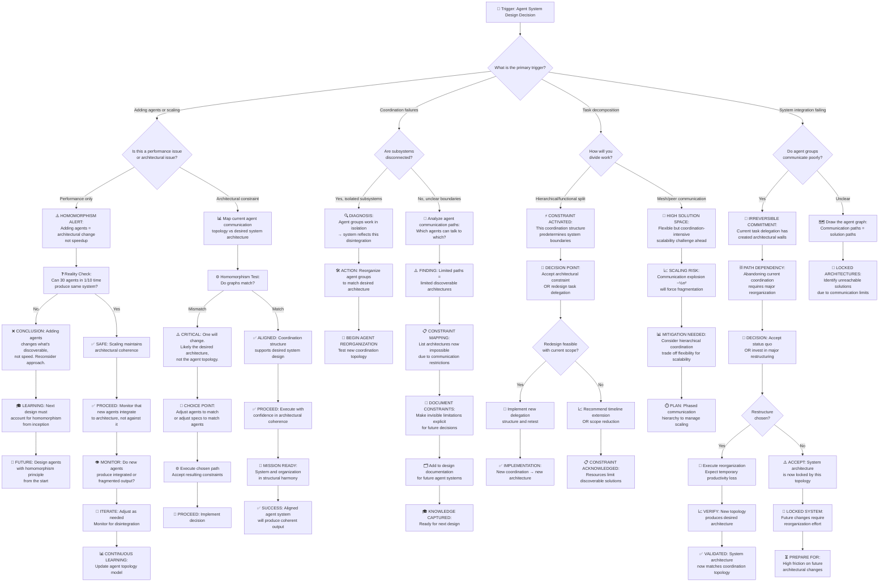

# Conway's Law Decision Tree: Agent Allocation & Coordination

```mermaid
graph TD
    A["🎯 Trigger: Agent System Design Decision"] --> B{What is the primary trigger?}
    
    B -->|Adding agents or scaling| C{Is this a performance issue<br/>or architectural issue?}
    B -->|Coordination failures| D{Are subsystems<br/>disconnected?}
    B -->|Task decomposition| E{How will you<br/>divide work?}
    B -->|System integration failing| F{Do agent groups<br/>communicate poorly?}
    
    C -->|Performance only| G["⚠️ HOMOMORPHISM ALERT:<br/>Adding agents = architectural change<br/>not speedup"]
    C -->|Architectural constraint| H["📊 Map current agent communication<br/>topology vs desired system architecture"]
    
    D -->|Yes, isolated subsystems| I["🔍 DIAGNOSIS:<br/>Agent groups work in isolation<br/>→ system reflects this disintegration"]
    D -->|No, unclear boundaries| J["💬 Analyze agent communication paths:<br/>Which agents can talk to which?"]
    
    E -->|Hierarchical/functional split| K["⚡ CONSTRAINT ACTIVATED:<br/>This coordination structure<br/>predetermines system boundaries"]
    E -->|Mesh/peer communication| L["🔀 HIGH SOLUTION SPACE:<br/>Flexible but coordination-intensive<br/>scalability challenge ahead"]
    
    F -->|Yes| M["🔗 IRREVERSIBLE COMMITMENT:<br/>Current task delegation has<br/>created architectural walls"]
    F -->|Unclear| N["🗺️ Draw the agent graph:<br/>Communication paths = solution paths"]
    
    G --> O["❓ Reality Check:<br/>Can 30 agents in 1/10 time<br/>produce same system?"]
    H --> P["⚙️ Homomorphism Test:<br/>Do graphs match?"]
    I --> Q["🛠️ ACTION: Reorganize agent groups<br/>to match desired architecture"]
    J --> R["⚠️ FINDING: Limited paths =<br/>limited discoverable architectures"]
    K --> S["🎯 DECISION POINT:<br/>Accept architectural constraint<br/>OR redesign task delegation"]
    L --> T["📈 SCALING RISK:<br/>Communication explosion ~½n²<br/>will force fragmentation"]
    M --> U["⛓️ PATH DEPENDENCY:<br/>Abandoning current coordination<br/>requires major reorganization"]
    N --> V["🔐 LOCKED ARCHITECTURES:<br/>Identify unreachable solutions<br/>due to communication limits"]
    
    O -->|No| W["❌ CONCLUSION: Adding agents<br/>changes what's discoverable,<br/>not speed. Reconsider approach."]
    O -->|Yes| X["✅ SAFE: Scaling maintains<br/>architectural coherence"]
    
    P -->|Mismatch| Y["⚠️ CRITICAL: One will change.<br/>Likely the desired architecture,<br/>not the agent topology."]
    P -->|Match| Z["✅ ALIGNED: Coordination structure<br/>supports desired system design"]
    
    Q --> AA["🔄 BEGIN AGENT REORGANIZATION<br/>Test new coordination topology"]
    R --> AB["📋 CONSTRAINT MAPPING:<br/>List architectures now impossible<br/>due to communication restrictions"]
    S --> AC{Redesign feasible<br/>with current scope?}
    T --> AD["📊 MITIGATION NEEDED:<br/>Consider hierarchical coordination<br/>trade off flexibility for scalability"]
    U --> AE["🚨 DECISION: Accept status quo<br/>OR invest in major restructuring"]
    
    AC -->|Yes| AF["🔄 Implement new delegation<br/>structure and retest"]
    AC -->|No| AG["📈 Recommend timeline extension<br/>OR scope reduction"]
    
    W --> AH["🎓 LEARNING: Next design must<br/>account for homomorphism<br/>from inception"]
    X --> AI["✅ PROCEED: Monitor that<br/>new agents integrate<br/>to architecture, not against it"]
    Y --> AJ["🔁 CHOICE POINT:<br/>Adjust agents to match<br/>or adjust specs to match agents"]
    Z --> AK["✅ PROCEED: Execute with<br/>confidence in architectural coherence"]
    AB --> AL["📝 DOCUMENT CONSTRAINTS:<br/>Make invisible limitations explicit<br/>for future decisions"]
    AE --> AM{Restructure<br/>chosen?}
    AD --> AN["⏱️ PLAN: Phased communication<br/>hierarchy to manage scaling"]
    
    AM -->|Yes| AO["🚀 Execute reorganization<br/>Expect temporary productivity loss"]
    AM -->|No| AP["⚠️ ACCEPT: System architecture<br/>is now locked by this topology"]
    
    AF --> AQ["✅ IMPLEMENTATION:<br/>New coordination → new architecture"]
    AG --> AR["📋 CONSTRAINT ACKNOWLEDGED:<br/>Resources limit discoverable solutions"]
    AH --> AS["🔮 FUTURE: Design agents<br/>with homomorphism principle<br/>from the start"]
    AI --> AT["👁️ MONITOR: Do new agents<br/>produce integrated or<br/>fragmented output?"]
    AJ --> AU["⚙️ Execute chosen path<br/>Accept resulting constraints"]
    AK --> AV["🎯 MISSION READY:<br/>System and organization<br/>in structural harmony"]
    AL --> AW["🗂️ Add to design documentation<br/>for future agent systems"]
    AO --> AX["📈 VERIFY: New topology<br/>produces desired architecture"]
    AP --> AY["🔐 LOCKED SYSTEM:<br/>Future changes require<br/>reorganization effort"]
    AT --> AZ["🔄 ITERATE: Adjust as needed<br/>Monitor for disintegration"]
    AU --> BA["🚀 PROCEED: Implement decision"]
    AV --> BB["✅ SUCCESS: Aligned agent system<br/>will produce coherent output"]
    AW --> BC["🎓 KNOWLEDGE CAPTURED:<br/>Ready for next design"]
    AX --> BD["✅ VALIDATED: System architecture<br/>now matches coordination topology"]
    AY --> BE["⏳ PREPARE FOR:<br/>High friction on future<br/>architectural changes"]
    AZ --> BF["📊 CONTINUOUS LEARNING:<br/>Update agent topology model"]
```
